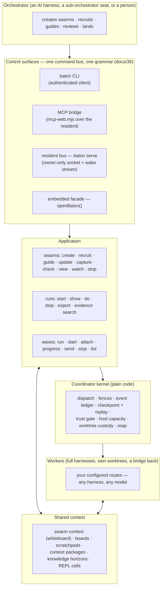

<div align="center">


</div>


# baton

**Repository:** <https://github.com/Flip-Engineering/baton>

**Cross-harness agent orchestration.** An orchestrator (an AI agent in one full coding harness, or a person at a terminal) directs other full coding-harness sessions as subordinate workers, on your own repository. Each worker gets its own git worktree, a written brief, a communication channel back to the orchestrator, live telemetry, mid-flight guidance, and a durable ledger recording what it did. The orchestrator receives event-driven wakes instead of polling for status, typed refusal codes instead of free-text errors, and a validated contribution report instead of an unstructured chat transcript.

---

## What baton is

A run-centric **fleet application** with a **swarm runtime** on top:

- **Runs.** You state an outcome; baton compiles it into an approved Plan, routes it onto a live worker seat, watches liveness, fields questions, verifies results against evidence it re-derives itself in a fresh worktree, and closes every resource it opened.
- **Swarms.** An orchestrator creates a swarm, recruits participants onto exact routes with path scopes and permissions, guides them, groups and couples them, and reads one view of who holds what. Participants report through a validated **contribution contract** (subject, base, commit, items, needs-from-others, carried-forward), reviewed and landed by the orchestrator. A seat can itself be a **sub-orchestrator**: granted `recruit` and `organize`, it recruits and steers its own builders.
- **The resident.** `baton serve` hosts a standing, owner-local deployment for one repository: an authenticated command bus over an owner-only socket, a wake stream, and a durable coordination ledger under `.git/baton/`. The CLI and the MCP bridge are thin authenticated clients of the same authority; a resident survives client crashes and answers again after a restart from its checkpoint.
- **The fleet.** Every worker is a full harness session in its own worktree, on whatever model and provider you configure: Claude Code, Codex, Grok and Kimi natively, GLM and DeepSeek through [omp](https://github.com/Flip-Engineering/omp), Muse as a one-shot contributor route, or your own harness adapter. Each route carries its own billing basis — subscription seats never get a per-token price on their profile; metered API routes do.

Underneath sits the **Coordinator**: a plain-code reliability kernel (version fencing, confirm-it-stopped, at-least-once cursors, answer-exactly-once, log-is-truth). The orchestrator may be an AI model; the Coordinator is deterministic code and is never an AI model, so the parts of the system responsible for correctness do not depend on a model's output.

---

## Architecture



**One authority, three access points.** The CLI discovers the resident through `.git/baton/connection.json` and speaks the authenticated bus; the MCP bridge (`impl/scripts/mcp-web.mjs`) projects the same operation table to an agent client; `openBaton({repo, advanced})` embeds the application directly in a Node process. Provider credentials are never passed as command arguments and never reach a worker's environment.

**Wakes instead of polling.** `baton swarm watch <swarm> --follow` prints one JSON frame per coordination row. The bounded form (`--timeout-ms`, `--wake-class`) returns on the first row of a named class, or at its deadline, and resumes with `--after-seq`. Run `baton swarm --help` for the full wake-class set.

**Verification is re-run, not trusted.** When a seat reports that a task is done, the system re-runs verification in a fresh worktree at the seat's commit. A worker's own report that its tests pass is treated as a claim to check, not as a fact.

**Turn-based steering, not hard kills.** Pausable harnesses end turns as checkpoints; the driver can send a nudge, wait, or claim signal instead of killing a worker at a turn boundary. One-shot harnesses receive guidance that is stored and delivered on their next resume. A worker's worktree is preserved on its lane branch when it dies rather than being deleted.

---

## Quickstart

Requires Node ≥ 20. The only runtime dependency is `@ast-grep/napi`. Baton is not yet published to npm — run it from a clone:

```bash
git clone https://github.com/Flip-Engineering/baton.git
cd baton/impl && npm ci
alias baton="node $(pwd)/scripts/baton.mjs"   # or add impl/scripts to your PATH

cd /path/to/your/repository

# 1. Host a standing resident for this repo, from a dedicated shell
(nohup baton serve > /tmp/baton-serve.log 2>&1 < /dev/null &)
baton doctor --check             # connection, served commit, route readiness, model profiles

# 2. Create a swarm and recruit one worker onto an exact route
baton swarm create "First swarm" --swarm-id my-first-swarm
baton swarm recruit my-first-swarm worker-1 "Fix the failing test in src/parser.js" \
  --options '{"exact":{"harness":"claude-code","model":"claude-sonnet-5","effort":"high"},"scope":["src/parser.js","test/parser.test.js"]}'

# 3. Let baton wake you instead of polling
baton swarm watch my-first-swarm --after-seq 0 --wake-class contribution_recorded,dead --follow

# 4. Review and land what the worker reports
baton swarm view my-first-swarm --projection participants
baton swarm update my-first-swarm swarm.contribution_reviewed \
  --payload '{"contributionId":"<id-from-the-wake>","decision":"accept","reason":"looks right"}'
baton swarm stop my-first-swarm worker-1 "landed"
```

`baton --help` lists every top-level verb; `baton help swarm`, `baton help run`, `baton help routing` and `baton help connection` render the topics in depth. The generated command inventories are [impl/CLI.md](impl/CLI.md) and [impl/MCP.md](impl/MCP.md).

**Credentials** are read once at the deployment root and projected into each worker's isolated environment. They are never passed as command arguments and never printed.

| Harness / provider | Where the credential goes |
|---|---|
| omp → GLM | `glm_key.json` at the deployment root |
| omp → DeepSeek | `deepseek_key.json` at the deployment root |
| omp → Kimi | `kimi_key.json` at the deployment root, or `baton credentials install kimi` |
| Claude Code | the harness's own OAuth login |
| Codex, Grok, native Kimi | the harness's own login |
| Muse | the OS keyring (`muse login`), with a file as a fallback |
| Artificial Analysis (optional model-profile data) | `BATON_AA_KEY`, or `~/.config/baton/aa_key` |

Run `baton doctor --check` to confirm a route is ready before recruiting on it.

**Restarting a resident, or developing baton itself?** See [CONTRIBUTING.md](CONTRIBUTING.md) — it covers the operator loop, the suite verdict, and the self-hosted development workflow in full.

---

## Why baton

Running several coding-agent sessions by hand has known problems: it is easy to lose track of which worktree has which change, a worker's claim that it finished is not checked, a stalled session gives no notification, and there is no durable record of what happened. Baton addresses each of these directly:

- **A durable ledger instead of scrollback.** Every recruit, guidance message, contribution and refusal is a recorded event. A resident restart replays the ledger and continues from where it left off.
- **Typed refusals instead of free-text errors.** A malformed request is answered with the exact field, the rule that was violated, and the admitted alternatives, consistently across the CLI, MCP, and the web transport.
- **Re-derived trust instead of self-reported status.** A worker's claim of success is checked by re-running verification in a clean worktree; it is not accepted as reported.
- **Wakes instead of polling.** The orchestrator, human or AI, blocks on a bounded watch call instead of repeatedly re-reading state in a loop.

Baton has developed itself since September 2026: every change to this codebase since then has gone through its own swarm runtime, recruited on a live resident and landed after review. [docs/PROGRESS.md](docs/PROGRESS.md) is the full per-phase record of that process. [CONTRIBUTING.md](CONTRIBUTING.md) describes how to run the same workflow.

---

## Documentation map

- **[SYSTEM.md](SYSTEM.md)** — the authoritative system design (read it second, after this file).
- **[GLOSSARY.md](GLOSSARY.md)** — the project's jargon, defined plainly.
- **[CONTRIBUTING.md](CONTRIBUTING.md)** — the self-hosted development loop, the suite verdict, and how to land a change.
- **[docs/PROGRESS.md](docs/PROGRESS.md)** — the per-phase progress ledger, oldest first; a row is never rewritten to look greener than it was.
- **[impl/CLI.md](impl/CLI.md) · [impl/MCP.md](impl/MCP.md)** — generated from the executable command registry.
- **[impl/scripts/expected-red-tests.json](impl/scripts/expected-red-tests.json)** — the reasoned expected-red manifest for the test suite; **[impl/src/limits.mjs](impl/src/limits.mjs)** — the frame-limits registry, the one place a bound is declared.

**Design documents (`docs/32`–`docs/48`)**

| doc | what it settles |
|---|---|
| [32](docs/32-reflexive-orchestration.md) | Reflexive orchestration: decision channels, task boards, context packages as typed hand-offs, REPL objects |
| [33](docs/33-shared-objects-repl-layer.md) | Shared objects and the REPL layer: content-addressed cells, named bindings |
| [34](docs/34-knowledge-horizons.md) | Knowledge horizons: task → workflow → project graphs, promotion, brief-time activation |
| [35](docs/35-turn-checkpoints.md) | Turn checkpoints: steer, don't gate |
| [36](docs/36-unified-control-grammar.md) | One grammar across embedded, web, CLI and MCP; the generated inventories and the conformance gate |
| [37](docs/37-wave-driver.md) · [37b](docs/37-holistic-runtime-convergence.md) | The shipped wave driver; holistic runtime convergence |
| [38](docs/38-flip-experience.md) · [38b](docs/38-flip-visual-surfaces.md) | The operator experience and visual surfaces (`baton top`) |
| [39](docs/39-swarm-runtime.md) | The swarm runtime: living swarms, tight and loose coupling, communication and shared context, the knowledge verbs on the bridge |
| [40](docs/40-runtime-review-2026-09-12.md) · [41](docs/41-verification-recovery-review.md) | The runtime review with checked results; verification and contribution recovery |
| [42](docs/42-suite-legitimacy.md) · [42b](docs/42-deployment-topology.md) | Suite legitimacy (expected-red reasons, the environment dimension); deployment topology beyond one host |
| [43](docs/43-host-capacity-and-derived-floors.md) | Host capacity is the throttle; the replaying → reconstructing → answering contract; restart truth |
| [44](docs/44-red-suffix-convention.md) | The `-red` test-suffix convention |
| [45](docs/45-open-coordination.md) | Open coordination: joint couplings, claims, peers-now |
| [46](docs/46-swarm-visibility.md) | Swarm visibility: one liveness derivation, the contributions ledger, the cost of a view |
| [47](docs/47-the-reading-half.md) | The reading half: a recruited seat reads its issue, its docs, its peers, and the landed work |
| [48](docs/48-reincarnation-in-place.md) | Resident reincarnation in place: the incarnation model, the handoff protocol, what survives and what drains |

The earlier corpus (problem framing through the representation ladder, docs 00–31) and the campaign-era working papers are indexed in the [superseded README](docs/reference/README-superseded-2026-08-13.md) and under `docs/reference/evidence/`; nothing was discarded. Dated campaign reports live in [`reviews/`](reviews/).

## Status

Baton is under active development and does not yet have a tagged release or a published package. The [open issue list](https://github.com/Flip-Engineering/baton/issues) is the current work tracker (`bug` + `priority:high` marks something that broke in real use and is sequenced first); [docs/PROGRESS.md](docs/PROGRESS.md) is the historical record. There is currently no LICENSE file in this repository — do not treat its absence as permission to use, copy, or redistribute the code; check with the maintainers before relying on it for anything beyond reading the source.
