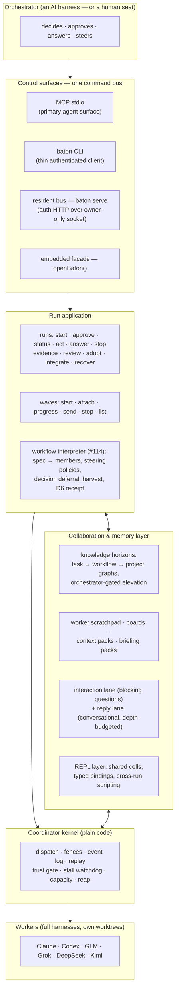

<div align="center">


</div>


# baton

**Cross-harness agent orchestration.** An orchestrator agent running in one full coding harness directs *other* full-session harnesses as subordinate workers — with real messaging, telemetry, mid-flight steering, and durable evidence — rather than the flat "spawn a process, wait for stdout" pattern.

The name: a conductor's baton directs an orchestra; a relay baton gets passed between runners. Both are the point.

> **Project updates.** Dated, evidence-cited campaign reports live in [`reviews/`](reviews/) — latest:
> **[baton-update-2026-08-14](reviews/baton-update-2026-08-14.html)** (the no-clock law, the detached bus,
> the uncapped fleet — 48h with focus on the last 12h/6h) ·
> [campaign state 2026-08-14](reviews/baton-campaign-state-2026-08-14.html) ·
> [foundry day 2026-08-13](reviews/baton-foundry-day-2026-08-13.html) ·
> [24h report](reviews/baton-24h-report.html).

> **Reading the status tiers.** Every capability below is labeled **[shipped]** (landed in
> `master`, pinned green by the canonical suite), **[in flight]** (mid-pipeline: contract →
> adversarial red-team → fold → red-first suite → blue-team → fold → implementation, with the
> current stage named), or **[planned]** (filed as a tracked issue, not started). In-flight work
> lands as *red-first* suites — tests that fail at a named stage until the capability ships — so
> `node impl/scripts/run-suite.mjs` exits nonzero **by construction** while pinned future
> behavior exists. That is the methodology working, not a regression: every shipped row is
> green, and the red set is exactly the declared in-flight roster.

---

## What baton is

A run-centric **fleet application**: you (or your orchestrator agent) state an outcome; baton compiles it into an approved Plan, routes it onto live worker seats across vendors, watches liveness, fields questions, verifies results against evidence it re-derives itself, and closes every resource it opened. One orchestrator can run **many workers in parallel as waves**, and can declare a whole multi-member workflow — heavyweight coordinator over cheap swarm rows, steering policies, harvest contract — as **one data file** run through the surface (`waves run`), no bespoke driver code.

The fleet today: **Claude** (opus/sonnet), **Codex** (gpt-5.6-sol), **Grok** (grok-build, 4.5), **GLM** 5.2, **DeepSeek** (`deepseek-v4-flash` wide seats, `deepseek-v4-pro[1m]` heavyweight), and **Kimi** k3 — each worker a full harness session with its own tools, sandbox, and context management, in its own git worktree.

Underneath the application sits the **Coordinator**: a plain-code reliability kernel (version fencing, confirm-it-stopped, at-least-once cursors, answer-exactly-once, log-is-truth) that makes "interrupt worker 3" actually land, every time. The orchestrator is an AI; the coordinator is not — that asymmetry is the design.

---

## Architecture



**The surfaces share one authority.** The CLI is a bearer-authenticated client of the resident bus, not a second controller; MCP is the primary agent-facing northbound; `openBaton({repo, advanced})` is the direct-embedding path the evidence drivers use. `baton serve` publishes discovery to `.git/baton/connection.json` only after an authenticated card/session/readiness challenge; credentials are never command arguments.

**Waves are the unit of parallel work.** A wave starts N members with per-member scopes and exact routes; the registry (`waves list`) projects roster, phase, and progress class live; outcome materialization pins each member's result as a content-addressed git object; re-drive restarts only the failed members. The **workflow interpreter** composes entire patterns declaratively: a spec names members, steering policies (`approveOnAdvertisedPlan`, `nudgeOnCheckpoint`, `claimOnStall`, `messageOnSpawn`, `elevateWhenNotes`, `answerDecisions`, `signalOnMembersDone`), and a harvest contract; the interpreter drives it to a verdict and a seven-key receipt.

**Turns, not gates.** Pausable harnesses end turns as checkpoints — the driver steers with `nudge_turn` / `wait_turn` / `claim_turn` instead of killing workers at turn boundaries, and every pause snapshots a recovery pin. The **stall watchdog** (#67) declares stalls only on liveness *evidence* (a closed re-arm set; an in-flight turn is never reaped — the slow-but-productive worker is structurally protected), with an escalate → claim/nudge → preserve-first-reap ladder, every step receipted.

**Trust is re-derived, never reported.** When a worker says "done," the coordinator re-runs the verification in a *fresh* worktree at the worker's commit — the worker's own directory is never trusted. Red→green enforcement, coverage-of-change, and mutation probes harden the gate; `run.review` sends the immutable result to an independently-routed reviewer; `run.adopt` / `run.integrate` are separate, policy-gated effects.

---

## Capabilities

### Shipped (landed, suite-green)

**Orchestration core**
- **Runs** — the ordinary API: concise intent → readable Plan → visible approval → one bounded RunView → attention → evidence → cleanup. `run.start / status / approve / act / answer / wait / stop / evidence / review / adopt / integrate / recover / resume_work`.
- **Waves** — multi-member orchestration with durable wave identity, per-member scopes/routes, attach-and-harvest, re-drive-the-failed, and the live registry projection (**#132**: `waves list` on CLI/bus/MCP, roster + phase + progress class).
- **Workflow-as-data** (**#114**) — whole multi-member workflows as one declarative spec through `baton.recipes.runWorkflow` / `baton waves run` / `baton_waves_run`: closed member fields, steering policy map, decision deferral to the human, harvest with `mustContain`, the closed seven-key D6 receipt.
- **The resident** — `baton serve`: a standing owner-local deployment publishing an authenticated bus over an owner-only Unix socket; CLI and MCP clients discover it through `.git/baton/connection.json`; signal close revokes only the current incarnation.
- **Turn-checkpoint steering** (**#31**) — nudge/wait/claim instead of turn-boundary kills; every pause snapshots a recovery pin.

**Communication & attention**
- **waitingOn vocabulary** (**#10**) — one honest projection of what a run is waiting on (the closed five kinds), surfacing *blocked_interaction* so an orchestrator never has to guess that it must act.
- **Reply lanes** (**#105**) — blocking asks ride the interaction lane; conversational follow-ups ride depth-budgeted reply chains (`MAX_MESSAGE_DEPTH_BUDGET`); membership-authorized, replay-exact.
- **Briefing packs** (**#103**) — the orchestrator-readable wave.closed record: what the wave did, per member, with result pins.
- **Decision channel** — workers ask multi-choice (+ free-response) questions that park the task at `input_required` until the orchestrator or a steering policy answers — the escalation lane the worker-orchestrated swarm rides.

**Memory & collaboration**
- **Knowledge horizons** — task-ephemeral → workflow-ephemeral → project-persistent knowledge graphs with orchestrator-gated elevation; the worker's typed scratchpad (**#33**) writes into its task-ephemeral graph; shared boards and context packs carry cross-member state.
- **REPL layer** — shared cells, typed bindings, cross-run scripting (**docs/33**).
- **Cairn memory** (Phases 44–53) — verified route statistics, causal integrity audit, bounded recall, selective promotion, scratch correction with independent-oracle release, recall-outcome attribution, authenticated contradiction workspace.

**Trust & evidence**
- **The trust gate** — fresh-worktree re-verification, red→green, coverage-of-change, mutation probes; independent semantic review over immutable git ranges; bounded evidence manifests; policy-gated adopt/integrate.
- **Atlas representations** (Phases 54, 61) — lexical-binding-aware CPG, graph-backed R1 structural delta / R2 SCIP snapshot / R3 bounded CPG delta, content-addressed and replay-exact.
- **Dependency & supply-chain chain** (Phases 36–43) — exact dependency dossiers + actual-lockfile SBOM, immutable reuse decisions, advisory TTL invalidation, isolated install graphs, transitive advisory projection, policy-epoch reconciliation, adverse provider ingress.
- **Fleet governance** — exact provider process lifecycle + reap (51), route-bound provider governance (57), canonical sparse worker/verifier authority (58), repo-scoped worktree capacity authority (59), attach-only native recovery (60), public drain/close (56).
- **Stall watchdog** (**#67**) — evidence-based liveness: closed re-arm kinds, the in-flight-turn gate, null-deadline interaction sweep, the preserve-first kill ladder.

**Surface engineering**
- **Unified control grammar** (**#43**, docs/36) — one grammar across embedded/Web/CLI/MCP; executable per-profile inventories; generated `CLI.md`/`MCP.md`; the surface-conformance gate (novel divergence fails the suite).
- **Adapter cards** — every harness publishes native/emulated/unsupported per control; the driver never pretends an emulated steer is a real one.

### In flight (mid-pipeline; stage named)

- **#74 — worker-orchestrated swarms** *(contract v1.2 + suite folded; implementation running on the heavyweight seat)* — a heavyweight coordinator member over cheap flash rows as ONE workflow spec: the truthful steering trail (denied answers record `denied`, never falsified `answered`), the scratchpad read-authorization law, escalation bounds. The two-level dogfood (**#147**, the control-surface audit) already ran this pattern end-to-end — its issues feed #154–#159.
- **#79 — worker delivery push** *(red-first suite landed)* — gate verdicts and attention pushed into the judged worker's next-turn brief; carries the **#111-F3** corrective-nudge coaching fold-in.
- **#61 — worker verdict surface** *(contract v1.1 + suite landed + blue-team folded; impl queued)* — the worker-facing four-field `{gate, check, detail, corrective}` verdict + objectives generated from live truth (never boilerplate).
- **#70 — cross-deployment knowledge** *(suite landed + blue-team folded; impl queued)* — one primary KG root per project; promotion primary-only on every path.
- **#72 — prescriptive doctor** *(suite landed + folded)* — the doctor warns on footguns before they bite; carries the **#111-F4** projection-fields amendment.
- **#73 — feedback-forge hardening** *(suite landed + blue-team folded; impl queued)* — `run.feedback` gate-shaped submissions are hub-minted or refused, never caller-authored.
- **#77 — suite resource governance** *(contract v1.2 + suite landed)* — load-calibrated gates: the end of the under-load flake cluster (#7) by construction.
- **#144 — LSP support** *(contract v1.1 + suite landed; suite-fold running)* — a bounded, honest LSP pool for diagnostic scoping and environmental understanding; clock-free wedged-server trigger; effective-view absence caching.
- **#69 tight cells · #59 harvest accessor · #66 doubt review · #71 orchestrator wake · #80 redrive continuity/TG3 · #99 harvest lane · #12 nested orchestration · #102** — red-first suites landed; implementations queued on the serialized impl lane.

### Planned (filed, not started)

The complete open map is ~112 tracked issues — the lossless catalog lives in the
[issue tracker](https://github.com/wahargis/baton/issues) and
[docs/28](docs/28-exhaustive-capability-audit.md); the thematic shape:

**Core platform rungs** — #2 orchestrator-selected exact routes · #3 the live route-matrix proof · #4 locale-independent ordering · #5 cross-controller namespaces · #6 semantic verification of model-authored reviews · #7 transitive process-forest reap under load · #8 durable autonomy/containment authority · **#9 the Program IR trunk** (closed, replayable, content-addressed workflow programs — the driver-killer's final form; #170's DSL is its surface syntax).

**The collaboration layer, completed** — #19 REPL objects as ordinary hand-offs · #24–#27 the KG horizons arc (read models, promotion paths, ambient activation, graph growth) · #96 the project tier across runs · #104 symbol-cited briefs · #122 the compaction firewall.

**Control-surface honesty (the operator's top priority)** — #155–#160 the #147-audit cluster (silent reinterpretation, MCP profile superset, CLI ghosts + registry fidelity, the scratchpad write verb, doc-truth↔admission conformance, error actionability as a gate law) · #136/#139 the cursor/refusal-quality elders · #41 the pattern source · #97 untyped TypeError refusals · #93/#156 the MCP surface completeness arc.

**Orchestration depth** — #12 nested orchestration (gates the #74 full shape + #162) · #102 tightly-coupled cells · #106 steering-policy coverage of the new lanes · #161 the orchestrator plan object · #162 mid-flight wave mutability · #163 quiescence-derived completion · #164 blind waits fail loud · #165 launch-time harvest validation · #167 the actual-inference readiness tier · #146 seat telemetry.

**Kernel honesty (#169's umbrella)** — #143 the `baton_repl_cite` cross-run read escape · #95 the public `driver` field · #98 NUL-byte key separators · #148 the resident credential fence · #168 snapshot sideband refs.

**Craft & governance** — #77 suite resource governance · #72 prescriptive doctor · #82 the frontier-sweep umbrella · #91 the orchestrator investigation surface · #100 wave-retry footguns · #101 the 4096 objective cap · #113 policy single-sourcing · #125 the replay harness · #149 the gate failure digest · #166 the anchor suite-law.

**Eval & proof** — #107 EVAL-R0 (pre-registered, fires on clear seats) · #125's replay-harness precondition · the attended-dogfood practice (recurring real-task waves as the defect-finder).

**Older AX frictions (worker-reported)** — #38 read-only objectives compiling change intent · #39 transient refusals cancelling runs · #49/#50 the glm seat elders · #51 upward state feedback · #52 MockAdapter stray commits · #54 kimi-acp thinking=on · #55–#58 the stall/AX convergence set (partially absorbed by #67) · #60 the worker friction up-channel · #65 keyed-wave close stall · #66 the doubt-review surface.

**Seats & reach** — #145 OhMyPi harness evaluation (low) · #29/#90 remote control over Tailscale (low) · computer-use worker tier (bet, flagged flaky) · programmatic provider reauth (#148-adjacent) · **#115/#133 the Flip experience** (docs/38; the pose grammar + native animation, low).

---

## Run it

Requires Node ≥ 20. The only runtime dependency is `@ast-grep/napi`.

```bash
cd impl && npm ci                     # install
node scripts/run-suite.mjs            # the canonical gate (see the red-first note above)
node scripts/baton.mjs serve          # start the owner-local resident
node scripts/baton.mjs doctor --check # connection + exact-route readiness
node scripts/baton.mjs waves list     # live wave registry (roster, phase, progress class)
node scripts/baton.mjs waves run path/to/workflow.json   # a whole workflow, as data
```

The full verb inventory is generated from the executable registry: [impl/CLI.md](impl/CLI.md) · [impl/MCP.md](impl/MCP.md). The resident's fleet routes are declared in [impl/scripts/resident.deployment.mjs](impl/scripts/resident.deployment.mjs).

---

## Documentation map

- **[SYSTEM.md](SYSTEM.md)** — the authoritative system design (read it second).
- **[docs/PROGRESS.md](docs/PROGRESS.md)** — the per-phase progress ledger (the status narrative).
- **[docs/26](docs/26-full-system-goal.md)** — the retained full-system goal; **[docs/28](docs/28-exhaustive-capability-audit.md)** — the lossless capability audit.
- **[GLOSSARY.md](GLOSSARY.md)** — any leftover jargon.
- **Design docs (`docs/`)** — the full table of the exploration corpus (problem framing through representation ladder) is preserved in the [superseded README](docs/reference/README-superseded-2026-08-13.md); nothing was discarded.
- **Specs (`spec/`)** — per-phase implementation contracts; the campaign-era contracts/red-teams/folds live in **`docs/reference/evidence/<epic>-<date>/`** (the spec-driven pipeline's working papers).
- **Issues** — [github.com/wahargis/baton/issues](https://github.com/wahargis/baton/issues): the tracked in-flight + planned roster (this README names the headline ones).
- **The orchestrator friction ledger** — [docs/reference/evidence/frontier-sweep-2026-08-03/orchestrator-friction-ledger.md](docs/reference/evidence/frontier-sweep-2026-08-03/orchestrator-friction-ledger.md): every AX friction the orchestrator hit while building baton with baton, with dispositions.
