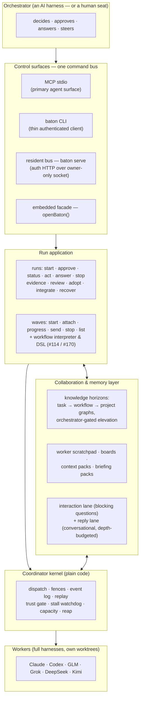

<div align="center">


*Flip the Sorcerer's Apprentice — the project mascot — conducts. The mark and its lineage live in [`docs/assets/brand/`](docs/assets/brand/).*

</div>

# baton

**Cross-harness agent orchestration.** An orchestrator agent running in one full coding harness directs *other* full-session harnesses as subordinate workers — with real messaging, telemetry, mid-flight steering, and durable evidence — rather than the flat "spawn a process, wait for stdout" pattern.

The name: a conductor's baton directs an orchestra; a relay baton gets passed between runners. Both are the point.

> **This is the product document.** Campaign progress, the staged in-flight roster, and the
> planned-issue map live in the
> [progress ledger](docs/reference/progress-ledger-2026-08-14.md) —
> [docs/PROGRESS.md](docs/PROGRESS.md) carries the per-phase narrative.

---

## What baton is

A run-centric **fleet application**: you (or your orchestrator agent) state an outcome; baton compiles it into an approved Plan, routes it onto live worker seats across vendors, watches liveness, fields questions, verifies results against evidence it re-derives itself, and closes every resource it opened. One orchestrator can run **many workers in parallel as waves**, and can declare a whole multi-member workflow — heavyweight coordinator over cheap swarm rows, steering policies, harvest contract — as **one data file** run through the surface (`waves run`), no bespoke driver code.

Underneath the application sits the substrate that makes that dependable — **the Coordinator**, a plain-code reliability kernel:

- **A coordination store that is the only truth.** Every dispatch, command, event, and decision lands in an append-only log; every view, index, and projection is rebuilt from it by replay. If a projection corrupts, delete it and replay ([SYSTEM.md §3.3](SYSTEM.md)).
- **Fencing.** Every command carries the worker's current version stamp; stale commands are rejected instead of misfiring — this is also how "the human always wins over the AI" is enforced, not promised ([SYSTEM.md §3.3](SYSTEM.md), `impl/test/fence.test.mjs`).
- **Content-addressed result pins.** A worker's result is captured as a commit and pinned as a content-addressed git object; verification runs in a *fresh* worktree at that pin — the worker's own directory is never trusted (the trust gate, below).
- **Waves and the workflow interpreter.** A wave starts N members with per-member scopes and exact routes; re-drive restarts only the failed members. The interpreter drives a declared workflow spec — members, steering policies, decision deferral, harvest contract — to a verdict and a seven-key D6 receipt (#114, `impl/test/workflow-as-data-red.test.mjs`; `impl/test/wave-attach-red.test.mjs`).
- **The workflow DSL (#170).** Workflows are authored as data files — a closed grammar compiled through the `waves compile` seam with steering cross-validation and admission-time refusal. The campaign itself now runs on it: contract foundries, suites, folds, and impl waves are `*.wavefile`s (`impl/test/workflow-dsl-red.test.mjs`, `impl/test/workflow-dsl-package-red.test.mjs`).
- **Collaboration lanes.** A blocking decision channel (workers ask multi-choice + free-response questions that park the run at `input_required` until answered), depth-budgeted reply lanes, the typed worker scratchpad, shared boards, context/briefing packs, and task→workflow→project knowledge horizons (#10, #105, #33, #103; suites cited in the ledger below).

The orchestrator is an AI; the coordinator is not — that asymmetry is the design.

The fleet today: **Claude** (opus/sonnet), **Codex** (gpt-5.6-sol), **Grok** (grok-4.5), **GLM** 5.2/5.3, **DeepSeek** (`deepseek-v4-flash` wide seats, `deepseek-v4-pro[1m]` heavyweight), and **Kimi** k3 — each worker a full harness session with its own tools, sandbox, and context management, in its own git worktree ([impl/CLI.md](impl/CLI.md) fleet table; campaign routes in [impl/scripts/resident.deployment.mjs](impl/scripts/resident.deployment.mjs)).

---

## Architecture



**The surfaces share one authority.** The CLI is a bearer-authenticated client of the resident bus, not a second controller; MCP is the primary agent-facing northbound; `openBaton({repo, advanced})` is the direct-embedding path the evidence drivers use. `baton serve` publishes discovery to `.git/baton/connection.json` only after an authenticated card/session/readiness challenge; credentials are never command arguments ([impl/CLI.md](impl/CLI.md), [impl/MCP.md](impl/MCP.md); `impl/test/phase89-resident-*`).

**Turns, not gates.** Pausable harnesses end turns as checkpoints — the driver steers with nudge/wait/claim instead of killing workers at turn boundaries, and every pause snapshots a recovery pin (#31; `impl/test/turn-checkpoints-31*-red.test.mjs`). The **stall watchdog** (#67) declares stalls only on liveness *evidence* — an in-flight turn is never reaped; the slow-but-productive worker is structurally protected — with an escalate → claim/nudge → preserve-first-reap ladder, every step receipted (`impl/test/stall-watchdog-red.test.mjs`).

**Trust is re-derived, never reported.** When a worker says "done," the coordinator re-runs the verification in a *fresh* worktree at the worker's commit. Red→green enforcement, coverage-of-change, and mutation probes harden the gate; `run.review` sends the immutable result to an independently-routed reviewer; `run.adopt` / `run.integrate` are separate, policy-gated effects ([SYSTEM.md §5.1](SYSTEM.md); `impl/test/trust-gate-steering-red.test.mjs`, `impl/test/decision-gate-trust-gate-red.test.mjs`).

---

## Quickstart

Requires Node ≥ 20. The only runtime dependency is `@ast-grep/napi`.

```bash
cd impl && npm ci                     # install
node scripts/run-suite.mjs            # the canonical gate (see the tier note above)
node scripts/baton.mjs serve          # start the owner-local resident
node scripts/baton.mjs doctor --check # connection + exact-route readiness
node scripts/baton.mjs waves list     # live wave registry (roster, phase, progress class)
node scripts/baton.mjs waves run path/to/workflow.json   # a whole workflow, as data
node scripts/baton.mjs waves compile path/to/spec.dsl   # the #170 DSL, admission-checked
```

The full verb inventory is generated from the executable registry — drift from served truth fails the suite: [impl/CLI.md](impl/CLI.md) · [impl/MCP.md](impl/MCP.md). The resident's fleet routes are declared in [impl/scripts/resident.deployment.mjs](impl/scripts/resident.deployment.mjs). MCP wiring for your harness (Claude Code / Kimi / Codex): [impl/MCP.md](impl/MCP.md).

---

## Capability ledger

> **Reading the tiers.** Every row below is labeled **LANDED** (in `master`, pinned green by
> the canonical suite `node impl/scripts/run-suite.mjs`), **IN-FLIGHT** (mid-pipeline:
> contract → adversarial red-team → fold → red-first suite → blue-team → fold →
> implementation), or **PLANNED** (filed as a tracked issue, not started). In-flight work
> lands as *red-first* suites — tests that fail at a named stage until the capability ships —
> so the gate exits nonzero **by construction** while pinned future behavior exists: every
> LANDED row is green, and the red set is exactly the declared in-flight roster. The staged
> roster and the planned map live in the
> [progress ledger](docs/reference/progress-ledger-2026-08-14.md).

### LANDED (landed, gate-verified)

**Orchestration core**
- **Runs** — the ordinary API: concise intent → readable Plan → visible approval → one bounded RunView → attention → evidence → cleanup. `run.start / view / approve / act / answer / stop / evidence / review / adopt / integrate / recover` *(suite: `impl/test/phase64-integrated-run-application.test.mjs`; surface: [impl/CLI.md](impl/CLI.md))*.
- **Waves** — multi-member orchestration with durable wave identity, per-member scopes/routes, attach-and-harvest, re-drive-the-failed *(suites: `impl/test/wave-attach-red.test.mjs`, `impl/test/waves-run-detach-red.test.mjs`)*, and the live registry projection — **#132**: `waves list` on CLI/bus/MCP, roster + phase + progress class *(suite: `impl/test/wave-observability-red.test.mjs`)*.
- **Workflow-as-data** — **#114** — whole multi-member workflows as one declarative spec through `baton.recipes.runWorkflow` / `baton waves run` / `baton_waves_run`: closed member fields, steering policy map, decision deferral to the human, harvest with `mustContain`, the closed seven-key D6 receipt *(suite: `impl/test/workflow-as-data-red.test.mjs`)*.
- **The workflow DSL** — **#170** — the `*.wavefile` grammar compiled through `waves compile` with steering cross-validation and admission-time `{line, field, expected}` refusal; the campaign's own waves now author through it *(suites: `impl/test/workflow-dsl-red.test.mjs`, `impl/test/workflow-dsl-package-red.test.mjs`)*.
- **The resident** — `baton serve`: a standing owner-local deployment publishing an authenticated bus over an owner-only Unix socket; CLI and MCP clients discover it through `.git/baton/connection.json`; signal close revokes only the current incarnation *(suites: `impl/test/phase89-resident-*.test.mjs`, `impl/test/mcp-web-local-resident-red.test.mjs`)*.
- **Turn-checkpoint steering** — **#31** — nudge/wait/claim instead of turn-boundary kills; every pause snapshots a recovery pin *(suites: `impl/test/turn-checkpoints-31a-red.test.mjs`, `…-31b-red.test.mjs`, `…-31b5-surface-red.test.mjs`)*.

**Communication & attention**
- **waitingOn vocabulary** — **#10** — one honest projection of what a run is waiting on (the closed five kinds), surfacing *blocked_interaction* so an orchestrator never has to guess that it must act *(suites: `impl/test/issue10-waiting-vocabulary-red.test.mjs`, `impl/test/issue10-blocked-interaction-red.test.mjs`)*.
- **Reply lanes** — **#105** — blocking asks ride the interaction lane; conversational follow-ups ride depth-budgeted reply chains; membership-authorized, replay-exact *(suite: `impl/test/reply-chains-red.test.mjs`)*.
- **Briefing packs** — **#103** — the orchestrator-readable `wave.closed` record: what the wave did, per member, with result pins *(suite: `impl/test/briefing-pack-red.test.mjs`)*.
- **Decision channel** — workers ask multi-choice (+ free-response) questions that park the task at `input_required` until the orchestrator or a steering policy answers — the escalation lane the worker-orchestrated swarm rides *(suites: `impl/test/reflex1-decision-requests-red.test.mjs`, `impl/test/kg12-decisions-red.test.mjs`)*.
- **Worker delivery push** — **#79** — gate verdicts and attention pushed into the judged worker's next-turn brief via the BD3-C minted-sender message lane *(suite: `impl/test/worker-delivery-push-red.test.mjs`; landed `d8282d0`, 32/32)*.

**Memory & collaboration**
- **Knowledge horizons (write path)** — task-ephemeral → workflow-ephemeral → project-persistent knowledge graphs with orchestrator-gated elevation; the worker's typed scratchpad (**#33**) writes into its task-ephemeral graph; shared boards and context packs carry cross-member state *(suites: `impl/test/scratchpad-33-red.test.mjs`, `impl/test/kg-settlement-red.test.mjs`, `impl/test/board-workerhalf-red.test.mjs` — #78; the read/activation arc is in flight, below)*.
- **REPL layer** — shared cells, typed bindings, cross-run scripting *(suites: `impl/test/repl1-manifest-red.test.mjs`, `impl/test/repl1-kind-inventory-red.test.mjs`, `impl/test/repl23-bindings-red.test.mjs`; [docs/33](docs/33-shared-objects-repl-layer.md))*.
- **Cairn memory** (Phases 44–53) — verified route statistics, causal integrity audit, bounded recall, selective promotion, scratch correction with independent-oracle release, recall-outcome attribution, authenticated contradiction workspace *(specs: `spec/phase44/` … `spec/phase53/`; e.g. `impl/test/phase44-cairn-route-stats.test.mjs`, `impl/test/phase50-cairn-scratch-correction.test.mjs`)*.

**Trust & evidence**
- **The trust gate** — fresh-worktree re-verification, red→green, coverage-of-change, mutation probes, turn-based steering cycle; independent semantic review over immutable git ranges; bounded evidence manifests; policy-gated adopt/integrate *(suites: `impl/test/trust-gate-steering-red.test.mjs`, `impl/test/decision-gate-trust-gate-red.test.mjs`; [SYSTEM.md §5.1](SYSTEM.md))*.
- **Atlas representations** (Phases 54, 61) — lexical-binding-aware CPG, graph-backed R1 structural delta / R2 SCIP snapshot / R3 bounded CPG delta, content-addressed and replay-exact *(specs: `spec/phase54/`, `spec/phase61/`; suites: `impl/test/phase54-atlas-cpg-lexical-bindings.test.mjs`, `impl/test/phase61-representation-*.test.mjs`)*.
- **Dependency & supply-chain chain** (Phases 36–43) — exact dependency dossiers + actual-lockfile SBOM, immutable reuse decisions, advisory TTL invalidation, isolated install graphs, transitive advisory projection, policy-epoch reconciliation, adverse provider ingress *(specs: `spec/phase36/` … `spec/phase43/`; e.g. `impl/test/phase36-quartermaster-external.test.mjs`, `impl/test/phase37-lockfile-sbom.test.mjs`)*.
- **Fleet governance** — exact provider process lifecycle + reap (51), route-bound provider governance (57), canonical sparse worker/verifier authority (58), repo-scoped worktree capacity authority (59), attach-only native recovery (60), public drain/close (56) *(specs: `spec/phase51/`, `spec/phase56/` … `spec/phase60/`; e.g. `impl/test/phase51-process-lifecycle.test.mjs`)*.
- **Stall watchdog** — **#67** — evidence-based liveness: closed re-arm kinds, the in-flight-turn gate, null-deadline interaction sweep, the preserve-first kill ladder *(suite: `impl/test/stall-watchdog-red.test.mjs`)*.

**Surface engineering**
- **Unified control grammar** — **#43** — one grammar across embedded/Web/CLI/MCP; executable per-profile inventories; generated `CLI.md`/`MCP.md`; the surface-conformance gate (novel divergence fails the suite) *(suites: `impl/test/grammar-m1-red.test.mjs` … `grammar-m5-red.test.mjs`, `impl/test/control-surface-truth-red.test.mjs`; [docs/36](docs/36-unified-control-grammar.md))*.
- **Adapter cards** — every harness publishes native/emulated/unsupported per control; the driver never pretends an emulated steer is a real one *(doc: [SYSTEM.md §6](SYSTEM.md); spec: `spec/adapter-contract.md`; suites: `impl/test/adapter.test.mjs`, `impl/test/cli-adapters.test.mjs`)*.

### IN-FLIGHT (mid-pipeline; waves running)

Stage-by-stage detail in the [progress ledger](docs/reference/progress-ledger-2026-08-14.md). Headlines: **#74** worker-orchestrated swarms (impl running on the heavyweight seat) · **#155–#160** the #147 control-surface honesty cluster (suites folded; impl-honesty waves running) · **#61** worker verdict surface · **#70** cross-deployment knowledge · **#72** prescriptive doctor · **#73** feedback-forge hardening · **#77** suite resource governance · **#144** LSP pool (suite-fold running) · the serialized impl lane's queued red-first suites (**#69, #59, #66, #71, #80, #99, #12, #102**) · the 2026-08-14 dispatches (**#149** gate digest · **#99/#179** result accessor · **#146** seat telemetry · **#161** plan object · **#24–#27/#186** KG read-path activation).

### PLANNED (filed, not started)

~112 tracked issues; the lossless catalog is [docs/28](docs/28-exhaustive-capability-audit.md) and the [issue tracker](https://github.com/wahargis/baton/issues). Thematic headlines: **#9** the Program IR trunk (closed, replayable, content-addressed workflow programs — #170's DSL is its surface syntax) · the completed collaboration layer (**#19, #96, #104, #122**) · orchestration depth (**#162** mid-flight mutability · **#163** quiescence completion · **#164** blind waits fail loud · **#165** launch-time harvest validation) · kernel honesty under **#169**'s umbrella (**#143, #95, #98, #148, #168**) · eval & proof (**#107** EVAL-R0, pre-registered) · the Flip experience (**#115/#133**, [docs/38](docs/38-flip-experience.md)). The full map: [progress ledger](docs/reference/progress-ledger-2026-08-14.md).

---

## Documentation map

- **[SYSTEM.md](SYSTEM.md)** — the authoritative system design (read it second).
- **[docs/reference/progress-ledger-2026-08-14.md](docs/reference/progress-ledger-2026-08-14.md)** — the campaign/status companion to this README (in-flight roster, planned map, methodology).
- **[docs/PROGRESS.md](docs/PROGRESS.md)** — the per-phase progress ledger (the status narrative).
- **[docs/26](docs/26-full-system-goal.md)** — the retained full-system goal; **[docs/28](docs/28-exhaustive-capability-audit.md)** — the lossless capability audit.
- **[GLOSSARY.md](GLOSSARY.md)** — any leftover jargon.
- **[docs/assets/brand/](docs/assets/brand/)** — the Flip persona, the baton mark, and their lineage.
- **Design docs (`docs/`)** — the full table of the exploration corpus (problem framing through representation ladder) is preserved in the [superseded README](docs/reference/README-superseded-2026-08-13.md); nothing was discarded.
- **Specs (`spec/`)** — per-phase implementation contracts; the campaign-era contracts/red-teams/folds live in **`docs/reference/evidence/<epic>-<date>/`** (the spec-driven pipeline's working papers).
- **Issues** — [github.com/wahargis/baton/issues](https://github.com/wahargis/baton/issues): the tracked in-flight + planned roster.
- **The orchestrator friction ledger** — [docs/reference/evidence/frontier-sweep-2026-08-03/orchestrator-friction-ledger.md](docs/reference/evidence/frontier-sweep-2026-08-03/orchestrator-friction-ledger.md): every AX friction the orchestrator hit while building baton with baton, with dispositions.
