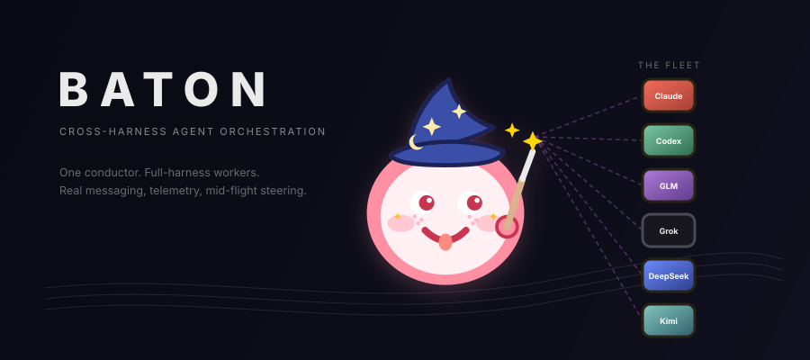

<div align="center">



</div>

# baton

**Cross-harness agent orchestration.** Can an orchestrator agent running in one full coding harness (Claude Code CLI, Codex CLI, Kimi Code) direct *other* full-session harnesses (Codex CLI, Claude Code CLI, Z.ai GLM harness, Grok Build) as subordinate workers — with real messaging, telemetry, and mid-flight interruption/steering — rather than the flat "spawn a process, wait for stdout" pattern?

The name: a conductor's baton directs an orchestra; a relay baton gets passed between runners. Both are the point.

## The core question

Every CLI coding agent today can *shell out* to another CLI coding agent. That's not orchestration — it's a blocking subprocess with a string result. Orchestration means:

- **Full-harness workers** — the subordinate keeps its own tools, sandbox, permissions, session state, and context management. You're delegating to *Codex-the-product*, not GPT-the-model.
- **Bidirectional messaging** — workers report progress and ask questions; the orchestrator answers without killing the run.
- **Telemetry** — normalized event stream (turns, tool calls, file edits, tokens, cost) across vendors, observable live.
- **Interruption & steering** — pause, redirect, or cancel a worker mid-turn from the orchestrator or from a human seat.
- **Symmetry** — the same machinery works Claude→(GPT+GLM) and GPT→(Claude+GLM). No privileged vendor.

## What baton is

A run-centric **fleet application** — one orchestrator agent directs full Claude Code / Codex /
Kimi Code / GLM 5.2 / Grok / DeepSeek workers across vendors while Baton compiles the objective
into approved
work, routes it, watches it, handles attention, verifies it, and closes its resources. The
Coordinator is the safety kernel beneath that application, not the interface every agent should
have to assemble manually. `Claude → (Codex + GLM)` and `Codex → (Claude + GLM)` remain core uses.

**Everything else supports the driver, and none of it is dropped:** independent verification (re-running a worker's tests so "done" can be trusted), learned routing (which vendor is good at what), a reliable coordination core (so "interrupt worker 3" always lands), telemetry/replay, and worker tools (search, debug, semantic diff). Earlier docs over-billed the *verification* as the product and demoted the *driving* to optional — doc 19 turns that right-side-up.

## Status

Baton is a runnable dependency-light Node ESM reference implementation, not a prototype skeleton.
The canonical suite is **2922/2922 green**. The fleet driver (Phases 1–65), the AX/lifecycle spine
(Phases 90–92.x), and the closed Baton Program IR slices (93a.1–93a.3a, issue #9) are shipped
underneath; the **agent-orchestration stack** is now first-class: waves with durable identity
(attach-and-harvest + re-drive-the-failed, 93B), a productized wave driver (`createWaveDriver`,
issue #46), the reflexive layer (decision channel, boards, packages, `context_eval`), the REPL
layer, knowledge horizons (task/workflow/project graphs with orchestrator-gated elevation),
the worker scratchpad (issue #33), and turn-checkpoint steering (issue #31). The unified
control-surface grammar (issue #43, docs/36) has landed M0–M4b plus the server-truth
conformance rung (executable per-profile inventories, generated docs, dead-path resolution,
`run.debug` registered). Fleet: Claude (opus/sonnet), Codex gpt-5.6-sol, Grok 4.5, GLM 5.2,
and DeepSeek (`deepseek-v4-flash` primary, `deepseek-v4-pro[1m]` pre-update opt-in) are live
worker families; Kimi k3 rides the Claude credential path (adapter over-strictness is issue
#54). Progress ledger: **[docs/PROGRESS.md](docs/PROGRESS.md)**.
Open work: **[issues #2–#55](https://github.com/wahargis/baton/issues)**.

## Architecture, plainly

The ordinary surface is one **Run application**: concise intent and deployment profile, visible
Plan approval, exact route, one bounded RunView, attention, evidence, and cleanup. Underneath,
the reliable Coordinator kernel makes dispatch, fencing, verification, replay, and reap exact.

- **Surfaces.** Direct embedding (`openBaton`), authenticated Web, the `baton` CLI, MCP stdio,
  and the browser Run desk share one command bus — the CLI is a thin authenticated Web client,
  not another fleet controller. `baton serve` starts the owner-local resident with no
  configuration module: authenticated HTTP over an owner-only Unix socket, discovery published
  only after an authenticated card/session/readiness challenge, and signal close that revokes
  only the current incarnation. Credentials are never command arguments.
- **The orchestration stack.** `baton.waves` runs multi-member orchestration waves with
  per-member scopes, live progress, outcome materialization, and steering; the reflexive layer
  gives workers a durable decision channel (multi-choice + free response, orchestrator-gated),
  shared and per-worker boards, context packages, and `application.context_eval`; the REPL
  layer shares cells, typed bindings, and cross-run scripting; knowledge horizons project
  task-ephemeral, workflow-ephemeral, and project-persistent graphs with orchestrator-gated
  elevation; and the scratchpad (issue #33) is the worker's typed write surface into its
  task-ephemeral graph.
- **Turns, not gates.** Pausable harnesses end turns as turn-checkpoints (issue #31): the
  driver steers with `nudge_turn` / `wait_turn` / `claim_turn` instead of killing workers at
  turn boundaries, and every pause snapshots a recovery pin. Semantic `run.send` /
  `run.interrupt` move durably through admitted → effect-started → provider-acknowledged →
  settled, so restart either executes a still-safe admission or exposes an explicit unknown
  outcome.
- **Trust and evidence.** Independent verification re-runs a worker's tests before "done" is
  believed; `run.review` launches a deployment-pinned independent reviewer over immutable Git
  ranges; `run.evidence` returns a bounded manifest; policy-gated `run.adopt` selects a result
  without merging or publishing; `run.integrate` delegates one local `ff-only` or structured
  transaction. Episode/workstream projections attribute evidence by role and generation.
- **Fleet tier.** Southbound, persistent Claude stream-json, Codex app-server, Kimi ACP, and
  Grok ACP sessions are the product tier; one-shot subprocess adapters remain an explicitly
  limited fire-and-forget tier. GLM 5.2 and DeepSeek (`deepseek-v4-flash` primary,
  `deepseek-v4-pro[1m]` pre-update opt-in) ride Anthropic-compatible session shims against
  repo-local key files. Learned routing records which vendor is good at what; GLM work
  is restricted to `glm-5.2` with effort chosen explicitly by the orchestrator.

The full verb inventory lives in [impl/CLI.md](impl/CLI.md) and [impl/MCP.md](impl/MCP.md);
the retained capability scope (Goal/Plan, causal graph, Vantage, Evidence Ladder, Scratch,
Skill Forge, Atlas AST/CST/SCIP/CPG/IR, semantic merge, behavioral fingerprint, evaluation)
remains in [docs/28](docs/28-exhaustive-capability-audit.md). Homelab integration is excluded.

## Run it

Requires Node ≥ 20. The only runtime dependency is `@ast-grep/napi`.

```bash
cd impl && npm ci        # install
npm test                 # canonical suite (currently 2834/2834 green)
node scripts/baton.mjs serve                              # start the owner-local resident
node scripts/baton.mjs doctor --check                     # connection + exact-route readiness
node scripts/baton.mjs review "attack the settlement-domain rule" \
  --exact glm/glm-5.2@xhigh --exact kimi-code/kimi-code/k3@high
```

The resident publishes discovery to `.git/baton/connection.json`; the CLI and MCP clients find it
through repository discovery. `openBaton({ repo, advanced })` from `impl/src/index.mjs` is the
direct-embedding path used by the evidence drivers under `docs/reference/evidence/`.

## → Read [SYSTEM.md](SYSTEM.md) first

**[SYSTEM.md](SYSTEM.md) is the concise architecture overview.**
[docs/PROGRESS.md](docs/PROGRESS.md) is the per-phase progress ledger;
[docs/26](docs/26-full-system-goal.md) is the retained full-system goal and scope ledger;
[docs/28](docs/28-exhaustive-capability-audit.md) is the shipped/partial/pending status audit.
[GLOSSARY.md](GLOSSARY.md) decodes any leftover jargon.

## Design docs (`docs/`)

| Doc | Contents |
|-----|----------|
| [00-brief](docs/00-brief.md) | Problem statement, expanded research agenda, framing |
| [01-landscape](docs/01-landscape.md) | Cited deep-research report: protocols, control surfaces, prior art, ToS |
| [02-harness-control-surfaces](docs/02-harness-control-surfaces.md) | Per-harness capability matrix (verified against installed binaries) |
| [03-protocol-analysis](docs/03-protocol-analysis.md) | ACP vs A2A vs MCP vs bespoke — the layer model |
| [04-architecture-options](docs/04-architecture-options.md) | Candidate designs, tradeoffs, recommendation |
| [05-telemetry-steering](docs/05-telemetry-steering.md) | Event schema, monitoring, corrected interruption/steering semantics |
| [06-critiques-and-quibbles](docs/06-critiques-and-quibbles.md) | Failure modes, security, the hard problems |
| [07-roadmap](docs/07-roadmap.md) | Build sequence (revised: eval + differentiating demo front-loaded) |
| [08-shared-memory-and-pm](docs/08-shared-memory-and-pm.md) | Three-tempo memory model; project-manager as foil |
| [09-revision-log](docs/09-revision-log.md) | Round-1 review: every finding → disposition → the doc change it forced |
| [10-interaction-model](docs/10-interaction-model.md) | Two channels (comms/steering) + three topologies; *paradigm framing deflated in round 2* |
| [11-capability-plane](docs/11-capability-plane.md) | The seven agent-shaped capability modules (search/debug/evidence/REPL/skills/orient/BoK) |
| [12-context-harness-engineering](docs/12-context-harness-engineering.md) | Context composition, agentic-first tools, interop; *emergence/ensemble claims revised in round 2* |
| [13-revision-log-r2](docs/13-revision-log-r2.md) | Round-2 red/blue/explore: the Referee-not-Conductor reframe + all six REVISE verdicts |
| [14-practitioner-addenda](docs/14-practitioner-addenda.md) | 30 net-new directions/critiques/features in my own voice: agent experience, context/harness craft, operator DX, the subtractive thesis |
| [15-representation-and-computation](docs/15-representation-and-computation.md) | Re-anchor (Conductor is the ask; Referee is its trust spine) + the representation ladder (AST→CPG→IR→e-graph) and beyond-frontier self-ideated ideas (semantic diff/merge, behavioral fingerprint, attestation-overlay) |
| [PROGRESS](docs/PROGRESS.md) | Per-phase progress ledger (the status narrative, kept current) |
| [31-wave-driver-ax](docs/31-wave-driver-ax.md) | The Wave surface: first-class orchestration drivers (failure-mode-baked semantics) |
| [32-reflexive-orchestration](docs/32-reflexive-orchestration.md) | Reflexive layer: typed decision channels, task boards, knowledge hand-off objects, REPL objects |
| [33-shared-objects-repl-layer](docs/33-shared-objects-repl-layer.md) | The REPL layer: shared cells, typed bindings, cross-run scripting |
| [34-knowledge-horizons](docs/34-knowledge-horizons.md) | Task/workflow/project knowledge graphs with orchestrator-gated elevation |
| [35-turn-checkpoints](docs/35-turn-checkpoints.md) | Pausable turns + nudge/wait/claim steering (steer, don't gate) |
| [36-unified-control-grammar](docs/36-unified-control-grammar.md) | One grammar: the unified agent control surface (M0/M1 landed) |
| [37-wave-driver](docs/37-wave-driver.md) | The shipped wave driver: productized poll/steer/settle loop (issue #46) |
| [28-exhaustive-capability-audit](docs/28-exhaustive-capability-audit.md) | Current shipped/partial/pending/retired map; supersedes the Phase-10 matrix for status without deleting any research row |
| [19-north-star-corrected](docs/19-north-star-corrected.md) | The fleet driver is the product; verification/routing/memory support it |
| [22-completeness-audit](docs/22-completeness-audit.md) | The built-not-wired audit that drove phases 8–10 |
| [24-goal-system-completion](docs/24-goal-system-completion.md) | Phase-10 whole-system goal and completion record |
| [25-capability-gap](docs/25-capability-gap.md) | Current researched-versus-shipped inventory and phase-11 boundary |
| [30-objective-review-and-route-readiness](docs/30-objective-review-and-route-readiness.md) | Issue-10 P0 objective review preset, capability-aware actions, connected doctor, and exact-route readiness |

Capability module designs: [docs/capabilities/](docs/capabilities/). Context/harness angle designs: [docs/reference/context-harness/](docs/reference/context-harness/).

**Specs** (`spec/`): [adapter-contract](spec/adapter-contract.md) (verb→real-API mapping per harness), [supervisor-state-machine](spec/supervisor-state-machine.md) (the durable control plane), [phase-93 closed Program IR](spec/phase93-closed-program-ir.md) (the Program v1 contract, built in slices), and [phase-10.1 reconciliation](spec/phase10.1/spawn-stop-reconciliation.md) (async spawn/stop ownership and the recursive-live safety gate).

**Reviews** (`reviews/`): [codex-external-review](reviews/codex-external-review.md) (cross-vendor red-team), [steering-interruption-redteam](reviews/steering-interruption-redteam.md) (the subordination-reliability red-team).

**Reference** (`docs/reference/`): implementation-grade dossiers plus committed live ledgers. The completed recursive fleet and four-Grok reap runs are under `docs/reference/evidence/`.
