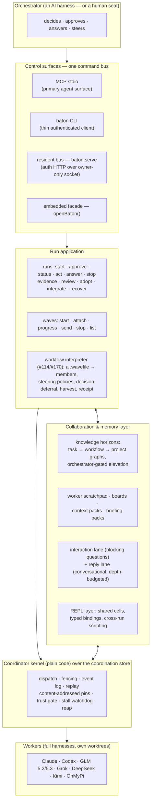

<div align="center">


</div>

# baton

**Cross-harness agent orchestration.** An orchestrator agent running in one full coding harness directs *other* full-session harnesses as subordinate workers — with real messaging, telemetry, mid-flight steering, and durable evidence — rather than the flat "spawn a process, wait for stdout" pattern.

The name: a conductor's baton directs an orchestra; a relay baton gets passed between runners. Both are the point.

> **Brand.** The mark is *Flip*, the project mascot as the Sorcerer's Apprentice — conductor's
> baton mid-downbeat in paw. Assets live in [`docs/assets/brand/`](docs/assets/brand/); the
> persona grammar (poses as a status channel, rendered only on stderr — stdout stays
> machine-clean) is designed in [`docs/38-flip-experience.md`](docs/38-flip-experience.md).

> **Campaign & progress.** This README is the product doc. Campaign tracking — the dated
> reports, the red-first methodology, the current checkpoint, the live wave fleet — moved to
> [`docs/reference/progress-ledger-2026-08-14.md`](docs/reference/progress-ledger-2026-08-14.md).
> Nothing was dropped; it all lives there, cross-referenced.

---

## What baton is

A run-centric **fleet application** on top of an **orchestration substrate**. You (or your orchestrator agent) state an outcome; baton compiles it into an approved Plan, routes it onto live worker seats across vendors, watches liveness, fields questions, verifies results against evidence it re-derives itself, and closes every resource it opened. One orchestrator can run **many workers in parallel as waves**, and can declare a whole multi-member workflow — heavyweight coordinator over cheap swarm rows, steering policies, harvest contract — as **one data file** (a `.wavefile` DSL document) run through the surface (`waves run`), no bespoke driver code.

The fleet today: **Claude** (opus/sonnet), **Codex** (gpt-5.6-sol), **Grok** (grok-build, 4.5), **GLM** 5.2/5.3, **DeepSeek** (`deepseek-v4-flash` wide seats, `deepseek-v4-pro[1m]` heavyweight), and **Kimi** k3 — each worker a full harness session with its own tools, sandbox, and context management, in its own git worktree. An **OhMyPi native member adapter** rides omp's RPC stdio protocol (#228). Waves settle on evidence, never a clock — the no-clock law (#163).

Underneath the application sits the **Coordinator**: a plain-code reliability kernel (version fencing, confirm-it-stopped, at-least-once cursors, answer-exactly-once, log-is-truth) over the **coordination store** — an append-only event ledger that makes replay, content-addressed result pins, and "interrupt worker 3, reliably" properties of the substrate, not of the driver. The orchestrator is an AI; the coordinator is not — that asymmetry is the design.

---

## Architecture



**The surfaces share one authority.** The CLI is a bearer-authenticated client of the resident bus, not a second controller; MCP is the primary agent-facing northbound; `openBaton({repo, advanced})` is the direct-embedding path the evidence drivers use. `baton serve` publishes discovery to `.git/baton/connection.json` only after an authenticated card/session/readiness challenge; credentials are never command arguments.

**Waves are the unit of parallel work.** A wave starts N members with per-member scopes and exact routes; the registry (`waves list`) projects roster, phase, and progress class live; outcome materialization pins each member's result as a content-addressed git object; re-drive restarts only the failed members. The **workflow interpreter** composes entire patterns declaratively: a spec (.wavefile) names members, steering policies (`approveOnAdvertisedPlan`, `nudgeOnCheckpoint`, `claimOnStall`, `messageOnSpawn`, `elevateWhenNotes`, `answerDecisions`, `signalOnMembersDone`), and a harvest contract; the interpreter drives it to a verdict and a seven-key receipt. Launches detach at the bus (#173) — admission is synchronous, the drive is a continuation.

**Turns, not gates; evidence, not clocks.** Pausable harnesses end turns as checkpoints — the driver steers with `nudge_turn` / `wait_turn` / `claim_turn` instead of killing workers at turn boundaries, and every pause snapshots a recovery pin. Waves settle on quiescence-derived evidence, never elapsed time (#163): the hardCap wall clock and the per-adapter fate clocks are gone. The **stall watchdog** (#67) declares stalls only on liveness *evidence* (a closed re-arm set; an in-flight turn is never reaped — the slow-but-productive worker is structurally protected), with an escalate → claim/nudge → preserve-first-reap ladder, every step receipted.

**Trust is re-derived, never reported.** When a worker says "done," the coordinator re-runs the verification in a *fresh* worktree at the worker's commit — the worker's own directory is never trusted. Red→green enforcement, coverage-of-change, and mutation probes harden the gate; `run.review` sends the immutable result to an independently-routed reviewer; `run.adopt` / `run.integrate` are separate, policy-gated effects.

---

## Quickstart

Requires Node ≥ 20. The only runtime dependency is `@ast-grep/napi`.

```bash
cd impl && npm ci                       # install
node scripts/run-suite.mjs              # the canonical gate (red rows = declared in-flight pins)
node scripts/baton.mjs serve            # start the owner-local resident
node scripts/baton.mjs doctor --check   # connection + exact-route readiness
node scripts/baton.mjs waves list       # live wave registry (roster, phase, progress class)
node scripts/baton.mjs waves run path/to/workflow.wavefile   # a whole workflow, as data
```

The full verb inventory is generated from the executable registry: [impl/CLI.md](impl/CLI.md) · [impl/MCP.md](impl/MCP.md). The resident's fleet routes are declared in [impl/scripts/resident.deployment.mjs](impl/scripts/resident.deployment.mjs).

---

## Capability ledger

> **Reading the tiers.** LANDED = gate-verified on `master` (the canonical suite is green on the
> capability's own rows). IN-FLIGHT = mid-pipeline, wave running, current stage named. PLANNED =
> filed on the [issue tracker](https://github.com/wahargis/baton/issues), not started. Every claim
> cites a suite, a doc, or an issue — nothing here is aspirational. The full methodology and the
> current campaign state live in
> [`docs/reference/progress-ledger-2026-08-14.md`](docs/reference/progress-ledger-2026-08-14.md).

### LANDED (gate-verified)

**Orchestration core**
- **Runs** — the ordinary surface: concise intent → readable Plan → visible approval → one bounded RunView → attention → evidence → cleanup. `run.start / status / approve / act / answer / wait / stop / evidence / review / adopt / integrate / recover`. Generated verb inventory: [impl/CLI.md](impl/CLI.md) + [impl/MCP.md](impl/MCP.md), conformance-gated (#43, [docs/36](docs/36-unified-control-grammar.md); `impl/test/control-surface-truth-red.test.mjs`).
- **Waves** — multi-member orchestration with durable wave identity, per-member scopes/routes, attach-and-harvest, re-drive-the-failed, and the live registry projection (**#132**; `impl/test/waves-list-scaling-red.test.mjs`; WLS-1 single-pass steering index, `8551955`).
- **Workflow-as-data + the workflow DSL** (**#114**/**#170**) — a wave is one `.wavefile` (named members, exact routes, scopes, objectiveRef briefs, steering policies, harvest contract); `baton waves run` / `waves compile` drive it. Suites `impl/test/workflow-dsl-red.test.mjs` (35/35) + `impl/test/workflow-dsl-package-red.test.mjs` (12/12).
- **Detached launches** (**#173**) — `waves.run` accepts synchronously and drives as a continuation; the bus survives launches (`impl/test/waves-run-detach-red.test.mjs`; `ac0f5bc`).
- **The resident** — `baton serve`: an owner-local deployment publishing an authenticated bus over an owner-only Unix socket; CLI and MCP clients discover it through `.git/baton/connection.json` ([impl/CLI.md](impl/CLI.md)).
- **Turn-checkpoint steering** (**#31**, [docs/35](docs/35-turn-checkpoints.md)) — nudge/wait/claim instead of turn-boundary kills; every pause snapshots a recovery pin.
- **Quiescence-derived completion — the no-clock law** (**#163**) — the `hardCap` clock and the wall-time fate clock removed across adapters (`8ec52a6c`, `b271406f`); waves settle on evidence (`impl/test/quiescence-completion-red.test.mjs`).

**Communication & attention**
- **waitingOn vocabulary** (**#10**) — the closed five kinds, surfacing `blocked_interaction` (`impl/test/issue10-waiting-vocabulary-red.test.mjs`).
- **Reply lanes** (**#105**) — blocking asks ride the interaction lane; conversational follow-ups ride depth-budgeted reply chains.
- **Briefing packs** (**#103**) — the orchestrator-readable `wave.closed` record: what the wave did, per member, with result pins.
- **Decision channel** — workers ask multi-choice (+ free-response) questions that park the task at `input_required` until the orchestrator or a steering policy answers.

**Memory & collaboration**
- **Knowledge horizons** — task-ephemeral → workflow-ephemeral → project-persistent knowledge graphs with orchestrator-gated elevation ([docs/34](docs/34-knowledge-horizons.md)); the worker scratchpad (**#33**) writes into its task-ephemeral graph; shared boards and context packs carry cross-member state.
- **REPL layer** — shared cells, typed bindings, cross-run scripting ([docs/33](docs/33-shared-objects-repl-layer.md)).
- **Cairn memory** (Phases 44–53) — verified route statistics, causal integrity audit, bounded recall, selective promotion, scratch correction, recall-outcome attribution.

**Trust & evidence**
- **The trust gate** — fresh-worktree re-verification, red→green, coverage-of-change, mutation probes; independent semantic review over immutable git ranges; bounded evidence manifests; policy-gated adopt/integrate ([SYSTEM.md](SYSTEM.md); [spec/supervisor-state-machine.md](spec/supervisor-state-machine.md)).
- **Atlas representations** (Phases 54, 61) — lexical-binding-aware CPG, graph-backed R1 structural delta / R2 SCIP snapshot / R3 bounded CPG delta, content-addressed and replay-exact.
- **Dependency & supply-chain chain** (Phases 36–43) — exact dependency dossiers + actual-lockfile SBOM, immutable reuse decisions, advisory TTL invalidation, isolated install graphs, policy-epoch reconciliation.
- **Fleet governance** (Phases 51–60) — exact provider process lifecycle + reap, route-bound provider governance, sparse worker/verifier authority, worktree capacity authority, attach-only native recovery, public drain/close.
- **Stall watchdog** (**#67**) — evidence-based liveness: closed re-arm kinds, the in-flight-turn gate, the preserve-first kill ladder.
- **The honesty package** (**#157–#160**) — CLI wave fidelity, the scratchpad write verb, doc-truth↔admission conformance, error actionability as a gate law (`impl/test/cli-wave-fidelity-red.test.mjs`, `impl/test/scratchpad-write-red.test.mjs`, `impl/test/doc-truth-conformance-red.test.mjs`, `impl/test/error-actionability-red.test.mjs`).

**Surface engineering**
- **Unified control grammar** (**#43**, [docs/36](docs/36-unified-control-grammar.md)) — one grammar across embedded/Web/CLI/MCP; executable per-profile inventories; generated [impl/CLI.md](impl/CLI.md)/[impl/MCP.md](impl/MCP.md); the surface-conformance gate (**#147**/**#159**).
- **Adapter cards** — every harness publishes native/emulated/unsupported per control ([docs/02](docs/02-harness-control-surfaces.md), [spec/adapter-contract.md](spec/adapter-contract.md)); the driver never pretends an emulated steer is a real one.

**Fleet & seats**
- **Fleet** — Claude (opus/sonnet), Codex (gpt-5.6-sol), Grok (grok-build, 4.5), GLM 5.2/5.3, DeepSeek (`deepseek-v4-flash` wide, `deepseek-v4-pro[1m]` heavyweight), Kimi k3 — each a full harness session in its own worktree. Routes in [impl/scripts/resident.deployment.mjs](impl/scripts/resident.deployment.mjs); the glm-5.3 route + GLM ceiling 1→4 at `bf93263c`.
- **OhMyPi native member adapter** (**#228**) — `OmpRpcCli` over omp's RPC stdio protocol (`cfdb593e`; `impl/test/omp-rpc-red.test.mjs`).
- **LSP pool** (**#144**) — a bounded, honest LSP pool for diagnostic scoping (`47ac21c7`; `impl/test/issue144-lsp-pool-red.test.mjs`).
- **Orchestrator plan object — store fold** (**#161**) — the plan/campaign state as a durable, worker-queryable first-class object (`5dc5e128`; `impl/test/orchestrator-plan-object-red.test.mjs`).
- **Kernel honesty landings** — versioned commit identity (**#220**, `ed655c3e`); phantom members named with their typed start errors (**#200**, `852700a5`); tri-state worktree-availability read (`3794b583`); the ~45s silent request-timeout floor removed (**#226**, `62c154da`).

### IN-FLIGHT (waves running)

Mid-pipeline, stage named; working papers under `docs/reference/evidence/<epic>-2026-08-14/`.

- **#208 attention spine** — `waves.attention.watch` aggregate + capability-gated MCP server-to-client push; retires the interim store-poller watcher; coalescing derives from cadence, never a clock ([evidence/attention-spine-2026-08-14](docs/reference/evidence/attention-spine-2026-08-14/)).
- **#227 MCP/DSL surface** — DSL-shaped fleet views + `sinceSeq` deltas; the facade carries the wire's whole registry; bounded list continuation; acceptance = the omp hand-rolled proxy retires ([evidence/mcp-dsl-surface-2026-08-14](docs/reference/evidence/mcp-dsl-surface-2026-08-14/)).
- **#228 omp-harness cutover** — the native-adapter contract: dialect, single-spawn, tool-scope, backpressure, MCP posture; cutover-by-measurement with named thresholds and rollback (the adapter itself has landed — see LANDED; [evidence/omp-harness-contract-2026-08-14](docs/reference/evidence/omp-harness-contract-2026-08-14/)).
- **#225 death certificates** — terminal events carry exit/signal/route/provider-cause + a bounded stderr/stdout tail; three distinguishable kills must be nameable from the ledger ([evidence/death-certs-2026-08-14](docs/reference/evidence/death-certs-2026-08-14/)).
- **member-harvest** — the C2 forensic leg: bounded manifest + terminal payload + route tuple retained at settle before runtime-dir removal ([evidence/member-harvest-2026-08-14](docs/reference/evidence/member-harvest-2026-08-14/)).
- **phantom-root** (**#199**/**#200**/**#207**) — wave-namespaced member task ids; admission refuses briefs members cannot start; no failed-verdict inside the spawn-confirmation window ([evidence/phantom-root-2026-08-14](docs/reference/evidence/phantom-root-2026-08-14/)).
- **#204 drain-restart** — `deployment.restart{drain}`: stop admitting, settle via quiescence, re-exec, re-publish ([evidence/drain-restart-2026-08-14](docs/reference/evidence/drain-restart-2026-08-14/)).
- **no-clock follow-ons** — the stall window derives from observed marker cadence; the last fate clock ([evidence/no-clock-followons-2026-08-14](docs/reference/evidence/no-clock-followons-2026-08-14/)).
- **K-plane activation** (**#24–#27**/**#186**) — the knowledge graph's READ path: ambient knowledge into spawn briefs, provenance-wrapped, honest-empty ([evidence/impl-kg-activation-2026-08-14](docs/reference/evidence/impl-kg-activation-2026-08-14/); `impl/test/kg-activation-red.test.mjs`).
- **#9 / WF-1 phase grammar** — the campaign-as-DSL phase level: named phases, outcomes as first-class values, orchestrator checkpoints ([evidence/phase-grammar-2026-08-14](docs/reference/evidence/phase-grammar-2026-08-14/)).
- **#146 seat telemetry** ([evidence/impl-telemetry-2026-08-14](docs/reference/evidence/impl-telemetry-2026-08-14/); `impl/test/seat-telemetry-red.test.mjs`).
- **#149 gate failure digest** — the gate emits a machine-readable digest ([evidence/impl-gate-digest-2026-08-14](docs/reference/evidence/impl-gate-digest-2026-08-14/)).
- **#99/#179 result accessor** — `run.result()` materialization, no git cat-file pin probing ([evidence/impl-result-accessor-2026-08-14](docs/reference/evidence/impl-result-accessor-2026-08-14/); `impl/test/harvest-accessor-red.test.mjs`).
- **#226 handshake patience** — explicit `handshakeTimeoutMs`, red-first pin with a 60s-answer fake fetch ([evidence/handshake-patience-2026-08-14](docs/reference/evidence/handshake-patience-2026-08-14/)).

### PLANNED (issues filed, not started)

The lossless map is the [issue tracker](https://github.com/wahargis/baton/issues) +
[docs/28](docs/28-exhaustive-capability-audit.md); the campaign-state report assigns every open
issue to a lane. The thematic shape:

- **Core platform rungs** — #2 orchestrator-selected exact routes · #3 the live route-matrix proof · #6 semantic verification of model-authored reviews · #7 transitive process-forest reap under load · #8 durable autonomy/containment authority · **#9 the Program IR trunk** (the phase grammar's final form; #170's DSL is its surface syntax).
- **C1 communications** — #205 the decision lane must ledger · #206 member voice surfaces · #174 sibling visibility · #195 mid-flight context injection · #212/#213 shared task lists + upward decision-posits · #108 `attention.watch` dead MCP principal · #138 stateless HTTP MCP · #128 the HTTPS provider-webhook route.
- **C2 durability** — #201 durable member retry · #218 seat-ceiling queue visibility · #216 pump-digest residual · #141/#142 deadline-drain reap · #143 `baton_repl_cite` read escape · #148 resident credential renewal · #168/#172/#185 the filesystem cluster · #217 native worktree dispatch · #120 the `rate_limited` progress class.
- **C3 phase grammar / C6 depth** — #162 mid-flight wave mutability · #12 nested orchestration · #74 the coordinator seat · #102 tight cells · #127 phase-79 join strategies · #163/#80/#59 completion follow-ons (suites red).
- **C4 oversight** — #10 `blocked_interaction` classification · #202/#209 bare-text shapes + the bus under flood · #165 launch-time harvest validation · #147/#159 the conformance-gate sweep · #129/#135/#137 the launch-honesty cluster · #139/#160 error quality at the gate.
- **K knowledge** — #187 the eight campaign-earned edge types + belief_status · #189/#191/#192 auto-scaffold, CLI↔MCP parity test, impact-propagation · #118/#119/#122 the knowledge-poverty cluster.
- **D diagnostics** — #214 symbol-anchored citations · #215 NUL extraction · #123 Atlas fleet discovery verbs · #104 symbol-cited briefs · #125 the replay harness · #166 the suite-law sweep.
- **G craft / E eval / ideation** — #150/#151/#152 contract seeds · #116/#117 restored registry tests · #107 EVAL-R0 · #126 fleet bakeoff · #145 OhMyPi-as-harness evaluation · #193 CUA worker tier · #115/#133 Flip TUI + animated Flip ([docs/38](docs/38-flip-experience.md)).
- **Older AX frictions** (worker-reported, partially absorbed by #67 and the honesty package) — #38/#39/#49/#50/#51/#52/#54/#55–#58/#60/#65/#66 (dispositions in the friction ledger).
- **Seats & reach** — remote control over Tailscale (#29/#90, low) · computer-use worker tier (bet, flagged flaky) · programmatic provider reauth (#148-adjacent).

---

## Documentation map

- **[SYSTEM.md](SYSTEM.md)** — the authoritative system design (read it second).
- **[docs/reference/progress-ledger-2026-08-14.md](docs/reference/progress-ledger-2026-08-14.md)** — campaign/progress tracking: the dated reports, the red-first methodology, the current checkpoint, the live wave fleet (this README's campaign home).
- **[docs/PROGRESS.md](docs/PROGRESS.md)** — the per-phase progress ledger (the status narrative).
- **[docs/26](docs/26-full-system-goal.md)** — the retained full-system goal; **[docs/28](docs/28-exhaustive-capability-audit.md)** — the lossless capability audit.
- **[GLOSSARY.md](GLOSSARY.md)** — any leftover jargon.
- **Design docs (`docs/`)** — the full table of the exploration corpus (problem framing through representation ladder) is preserved in the [superseded README](docs/reference/README-superseded-2026-08-13.md); nothing was discarded.
- **Specs (`spec/`)** — per-phase implementation contracts; the campaign-era contracts/red-teams/folds live in **`docs/reference/evidence/<epic>-<date>/`**.
- **Brand** — [`docs/assets/brand/`](docs/assets/brand/): the Flip mark, mascot, and the terminal-face renderer (`impl/src/brand.mjs`).
- **Issues** — [github.com/wahargis/baton/issues](https://github.com/wahargis/baton/issues): the tracked IN-FLIGHT + PLANNED roster (this README names the headline ones).
- **The orchestrator friction ledger** — [docs/reference/evidence/frontier-sweep-2026-08-03/orchestrator-friction-ledger.md](docs/reference/evidence/frontier-sweep-2026-08-03/orchestrator-friction-ledger.md): every AX friction the orchestrator hit while building baton with baton, with dispositions.
