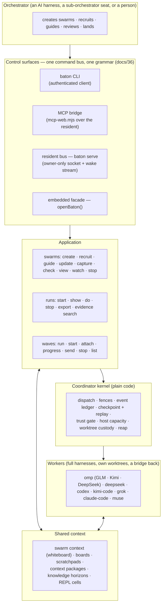

<div align="center">


</div>


# baton

**Repository:** <https://github.com/Flip-Engineering/baton>

**Cross-harness agent orchestration.** An orchestrator (an AI agent in one full coding harness, or a person at a terminal) directs *other* full coding-harness sessions as subordinate workers. Workers get their own git worktree, a brief, a bridge back into the swarm, live telemetry, mid-flight guidance, and a durable ledger that records everything they did. The orchestrator gets wakes instead of polling, typed refusals instead of prose, and a contribution contract instead of a chat transcript.

The name: a conductor's baton directs an orchestra; a relay baton gets passed between runners. Both are the point.

**Status (2026-09-18).** Baton is developed by Baton: every change since 2026-09-13 has been written by a recruited seat on a running Baton resident and landed by the root. The current design work is the **swarm runtime** ([docs/39](docs/39-swarm-runtime.md)) with its open-coordination ([docs/45](docs/45-open-coordination.md)) and visibility ([docs/46](docs/46-swarm-visibility.md)) extensions. The canonical suite is judged against an expected-red manifest ([docs/42](docs/42-suite-legitimacy.md)); a full acceptance run on current `master` is not published. The open tracker is the [issue list](https://github.com/Flip-Engineering/baton/issues) (`bug` + `priority:high` marks a subsystem that failed in the real loop and is sequenced first).

---

## What baton is

A run-centric **fleet application** with a **swarm runtime** on top:

- **Runs.** You state an outcome; baton compiles it into an approved Plan, routes it onto a live worker seat, watches liveness, fields questions, verifies results against evidence it re-derives itself in a fresh worktree, and closes every resource it opened.
- **Swarms.** An orchestrator creates a swarm, recruits participants onto exact routes with path scopes and permissions, guides them, groups and couples them, and reads one view of who holds what. Participants report through a validated **contribution contract** (subject, base, commit, items, needs-from-others, carried-forward), reviewed and landed by the root. Seats can be **sub-orchestrators**: a seat granted `recruit` and `organize` recruits and steers its own builders.
- **The resident.** `baton serve` hosts a standing, owner-local deployment for one repository: an authenticated command bus over an owner-only socket, a wake stream, and a durable coordination ledger under `.git/baton/`. The CLI and the MCP bridge are thin authenticated clients of the same authority; a resident survives client crashes and answers again after a restart from its checkpoint.
- **The fleet.** Every worker is a full harness session in its own worktree. Served today: **omp** running `zai/glm-5.3-flash`, `kimi-code/k3` and `deepseek/deepseek-flash`; native **deepseek**; **codex** (`gpt-5.6-sol`); **kimi-code** (`k3`); **grok** (`grok-4.5`); **claude-code** (Claude Opus/Sonnet); and **muse** (`muse-spark-1.3-contributor`, one-shot). Each route carries its billing basis: subscription routes (GLM, Kimi, Codex, Grok, Claude, muse) never get a per-token price on their profile; API routes (DeepSeek) do.

Underneath sits the **Coordinator**: a plain-code reliability kernel (version fencing, confirm-it-stopped, at-least-once cursors, answer-exactly-once, log-is-truth). The orchestrator is an AI; the coordinator is not. That asymmetry is the design.

---

## Architecture



**One authority, three doors.** The CLI discovers the resident through `.git/baton/connection.json` and speaks the authenticated bus; the MCP bridge (`impl/scripts/mcp-web.mjs`) projects the same operation table to an agent client; `openBaton({repo, advanced})` embeds the application directly (the evidence drivers use it). Provider credentials are never command arguments and never reach a worker's environment.

**Wakes, not polling.** `baton swarm watch <swarm> --follow` prints one JSON frame per coordination row; the bounded form (`--timeout-ms`, `--wake-class`) answers on the first row of a named class or at its deadline and resumes with `--after-seq`. The closed wake-class set is printed by `baton swarm --help` (recruited, left, assigned, work_updated, coupling_updated, context_updated, contribution_recorded, reviewed, note, knowledge, closed, refused, queued, dead, paused, attention, guidance_delivered, integrated, checkpoint, capacity_pressure, resident_lifecycle).

**Trust is re-derived, never reported.** When a seat says "done", the check re-runs the verification in a fresh worktree at the seat's commit. Verifications take a host verify lease (one suite per host); a check that must wait records `contribution.check_queued`. Every limit the runtime enforces is one row in `impl/src/limits.mjs` (the frame-limits registry), derived from the host or a policy, never a literal in code.

**Turns, not gates.** Pausable harnesses end turns as checkpoints; the driver steers with nudge / wait / claim instead of killing workers at turn boundaries. One-shot harnesses (muse) get guidance parked and delivered on their next resume. Progress checkpoints are recorded during a turn from activity, and a dead seat's worktree is snapshotted onto its lane branch and retained under custody rules rather than deleted.

---

## How Baton is developed (the loop you will run)

Since 2026-09-13 every change lands through this loop. It is the product's own acceptance test.

1. **Serve a resident** on the commit you want to develop against, from a dedicated shell that does nothing else:
   ```bash
   cd impl && (nohup node scripts/baton.mjs serve > /tmp/baton-serve.log 2>&1 < /dev/null &)
   node scripts/baton.mjs doctor --check      # connection, served commit, route readiness, model profiles
   ```
   The log's flip line says `replayed (...)` then `answering (... checkpoint <state>; reconstructed <ms>)`. A resident on a large ledger publishes from its checkpoint in tens of seconds.
2. **Create a swarm and recruit lanes.** One issue per lane, exact route, path scope, the permissions it needs:
   ```bash
   node scripts/baton.mjs swarm create "Baton develops Baton: wave N" --swarm-id swarm-wave-N
   node scripts/baton.mjs swarm recruit swarm-wave-N omp-442 "$(cat brief-442.txt)" \
     --options '{"exact":{"harness":"omp","model":"deepseek/deepseek-flash","effort":"max"},"scope":["impl/src/swarm-runtime.mjs","impl/test/issue442-*.test.mjs"]}'
   # a sub-orchestrator that recruits its own builders:
   node scripts/baton.mjs swarm recruit swarm-wave-N kimi-441 "$(cat brief-kimi-441.txt)" \
     --permissions '["read","communicate","contribute","review","organize","recruit","stop"]' \
     --options '{"exact":{"harness":"omp","model":"kimi-code/k3","effort":"max"},"scope":["docs/47-*.md","impl/test/issue441-*.test.mjs"]}'
   ```
   The recruit receipt names the seat's run, worker and workspace (`.baton/wt/<workspaceId>`, a lane branch `baton/<workspaceId>`). The brief a seat receives is composed by the runtime: the objective, the swarm situation, the routes it may recruit on, the bridge verbs it holds, and an admitted example of the contribution payload. Workers hold no GitHub credential, so a brief carries the issue text; issue #441 (the reading half) is landing the `--issue N` form that admits the issue and its cited docs as a context package.
3. **Let Baton wake you.**
   ```bash
   node scripts/baton.mjs swarm watch swarm-wave-N --after-seq <cursor> \
     --wake-class contribution_recorded,dead --timeout-ms 1740000 --projection outline
   ```
   The answer carries the wake row and the outline; re-arm from the returned seq. Until #433 lands, a second wake inside one call is not carried, so scan the ledger from the cursor after every return.
4. **Land the contribution.** The row's `commit.sha` names the real commit and `commit.branch` the lane branch. Pick the whole range in order, regenerate the shared artifacts, run the gate set the changed files imply, push:
   ```bash
   git log --reverse master..baton/<workspaceId>            # the whole lane range, never the tip alone
   git cherry-pick <sha...>                                  # seam-inventory.json conflicts: take theirs, then regenerate
   node scripts/seam-inventory.mjs --write && node scripts/surface-gate.mjs --write && node scripts/render-surface-docs.mjs --write
   BATON_SUITE_VERDICT_FILE=/tmp/verdict.json node scripts/run-suite.mjs test/<gate files>
   ```
   Issue #296 (priority:high) turns this into `swarm integrate` with the merge-base rule, a derived gate set and a durable integration receipt.
5. **Review and release the seat.**
   ```bash
   node scripts/baton.mjs swarm update swarm-wave-N swarm.contribution_reviewed \
     --payload '{"contributionId":"<id>","decision":"accept","reason":"landed as <sha>"}'
   node scripts/baton.mjs swarm stop swarm-wave-N omp-442 "landed"
   ```
   Then smoke-test the served surface on the landed commit before closing the issue: a lane's green test files are not proof its verb works from the CLI.

**What a seat records.** One `swarm.contribution_recorded` per lane through its bridge (`$BATON_SWARM_CLIENT`), with `body.subject`, `body.base {observedHead, rebasedOnto}`, `body.commit {sha, branch}`, `body.items[] {id, status: delivered | not_delivered, change, files, test, evidence}`, `body.needsFromOthers[]`, `body.carriedForward[]`. A seat that needs a file outside its scope hands it back in `needsFromOthers`; issue #441 makes that a claim instead.

**What the root learns from the ledger.** Every worker's evidence is under `.git/baton/application-v3/state/w-<n>.jsonl`; the coordination ledger is `.../state/coordination/events.jsonl`. A failed turn is a typed row (`lifecycle.turn_completed status=failed failure.code=provider_quota_exhausted`, for example) and a policy kill is `kill.requested {rule: provider_fault}`. Issue #442 (priority:high) folds those into the swarm so the participant row, the wake feed and the route readiness say so without a ledger read.

---

## Run it

Requires Node ≥ 20 (Node 22 is what the residents run). The only runtime dependency is `@ast-grep/napi`.

```bash
cd impl && npm ci                              # install
node scripts/run-suite.mjs                     # the canonical gate, judged against expected-red-tests.json
node scripts/surface-gate.mjs                  # grammar lint, generated artifacts, MCP dispatch (--write regenerates)
node scripts/baton.mjs serve                   # host the owner-local resident for this checkout
node scripts/baton.mjs doctor --check          # connection + served commit + exact-route readiness + model profiles
node scripts/baton.mjs swarm list              # the swarms this resident serves
node scripts/baton.mjs swarm view SWARM_ID --projection participants
node scripts/baton.mjs swarm watch SWARM_ID --follow          # one JSON frame per event, no polling
node scripts/baton.mjs evidence search --swarm SWARM_ID --text "refused"
node scripts/baton.mjs waves run path/to/workflow.json        # a whole workflow, as data
node scripts/baton.mjs top                                     # the operator seat (docs/38)
```

`baton --help` lists every top-level verb; `baton help swarm`, `baton help run`, `baton help routing` and `baton help connection` render the topics. The generated inventories are [impl/CLI.md](impl/CLI.md) and [impl/MCP.md](impl/MCP.md). Unknown flags and missing positionals refuse at the CLI with the admitted spelling (#431); every swarm refusal crosses the web layer as its own typed code (#430).

**Credentials** are read at the deployment root, projected into each worker's isolated home, and never printed:

| Harness / provider | Where the credential lives | Readiness |
|---|---|---|
| omp → zai (GLM) | `glm_key.json` in the deployment's config root, projected into `$HOME/.omp/agent` | route row blocks naming the missing file |
| omp → deepseek | `deepseek_key.json` | same |
| omp → kimi-code | `kimi_key.json` (`baton credentials install kimi`) | same |
| claude-code | the harness's own OAuth login; readiness carries `expiresAt` / `refreshable` (#346) | typed `provider_auth_expired` with the root-side remedy |
| codex, grok, kimi-code native | the harness's own login | quota exhaustion is a typed turn failure, not readiness (#341) |
| muse | OS keyring first (`muse login`), file backend as fallback | `doctor --check` confirms |
| Artificial Analysis (model profiles, #429) | `BATON_AA_KEY`, else `~/.config/baton/aa_key` (0600) | absent key → a degraded profile row, never a refusal |

Subscription routes (GLM, Kimi, Codex, Grok, Claude, muse) are windowed: GLM's 5-hour window closing ends every GLM seat with `provider_quota_exhausted` and a reset instant. Spread a wave over routes; the doctor's route table is the input to that decision.

**The suite verdict.** `run-suite.mjs` runs the parallel lane, then the process-heavy files of `impl/scripts/suite-lanes.json` serially, and judges the run against `impl/scripts/expected-red-tests.json`: rows are `file :: name`, each with a reason naming the issue it waits on ([docs/42](docs/42-suite-legitimacy.md)). GREEN means every failure is listed, no listed test passed or vanished, and nothing hung (`BATON_SUITE_IDLE_MS`, default 10 min). Red-before tests land under the `-red` suffix convention ([docs/44](docs/44-red-suffix-convention.md)) and are delisted when the implementing lane turns them green. A subset run prints a `SUBSET verdict (n of m files)` line and never counts as acceptance. On a host that runs lanes, the suite takes a verify lease so two suites never share the cores (#333); `BATON_HOST_CAPACITY_DISABLED=1` bypasses the capacity gate for a root-side gate run.

**Restarting a resident.** Stop seats first (`swarm stop`), `kill -TERM` the exact pid (resolve it by working directory, never by a substring match), wait for the `host.stopped` row, relaunch from a dedicated shell, and probe with one `swarm recruit` on a cheap route before trusting the new commit: a `baton run` succeeding proves nothing about recruit. Issue #351 tracks the remaining idle-stop cost; #306 is the in-place reincarnation that removes the restart.

---

## Where the design stands (2026-09-18)

Landed since the swarm runtime began (2026-09-13), by theme, with the issue that carries the evidence:

- **Swarm runtime.** Living swarms with groups, work, assignments, couplings and shared context (docs/39); contribution contract rendered in the brief with an admitted example (#310, #371); progress checkpoints during a turn (#305); guidance parked for one-shot seats (#337); membership settled on stop (#350); read-only recruit mode (#373); one closed refusal set across the web layer (#430); closed CLI argv (#431); worktree custody on stop, drain and crash (#428, #435); lost seats named after a restart (#364); writer couplings honest (#425); the context projection (#427).
- **Wakes and views.** The wake stream with a closed class set (#272, #294); the bounded watch with `--wake-class` (#339); wake primitives above the CLI boundary with no client-side size anticipation (#356); typed attention rows for foreign changes and turns without a contribution (#357); evidence and contribution search (#312, #338).
- **The resident.** Owner-local publication; shutdown that never serializes the whole ledger on the main thread and a checkpoint that is reused across restarts (#351 lanes 1–4, #397, #361, #434); EPIPE-safe transports (#383); host capacity measured from the machine (#329, #359); the served commit on every wake frame and a provider stall as one deployment fact (#316).
- **Routes and fleet.** Exact-route admission that consults readiness (#324); omp readiness from the harness catalog (#342); route comparison answered on recruit (#341); Claude OAuth expiry typed (#346); live model profiles from Artificial Analysis with subscription billing honoured (#429).
- **Suite legitimacy.** Reasoned expected-red rows, the environment dimension, the `-red` convention (#260, docs/42, docs/44); the verify lease (#333); per-row prerequisite attribution (#327).

Open and sequenced first (`bug` + `priority:high`): **#441** the reading half (seats read their issue, cited docs, landed work and peers through Baton's own context primitives; a Kimi sub-orchestrator and two DeepSeek builders are on it), **#442** provider-quota kills fold into the swarm and wake the root, **#438** `swarm.view` never spawns git on the read path, **#296** the native landing verb, **#306** resident reincarnation in place, **#351** the idle-stop remainder, **#433** the contributions projection and multi-wake frame. Filed from the operator's asks: **#443** re-route runs ended by depleted usage, **#444** Design Arena rankings beside the Artificial Analysis profiles.

---

## Documentation map

- **[SYSTEM.md](SYSTEM.md)** — the authoritative system design (read it second). **[GLOSSARY.md](GLOSSARY.md)** — the jargon.
- **[docs/PROGRESS.md](docs/PROGRESS.md)** — the per-phase progress ledger, oldest first; a row is never rewritten to look greener than it was.
- **[impl/CLI.md](impl/CLI.md) · [impl/MCP.md](impl/MCP.md)** — generated from the executable registry; regenerate with `node impl/scripts/surface-gate.mjs --write` after any surface change (the pre-commit hook runs the same gate: `git config core.hooksPath .githooks` once per clone).
- **[impl/scripts/expected-red-tests.json](impl/scripts/expected-red-tests.json)** — the reasoned expected-red manifest; **[impl/src/limits.mjs](impl/src/limits.mjs)** — the frame-limits registry, the one place a bound is declared.

**Design docs — the swarm era (`docs/`)**

| doc | what it settles |
|---|---|
| [32](docs/32-reflexive-orchestration.md) | Reflexive orchestration: decision channels, task boards, context packages as typed hand-offs, REPL objects |
| [33](docs/33-shared-objects-repl-layer.md) | Shared objects and the REPL layer: content-addressed cells, named bindings |
| [34](docs/34-knowledge-horizons.md) | Knowledge horizons: task → workflow → project graphs, promotion, brief-time activation |
| [35](docs/35-turn-checkpoints.md) | Turn checkpoints: steer, don't gate |
| [36](docs/36-unified-control-grammar.md) | One grammar across embedded, web, CLI and MCP; the generated inventories and the conformance gate |
| [37](docs/37-wave-driver.md) · [37b](docs/37-holistic-runtime-convergence.md) | The shipped wave driver; holistic runtime convergence |
| [38](docs/38-flip-experience.md) · [38b](docs/38-flip-visual-surfaces.md) | The Flip operator experience and visual surfaces (`baton top`) |
| [39](docs/39-swarm-runtime.md) | **The swarm runtime**: living swarms, tight and loose coupling, communication and shared context, the knowledge verbs on the bridge |
| [40](docs/40-runtime-review-2026-09-12.md) · [41](docs/41-verification-recovery-review.md) | The runtime review with checked results; verification and contribution recovery |
| [42](docs/42-suite-legitimacy.md) · [42b](docs/42-deployment-topology.md) | Suite legitimacy (expected-red reasons, the environment dimension); deployment topology beyond one host (#298) |
| [43](docs/43-host-capacity-and-derived-floors.md) | Host capacity is the throttle; the replaying → reconstructing → answering contract; restart truth |
| [44](docs/44-red-suffix-convention.md) | The `-red` test-suffix convention |
| [45](docs/45-open-coordination.md) | Open coordination: joint couplings, claims, peers-now (#422, #423, #374) |
| [46](docs/46-swarm-visibility.md) | Swarm visibility: one liveness derivation, the contributions ledger, the cost of a view (#433, #364, #438) |
| 47 | The reading half (#441) — being written by the `kimi-441` design seat |

The earlier corpus (problem framing through the representation ladder, docs 00–31) and the campaign-era working papers are indexed in the [superseded README](docs/reference/README-superseded-2026-08-13.md) and under `docs/reference/evidence/`; nothing was discarded. Dated campaign reports live in [`reviews/`](reviews/). The orchestrator friction ledger, every AX friction met while building baton with baton, is at [docs/reference/evidence/frontier-sweep-2026-08-03/orchestrator-friction-ledger.md](docs/reference/evidence/frontier-sweep-2026-08-03/orchestrator-friction-ledger.md); its successors are the `bug` issues filed from each wave.
