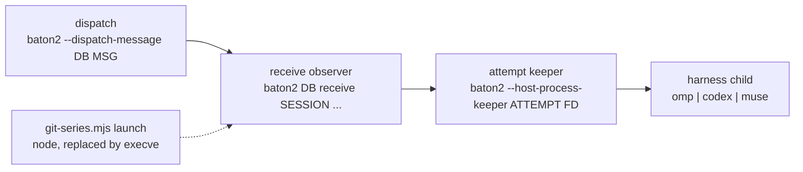

# Native instance process and resource baseline

This note records the process topology of one Baton2 instance and the memory, CPU
and startup cost of its runtime processes, measured on the host that runs the audit
Orchestra. Measurements come from `ps(1)`, `footprint(1)`, `sysctl(1)`, `vm_stat(1)`,
read-only SQLite queries, and one owned fixture database driven by the installed
release binary.

## Identity

| Item | Value |
| --- | --- |
| Source commit | `fca7af876c8260c32d17f95f3e19bc68ee1bf561` |
| Source worktree | `.scratch/semantic-context-20261005/worktrees/native-instance-measure` |
| Installed release | `~/.local/share/baton2/releases/1.1.0-fca7af876c8260c32d17f95f3e19bc68ee1bf561` |
| Binary | `bin/baton2`, Mach-O 64-bit arm64, 3,973,720 bytes |
| Binary SHA-256 | `972d620ce6209193cb91273350a9c1ea2713cac6b4b2bcf692a6303df75c766c` |
| Host | Mac16,12, 10 CPUs, 16 GiB RAM (17,179,869,184 bytes) |
| Boot | Mon Oct 5 10:46:16 2026 PT |
| Capture window | 2026-10-05T18:13Z to 2026-10-05T18:26Z PT (UTC) |
| Load during capture | 15.6 to 48.3 on 10 CPUs; 4.7 GiB of 6 GiB swap in use |
| Node | v25.8.0 (`/opt/homebrew/Cellar/node/25.8.0/bin/node`) |

Every installed `libexec/baton2/*.mjs` helper is byte-identical to its source file at
this commit: `git-series.mjs` (`bend2/harness/git-series.mjs`), `omp-conductor.mjs`,
`mcp-conductor.mjs` and `codex-conductor.mjs` (`bend2/scripts/`). The installed
binary and its helpers therefore describe the source tree named above.

## Execution boundary

The operator directs compilation and CI/CD onto remote runners. This laptop is used
for orchestration, source editing and review, and retained-evidence inspection. The
measurements in this report were taken on the laptop's live Orchestra before that
boundary was in force; they keep their host and source attribution and are not a
reproduction recipe for local execution. Compiler, build, law-check and test work, and
fixture or harness execution, run on admitted remote runners only. The prepared
same-workload request for remote Linux and remote Darwin runs is
`remote-measurement-request.md` beside this report.

Ownership: `native-instance-measure` owns the tools under
`bend2/measure/native-instance/` and this report and request.
`native-instance-conductor` owns `context/receive-request.bend` and
`context/retained-read.bend`. `native-instance-owner` retains the custody task module.

## Process roles in one active session

A session turn runs four OS processes:



Measured parentage from `ps -axo pid,ppid,command` at 2026-10-05T18:34Z: 24 harness
children have a keeper as parent, each keeper has a receive observer as parent, and
each observer has either a detached `--dispatch-message` process or the invoking CLI
process as parent. Two `codex app-server` daemons have PID 1 as parent and are not
part of a session chain.

Role counts at 2026-10-05T18:34Z: 27 `--dispatch-message`, 33 receive observers, 29
keepers, 2 `--recover-receive` observers, 2 CLI delivery processes, 13 `omp` and 12
`codex` harness children (excluding the two daemons).

Variants measured or read from source:

- `start` and `dispatch-file` launch a detached `baton2 --dispatch-message DB MSG`
  process, which runs the registered endpoint and waits for it
  (`control.bend:149`, `main.bend:258`).
- `message`, `report` and `ask` perform the same delivery inside the invoking CLI
  process, so that process stays resident for the recipient's whole turn. Observed
  live: a receive observer whose parent is a CLI invocation (`pid 67091 <- 67084`).
- After observer loss, the keeper relaunches the attempt as
  `baton2 --recover-receive ...`; observed live with a keeper as parent
  (`pid 64089 <- 51569`).
- `git-series.mjs launch` replaces its own process image with the endpoint command
  through `process.execve` (`harness/git-series.mjs:172-185`). Measured: the launched
  command reported the launcher's PID (75778), and no `git-series.mjs` process
  remains in the process table after the transition.
- `IO.fork`, used for a completed attempt's delivery and continuation
  (`src/coordinator/receive.bend:88`), is an in-process helper-thread task built from
  `Chan` and `IO.spawn` (`base.bend:239-245` in the toolchain tree); the runtime runs
  spawned IO on a helper thread (`guide/EFFECTS.md:57` in the toolchain tree). The
  measured process counts contain no forked OS process for these duties.

## Source map

Paths below are relative to `bend2/`. The toolchain guide is the installed Bend
2.0.25 tree at `.scratch/native-artifact-qualification-20261002T174637Z/toolchain-home/`.

| Mechanism | Source |
| --- | --- |
| Endpoint argv construction | `src/coordinator/control.bend:26` `receiver_args`, `:32` `identity_args`, `:37` `identity_endpoint` |
| Endpoint configuration and admission check | `src/coordinator/control.bend:90` `configured_endpoint`, `src/coordinator/commands.bend:145` `endpoint_admitted` |
| Detached dispatch and launch | `src/coordinator/control.bend:149` `dispatch_admitted`, `:201` `deliver`, `src/coordinator/main.bend:258-263` `cli` |
| CLI entry and stored-command result | `src/coordinator/main.bend:64` `run`, `:73` `IO.try(String,Store.apply(...))` |
| Delivery selection and endpoint read | `src/coordinator/delivery.bend:11` `endpoint_sql`, `:27` `launch`, `:59` `normal_delivery`, `:101` `wake_pending` |
| Receive admission, attempt selection, completion | `src/coordinator/receive.bend:250` `available`, `:245` `registered`, `:233` `acquired_recorded`, `:183` `selected`, `:161` `started`, `:100` `completed`, `:88` `finish_pending`, `:275` `recover` |
| Attempt launch and harness argv | `src/host/process.bend:26` `ProcessChild.retain`, `src/coordinator/turn.bend:355` `Turn.retained`, `src/harness/omp-player.bend:19` `arguments`, `src/harness/codex-player.bend` |
| Keeper, spool, wait, input | `src/host/process-spawn.c` (`baton_children` table, `posix_spawnp(...,environ)` at line 84), `src/host/process.bend:58` `keeper`, `:67` `read_line`, `:70` `wait` |
| Endpoint helper resolution | `src/host/control.c:42-77` (libexec path, registry) |
| Scoped Git identity | `harness/git-series.mjs:141-170` `scoped_environment` |
| Single-process stdout | `src/host/text.c` `baton_control_output_call` (writes fd 1 under `flockfile(stdout)`) |
| MCP bridge | `scripts/mcp-conductor.mjs` (stdio JSON-RPC server, `execFileSync` per tool call at line 114, one-shot socket delivery via `--deliver`) |
| In-process `IO.fork` | `base.bend:239-245` in the toolchain tree (`Chan.new` plus `IO.spawn`); helper-thread execution at `guide/EFFECTS.md:57` |

Environment inheritance measured inside one chain: the harness child of a keeper
carries `GIT_AUTHOR_NAME="Flip Baton - DeepSeek"`, the matching committer address,
`GIT_CONFIG_COUNT=12`, `GIT_ASKPASS=<node> git-series.mjs deny-askpass` and 33 `GIT_*`
variables in total. The wrapper sets this environment once, and the keeper and
harness inherit it because `posix_spawnp` passes the process environment.

## Live instance measurement

Read-only. The audit Orchestra database held 88 sessions (86 with a parent; 62
`omp`, 21 `codex`, 4 `muse`), 44 `executions` rows in phase `running`, 4,707 messages
and 1,994 unreceipted messages at 2026-10-05T18:23Z.

One snapshot of all Baton2 runtime processes at 2026-10-05T18:19:45Z:

| Role | Count | RSS sum | phys_footprint sum | footprint peak sum |
| --- | --- | --- | --- | --- |
| receive observer | 24 | 682 MiB | 2,059 MiB | 2,134 MiB |
| keeper | 21 | 43 MiB | 50 MiB | 50 MiB |
| `--dispatch-message` | 23 | 48 MiB | 66 MiB | 66 MiB |
| `--recover-receive` | 2 | 6 MiB | 123 MiB | 123 MiB |
| harness `omp` | 10 | 1,916 MiB | not collected | not collected |
| harness `codex` | 14 | 1,443 MiB | not collected | not collected |
| `bend` compiler (build) | 2 | 2,708 MiB | 10,203 MiB | — |

Across an 18-sample series taken every 20 s over six minutes, the receive observer
count stayed between 23 and 24, with a median RSS sum of 670 MiB and a median
phys_footprint sum of 2,026 MiB. Individual observers in that series ranged from 5.6
MiB to 123 MiB RSS and from 5 MiB to 907 MiB phys_footprint. The largest observed
observer held 907 MiB of phys_footprint with a 953 MiB peak while its RSS was 2.8 MiB
at the same instant: 860 MiB of its dirty pages were compressed at that moment.

The Baton2 runtime layer for the 24 concurrent turns carried 2.24 GiB of
phys_footprint and 779 MiB of RSS, of which the observers were 2.01 GiB and 682 MiB.
The `bend` compiler processes are build cost, not runtime cost, and they dominate
total machine memory in this window.

## Owned fixture measurement

The fixture lives in `bend2/measure/native-instance/fixture-*/`, uses a fresh database
in that directory, and drives the installed binary through `start`, which commits a
task message and launches the chain. Two tasks ran on route
`deepseek/deepseek-flash`, effort `high`:

| | `fixture-small` | `fixture-big` |
| --- | --- | --- |
| Task | reply `fixture-ok`, no tools | run `seq 1 400000`, report the line count |
| `start` exit / reported PID | 0 / `{"deliveryPid":66866}` | 0 / `{"deliveryPid":67010}` |
| Delivery message body | `fixture-ok` | line count with tool evidence |
| Chain wall time | 10.1 s | 37.3 s |
| Recorded frame log | 95,634 B | 769,911 B |
| Harness session JSONL | 13,760 B | 114,937 B |
| dispatch peak RSS / footprint | 4.5 MiB / 2.9 MiB | 4.5 MiB / 2.9 MiB |
| receive peak RSS / footprint | 85.4 MiB / 86.0 MiB | 225.8 MiB / 226.0 MiB |
| receive CPU time | 0.97 s | 9.07 s |
| keeper peak RSS / footprint | 2.1 MiB / 2.2 MiB | 3.6 MiB / 2.3 MiB |
| keeper CPU time | 0.01 s | 0.08 s |
| harness peak RSS / footprint | 301.4 MiB / 339.2 MiB | 346.7 MiB / 330.5 MiB |
| harness CPU time | 3.60 s | 6.04 s |

The observer's peak phys_footprint rose 140.4 MiB while the recorded frame volume rose
675,277 B, which is 218 bytes of peak observer footprint per recorded frame byte on
this pair of runs. The floor for a 95 KB turn was 86 MiB.

First appearance relative to the `start` invocation, sampled every 50 ms:
`fixture-small` dispatch 0.52 s, receive 1.02 s, keeper and harness 1.25 s;
`fixture-big` dispatch 0.65 s, receive 1.19 s, keeper and harness 1.47 s. The whole
chain had exited by the final sample of each run. An empty process set is observed for
a session with no active attempt; the observation does not follow from an empty inbox,
because an active attempt can hold the observer with no unreceipted input, and a
delivery creates the chain for a session that has none.

### Second delivery while the guard is held

`fixture-queue` runs the slow task and commits a second message while the first turn
holds the session guard. Measured transitions:

```
t=  0.97s  dispatch=69281 receive=69288 keeper=69304 harness=69305
t=  0.88s  second delivery: receive answered {"session":"fixture-agent","status":"queued"}
t=105.28s  harness 69305 exits
t=129.83s  keeper 69304 exits
t=130.08s  receive 69288 starts attempt 2 with keeper 76779 and harness 76780
t=140.78s  harness 76780 exits
t=141.23s  chain empty
```

The queued answer is recorded in `<database>.root.log`, the second message keeps
`receipt: null` until it is consumed, and the running observer starts the second
attempt with a new keeper and harness after the first turn finishes. The fixture holds
two attempt directories, one per turn, and the second turn's report body is
`queued-followup`.

## Per-attempt exit and route record

Each accepted turn keeps its own directory `<database>.attempt-<hex(attempt id)>`,
named from the attempt id (`receive:<session>:<cursor>:<random>`). The keeper and
observer write:

| File | Content |
| --- | --- |
| `manifest` | `BATONRP1` header (magic, six field lengths, `keep_stdin`, reserved), then the encoded native argv, working directory, log path, recovery argv and socket name |
| `launch` | marker written before the keeper listens |
| `native.pid` | native child PID |
| `native.birth` | child PID with its start seconds and microseconds, used to reject PID reuse (`process-spawn.c:245-296`) |
| `status` | raw `waitpid` status as decimal text, written by the keeper when it reaps the child (`process-spawn.c:691-696`) |
| `released` | the keeper closed the session-lock descriptor after the child exited |
| `acknowledged` | the keeper wrote the final acknowledgement and unlinked the spool |
| `stdout` (spool) | native stdout copy, removed at acknowledgement |
| `keeper.log`, `native.stderr` | keeper notes and the child's stderr |

`process-spawn.c:583-592` renders the stored status as `exit N`, `signal N`, or
`unknown after keeper loss`; `attempt_exit_records.py` applies the same wait-status
decoding. Attempt-keyed report and event rows come from captured `turns <session>`
output, not from a database read by the tool.

Release and acknowledgement are separate keeper commands:

- `ProcessChild.release(handle)` sends `BR_RELEASE`. The keeper requires the child to
  have exited, closes its copy of the session-lock descriptor and writes `released`
  (`process-spawn.c:718-724`); the observer closes its own copy of that descriptor
  (`process-spawn.c:606-609`). The keeper keeps the native child.
- `ProcessChild.acknowledge(handle)` sends `BR_ACK`. The keeper requires exit and
  release, writes `acknowledged` and unlinks the spool
  (`process-spawn.c:725-737`); the observer shuts down the socket, joins its receiver
  thread and closes the spool, life and watch descriptors
  (`process-spawn.c:610-619`).

Neither operation signals or frees the native child; the keeper keeps custody of the
child until the child exits by itself, and `ProcessChild.control_signal` is the
separate signalling path.

Measured over the live database's attempt directories and scoped CLI reads,
read-only, at 2026-10-05T20:05Z:

| Measure | Count |
| --- | --- |
| attempts | 1,503 across 81 sessions |
| exit 0 | 1,403 |
| exit 143 | 8 |
| exit 101 | 1 |
| no `status` written | 91 (16 are current attempts, 75 historical) |
| `released` and `acknowledged` | 1,482 |
| released, not yet acknowledged | 2 |
| not acknowledged | 21 |
| attempts that are the current `executions` pointer | 81 |
| historical attempts whose exit exists only in their own directory | 1,422 |

The `executions` row (one row per session, keyed by `session`) holds the current
attempt pointer: 1,422 of the 1,503 recorded exits belong to attempts that pointer no
longer names. Nine attempts ended with a non-zero status (eight at exit 143, one at
exit 101); the delivered report for those names the outcome (`Player process ended
without a native result (exit 143).`), and all nine carry both `released` and
`acknowledged` at this snapshot.

### Reader limits in the 2026-10-05T20:05Z snapshot

That snapshot was produced by an earlier revision of `attempt_exit_records.py` with two
confirmed defects, so its route classification and its session and report columns are
author-attributed and are not independently validated:

1. The spool read opened `stdout` in text mode, read a character count and compared it
   with a byte length from `os.path.getsize`. For any non-ASCII byte or newline
   translation the read was neither a 4 MiB byte read nor a reliable test for end of
   file, so a `no-route-frame-in-retained-spool` result in that snapshot does not
   establish that the whole spool was inspected.
2. The session rows and per-attempt reports were taken by wrapping CLI commands in a
   Python subprocess and parsing their JSON, which the Root56 direct-native instruction
   excludes.

The exit and custody columns of that snapshot do not depend on either defect: they come
from the `status`, `released` and `acknowledged` files read directly. The corrected
reader reports the bytes read, whether end of file was reached, whether the spool
changed during the read, the undecoded and uninterpreted line and frame counts, and
whether the final line is a partial frame, and it consumes CLI output only from files a
direct CLI invocation produced. Reclassifying the 20:05Z snapshot with the corrected
reader requires a fresh authorised read of the retained attempt files; the snapshot
stays in place as the earlier evidence.

The schema makes the pointer explicit: `executions` has `session` as its primary key
(`commands.bend:90`), `Stop.admit` upserts it per session with
`ON CONFLICT(session) DO UPDATE` (`stop.bend:11`), and the exit write updates only the
row whose `id` still matches the attempt (`stop.bend:93`).

Fixture attempts, from `evidence/attempt-exits-fixture-*.json`. The configured route
comes from each attempt's own manifest; the observed route is reported only where
retained per-attempt frame evidence exists:

| Fixture | Harness command | `status` | Decoded | `released` / `acknowledged` | Report | Configured route | Observed route |
| --- | --- | --- | --- | --- | --- | --- | --- |
| `fixture-small` | OMP toolchain | `0` | exit 0 | yes / yes | `fixture-ok` | `deepseek/deepseek-flash`, high | unavailable |
| `fixture-big` | OMP toolchain | `0` | exit 0 | yes / yes | line count with tool evidence | `deepseek/deepseek-flash`, high | unavailable |
| `fixture-queue` attempt 1 | OMP toolchain | `0` | exit 0 | yes / yes | line count | `deepseek/deepseek-flash`, high | unavailable |
| `fixture-queue` attempt 2 | OMP toolchain | `0` | exit 0 | yes / yes | `queued-followup` | `deepseek/deepseek-flash`, high | unavailable |
| `fixture-fail` | `/usr/bin/false` | `256` | exit 1 | yes / yes | `Player process ended without a native result (exit 1).` | `deepseek/deepseek-flash`, high | unavailable |

Every fixture attempt was acknowledged, and the keeper unlinks the native stdout spool
at acknowledgement, so no fixture attempt retains its own frame evidence. Two further
records exist for these runs and are session-scoped rather than attempt-scoped: the
harness session record file `fixture.db.root-sessions/*.jsonl`, which for
`fixture-small` and `fixture-big` records `provider: deepseek, model: deepseek-flash`
in its assistant message records, and the `baton2 session` output that `fixture_run.py`
captured at run time. Each of those databases holds exactly one attempt, so either
record belongs to that attempt. `fixture-queue` holds two attempts in one session and
`fixture-fail`'s harness reported nothing, so neither run has per-attempt observed
evidence.

The `fixture-fail` turn shows the failure path: the harness exited before writing any
native frame, the keeper wrote `status` = `256` and the full release and
acknowledgement sequence, and the delivered report named the exit code. That attempt
has no `turns` row, because the turn row is written only for a native terminal event
(`commands.bend:178-181`), and the session's `native` and `observed_model` stay empty
because the harness reported no identity. The dispatch process exited non-zero with
`Native receive failed; read the retained native log and pending inbox.` and `Message
committed; session delivery failed.`, while `start` itself returned exit 0 with
`{"deliveryPid":...}`; a caller learns the delivery outcome from the dispatch log and
the report, not from the `start` status.

Route records have two separate provenances:

- **Configured route, per attempt.** The attempt's own manifest argv holds the exact
  native command, for example `<omp> --mode rpc --model deepseek/deepseek-flash
  --thinking high --approval-mode yolo --session-dir <storage>`, or `/usr/bin/env -u
  OPENAI_API_KEY -u CODEX_API_KEY <codex> -c forced_login_method="chatgpt" exec
  resume <native> --json --model gpt-6-astra`. Across the 1,503 attempts: 794
  `gpt-6-astra`, 285 `kimi-code/k3`, 254 `deepseek/deepseek-flash` at `high`, 169
  `zai/glm-5.3-flash`, and one `deepseek/deepseek-flash` at `low`.
- **Observed route, per attempt only where retained evidence carries it.** The
  harness's own route report lives in the attempt's native stdout spool
  `<attempt>/stdout`, which the keeper unlinks at acknowledgement. The earlier reader
  classified the 1,503 attempts as:

  | State (earlier reader) | Count | Meaning |
  | --- | --- | --- |
  | `route-parsed-from-retained-spool` | 72 | a route frame was parsed from that attempt's own spool; all 72 equal the attempt's configured route |
  | `no-route-frame-in-retained-spool` | 3 | the reader reached its byte bound inside the spool and saw no recognised route frame; the reader's text-mode length test makes "whole spool" unproven |
  | `no-route-frame-in-inspected-prefix` | 29 | the reader's bound was reached and the suffix is uninspected, so route evidence is not established either way |
  | `no-retained-spool` | 1,399 | the keeper unlinked the spool at acknowledgement; the attempt's observed route is unavailable |

  A missing observed route therefore means unavailable in the retained and inspected
  evidence. It is not evidence that the attempt produced no model frame. The OMP frame
  is the `get_state` response with `data.model.provider` and `data.model.id`; Baton
  composes the same value into `sessions.observed_model` (`commands.bend:175-176`),
  which is one mutable session-level value that follows later attempts of the session
  and states nothing about an earlier attempt.

The corrected reader names the states for what it can establish and adds two:

| State (corrected reader) | Established by |
| --- | --- |
| `route-parsed-from-retained-spool` | a recognised route frame in the inspected bytes; later inspected lines are still counted, so route existence and completeness are separate facts |
| `no-route-frame-in-fully-read-spool` | end of file reached, every metadata sample agreed, and every inspected line decoded and interpreted, with no recognised route frame |
| `no-route-frame-in-inspected-prefix` | any of those conditions failed: the byte bound ended before end of file, a line did not decode, a line was not JSON, a value was not an object, an object matched no recognised shape, or the final line was partial |
| `spool-changed-during-read` | a metadata comparison at the listing, open, end of read or final path stat differed |
| `spool-removed-after-listing` | the directory listing saw a spool that was gone before the read |
| `no-retained-spool` | no listing and no file observed a spool |

Every record carries the uninterpreted categories with their counts, the bytes read,
end-of-file, the four metadata samples and their comparisons, and the metadata-sampling
limit: the samples bound a concurrent change but are not an atomic snapshot.

`attempt_exit_records.py` reports the configured route from the manifest, the observed
route and its state from the retained spool, and session and per-attempt report rows
only from CLI captures that a direct CLI invocation produced
(`capture-cli-reads.sh`). The tool runs no CLI command: it consumes the captured
`.stdout`, `.stderr` and `.exit` files, requires all three streams for every read and a
bound header naming the CLI, its SHA-256, the database and the capture time, records the
sizes and hashes of the captured streams, and states a reason for every read it does not
interpret. A capture set bound to another database is refused, and a missing, failed or
unparsable read is never reported as an empty result. Session and per-attempt states are
separate: `cli_state` names the `players` outcome (`ok`, `players-empty-list`,
`players-missing`, `players-failed`, `players-unparsable-stdout`, `players-malformed` or
a capture-set state), and `session_cli_state` names each session's `turns` outcome, so a
successful empty list is distinguishable from an absent or partial one. A missing
`turns` read does not make the session's `current_execution` unavailable; the two
carry separate states. The document carries the same provenance rule in
`route_provenance`.

Identity: the tools that name a release, helper, registry or model require those inputs
and stop when one is missing or does not resolve. The retained laptop paths are
reachable only through `BATON2_MEASURE_IDENTITY=historical-fca7af87-laptop`, whose use
each tool records as `identity_mode` in its output.

## Diagnostics observed

A failed control lookup reports one fixed sentence with no path and no errno:
`control.c:228` builds every failure of `workspace`, `command`, `output`, `identity`
and `launch` as `Native control setup failed; inspect the registered session and
retained input.` A `start` and a `receiver` call with a harness path that does not
exist on the host (`/bin/false`) produced that sentence and exit 2, with the session
row left uncreated and no dispatch log. Both commands carried the same text, so the
caller could not tell the failing argument or the reason.

## Startup costs

`bend2/measure/native-instance/evidence/startup-costs.json`, five repetitions each,
load average 46.8 at capture:

| Command | min | median | max |
| --- | --- | --- | --- |
| `baton2 help` | 8.9 ms | 10.7 ms | 10.9 ms |
| `baton2 DB players` | 13.4 ms | 14.1 ms | 18.0 ms |
| `baton2 DB session ID` | 13.9 ms | 14.8 ms | 15.5 ms |
| `baton2 DB status` | 12.5 ms | 14.8 ms | 15.5 ms |
| `node git-series.mjs check --registry R --model-key M` | 289.3 ms | 326.7 ms | 562.4 ms |
| `node git-series.mjs launch ... -- /usr/bin/true` | 283.3 ms | 322.7 ms | 442.3 ms |

An idle Node process holds 45.6 MiB RSS, which is the floor for the MCP conductor's
stdio server.

## Memory measures

`RSS` is the resident set reported by `ps(1)`. `phys_footprint` and
`phys_footprint_peak` come from `footprint -j` (`auxiliary.phys_footprint_peak`), which
credits a process with its dirty pages, including dirty pages the compressor has
already moved out of physical memory, and excludes clean shared pages. The two
measures answer different questions: RSS counts pages currently resident for the
process, phys_footprint counts the pages the process owns whether or not they are
resident. In the measurements above they differ by up to two orders of magnitude for
long-lived observers, and the phys_footprint sum across processes can exceed physical
RAM on a machine that is compressing.

## Limits

1. The live figures describe a shared Orchestra at load average 15.6 to 48.3 on 10
   CPUs with 4.7 GiB of swap in use. They are observations, not a controlled baseline,
   and support no saving claim for any candidate design.
2. The fixture covers five runs across three tasks (a trivial reply, a large-output
   turn and a failing harness), one model route, one effort level, one machine, and
   one release build. The failing-harness run sends no model request.
3. Peak values come from 50 ms `ps` sampling and a `footprint` pass every 500 ms; a
   peak shorter than that window is not captured.
4. `phys_footprint` attributes dirty and compressed pages to a process. These
   measurements do not separate retained live data from allocator slack inside the
   observer, and no heap profile was taken.
5. Aggregate CPU-time sums over the live series carry the `ps(1)` one-second-per-
   process truncation; per-run CPU totals in the fixture table come from the final
   sample of a bounded chain.
6. The helper-thread pool size and its saturation behaviour were not measured here;
   only the fact that `IO.fork` tasks run on helper threads inside one process.
7. No candidate shared-owner implementation was measured. A candidate comparison
   needs the owner's API and a fixture that runs both versions on identical workload.
8. The installed binary is a release artifact built 2026-10-04 16:31; this worktree
   holds no build of its own. Its `libexec` helpers match the source at the recorded
   commit.
9. The attempt-directory counts are one read-only snapshot of a live database, taken
   2026-10-05T20:05Z; the live Orchestra writes new attempts while the tool runs. The
   `status` file is the raw `waitpid` status; 75 historical attempts carry no `status`,
   so their native exit is unrecorded. Attempt directories written by keepers from an
   earlier release build were not distinguished from current-build attempts.
10. Route evidence is asymmetric. The configured route is per attempt, from that
   attempt's manifest. The observed route exists per attempt only where the retained
   stdout spool carries a recognised frame, and only three frame shapes are recognised,
   so a harness that reports its route in another shape is counted unrecognised rather
   than interpreted. In the 2026-10-05T20:05Z snapshot the earlier reader recorded 72
   parsed, 3 bounded with no recognised frame, 29 prefix-only and 1,399 with no
   retained spool; that reader's text-mode length test makes its "whole spool" case
   unproven, and the corrected reader replaces it with
   `no-route-frame-in-fully-read-spool`, claimed only when end of file was reached, the
   spool did not change during the read, and every line was interpreted. A missing
   observed route means unavailable in the retained and inspected evidence; it is not
   evidence that the attempt produced no model frame. `sessions.observed_model` is a
   mutable session-level value; it cannot attribute a route to an earlier attempt of
   the same session.
11. The measurements in this report were taken on the laptop before the remote-only
   execution boundary. They are historical evidence with their host attribution, and
   the fixture and harness runs are not repeated locally. `measure_processes.py`
   reads `ps` and `footprint`, which is retained-evidence inspection and remains local.
12. The corrected `attempt_exit_records.py`, `capture-cli-reads.sh`,
   `measure_identity.py`, the fixture directory rules and `reader-case-suite.py` are
   source corrections only. They have not been executed: no compiler, syntax check,
   fixture, harness, test or remote job ran for them, and the 20:05Z snapshot was not
   regenerated. Their behaviour is read from source, and their first execution belongs
   to an authorised read or a remote run. `reader-case-suite.py` is the prepared check
   for the malformed, truncated, removed and capture-failure paths; it builds synthetic
   attempt directories and capture sets and runs no Baton command.
13. Every tool that names a release, helper, registry or model requires those inputs.
   The retained laptop paths are reachable only through
   `BATON2_MEASURE_IDENTITY=historical-fca7af87-laptop`, and each tool records the mode
   it used. A historical-mode run is a reproduction of the retained baseline, not a
   qualification of a candidate.

## Evidence files

Tracked in git: `*.py`, this report and `.gitignore`. Retained locally and not
tracked: `evidence/` and `fixture*/`, with the identity below.

| Path | Content |
| --- | --- |
| `evidence/live-snapshot-1.json` | full 2026-10-05T18:15Z snapshot with per-process argv, RSS, CPU and footprint |
| `evidence/live-series-1.jsonl` | 18 snapshots every 20 s, 2026-10-05T18:19Z |
| `evidence/live-series-1.samples.txt` | per-sample role summaries from the same run |
| `evidence/startup-costs.json` | CLI, wrapper and Node-floor timings |
| `evidence/attempt-exits-live.json` | the 2026-10-05T20:05Z snapshot: 1,503 attempt records with exit, birth, per-attempt configured route and the earlier reader's route classification; produced before the reader correction, with the limits stated above |
| `evidence/cli-reads/` | raw `players` and `turns <session>` output from that snapshot, produced by the earlier reader's CLI wrapping; superseded by direct captures through `capture-cli-reads.sh` |
| `evidence/attempt-exits-fixture-*.json` | the same record for each fixture turn |
| `evidence/report-to-parent.md` | the first report as sent; its release sentence is superseded by the release and acknowledgement description above |
| `evidence/report-continuation-2.md` | the second report as sent; its per-attempt route claim is superseded by the two-provenance route record above |
| `remote-measurement-request.md` | the prepared same-workload request for remote Linux and remote Darwin runs |
| `fixture-small/run.json` | chain timeline, per-process peaks, session, inbox, turns and logs |
| `fixture-big/run.json` | same for the large-output task |
| `fixture-queue/queue-probe.json` | busy-guard probe timeline, delivery logs, inbox, turns |
| `fixture-fail/run.json` | failing-harness turn |

Raw evidence names its own source and binary identity: `evidence/*.json` carry the
release path and, where relevant, the process argv and the CLI path with its hash;
`run.json` files carry `release_sha256` and `boot`.

## Reproduction

The first block reads process state and retained attempt files and remains local.
Every fixture or harness command in the second block is remote-only under the
operator's execution boundary; they are the historical laptop invocations and are not
repeated locally. The fully specified remote form is in `remote-measurement-request.md`.

```
# A new run must name its inputs:
#   BATON2_RELEASE, BATON2_GIT_SERIES, BATON2_GIT_REGISTRY, BATON2_MEASURE_MODEL
# To reproduce the retained laptop baseline instead, set
#   BATON2_MEASURE_IDENTITY=historical-fca7af87-laptop
# Every tool records which mode it used as identity_mode.
M=${BATON2_MEASURE_MODEL:?set BATON2_MEASURE_MODEL}
OMP=${OMP:?set OMP to the admitted harness executable}

# local: read retained process and attempt evidence
python3 bend2/measure/native-instance/measure_processes.py evidence/snapshot.json --label local
python3 bend2/measure/native-instance/measure_processes.py --loop 18 20 evidence/series.jsonl local

# local: analyse attempt files, with operational state taken from direct CLI captures
python3 bend2/measure/native-instance/attempt_exit_records.py --list-sessions "$AUDIT_DATABASE" > sessions.txt
bend2/measure/native-instance/capture-cli-reads.sh "$READ_CLI" "$AUDIT_DATABASE" captures-audit sessions.txt
python3 bend2/measure/native-instance/attempt_exit_records.py "$AUDIT_DATABASE" attempt-exits.json --captures captures-audit
python3 bend2/measure/native-instance/attempt_exit_records.py "$AUDIT_DATABASE" attempt-exits-files-only.json

# remote only: reader case suite, then a fixture chain and a provider turn in a fresh directory
python3 bend2/measure/native-instance/reader-case-suite.py
RUN=$(mktemp -d /tmp/baton-measure-XXXXXX)
python3 bend2/measure/native-instance/fixture_run.py "$RUN/fixture-small" "$OMP" "$M" high "Reply with exactly the text fixture-ok and nothing else. Do not use any tools." fixture-small
python3 bend2/measure/native-instance/fixture_run.py "$RUN/fixture-big" "$OMP" "$M" high "Use the bash tool to run exactly: seq 1 400000 . Then reply with the total number of lines you observed." fixture-big
python3 bend2/measure/native-instance/fixture_queue_probe.py "$RUN/fixture-queue" "$OMP" "$M" high
python3 bend2/measure/native-instance/fixture_run.py "$RUN/fixture-fail" /usr/bin/false "$M" high "Reply with the text that this harness cannot produce." fixture-fail
python3 bend2/measure/native-instance/measure_startup.py "$RUN/fixture-small/fixture.db" "$RUN/startup-costs.json"
```

`measure_processes.py` reads `ps` and `footprint -j` only. `attempt_exit_records.py`
reads attempt files, consumes CLI captures produced by `capture-cli-reads.sh`, runs no
CLI command, and takes no database path other than the one on its command line. The
fixture scripts require a new run directory and refuse to reuse an existing one, so an
interrupted run and its evidence stay in place. `fixture-fail` uses the platform's
`false` executable as the harness command and sends no model request.
`reader-case-suite.py` builds only synthetic files in a temporary directory.
