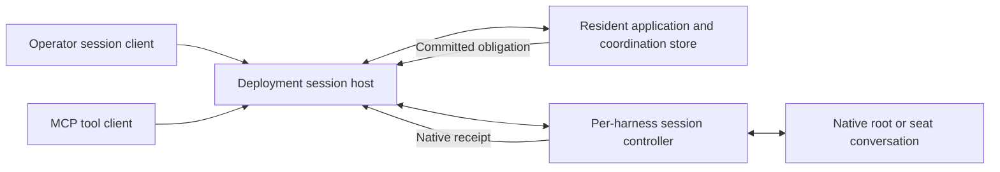

# 57 — Durable attention and harness session ownership

Issue: [#592](https://github.com/Flip-Engineering/baton/issues/592).
Status: stage 1 proposal for root review. No implementation is authorized by this document.
Research date: 2026-09-25 UTC. Repository inspected: `67b165685045c8f579fbbaba55d1f95c0f6f30f3`.

## Decision proposed for review

Baton should own the supported programmatic session interface of every agent it must wake,
including the operator's root. A deployment session host submits owed work through that interface,
records the harness's response, and restores the logical recipient after a process restart. The
operator interacts with the root through a Baton session client. Roots and seats use the same
session controller and attention dispatcher for their selected harness.

This is a product decision requiring the root's review: the proposed operator entry point is
`baton root`, which opens the deployment's root conversation through Baton. For Claude Code, the
conversation runs in the Claude Code runtime through the public Agent SDK. The terminal client
must carry operator messages, streamed replies, permission requests, user questions, interrupts,
and reconnectable conversation history. Building that client is part of this proposal.

An independently launched native Claude terminal has a different integration contract. Its
documented inbound event interface is Channels. Channels currently has a preview allowlist,
per-launch enablement, and no machine acknowledgment of event receipt. Section 3 explains why
this proposal does not select it for the required delivery guarantee. This design does **not**
claim that adopting the session host automatically upgrades the already-running root terminal.
The operator would move the root role to a hosted Claude Code conversation at cutover. If keeping
the existing native terminal as the root is a requirement, this proposal needs revision before
implementation; that constraint cannot be concealed inside a transport adapter.

## 1. Required behavior

An attention obligation names a logical Baton recipient and the work requiring its attention.
The root recipient is the deployment's root role. A seat recipient follows its recorded
participant succession. Starting or resuming either recipient automatically connects its
controller to its owed attention. No model subscription, wake tool, heartbeat, or acknowledgment
task is part of delivery.

The obligation survives a disconnected UI, an MCP client restart, a harness process restart,
and a complete deployment process restart. Business resolution closes an obligation: for
example, the contribution has a review or the question has an answer. A transport write alone
cannot close it. A refused input preserves the obligation and records the refusal cause.

The architecture uses process exit, committed state changes, harness protocol events, and
connection lifecycle events to dispatch and recover. It has no delivery deadline, retry limit,
polling loop, or periodic rescan. Passing time cannot resolve, exhaust, or abandon an obligation.

Authority and native resume handles are generated from authenticated runtime operations. They
are persisted as execution facts. No operator edits a session ID, PID, socket address, or path
to keep delivery working. A harness choice and model choice remain ordinary routing policy.

## 2. Inspected implementation

`docs/54-native-wake.md` describes brief composition, MCP auto-subscription, and the rejected
root socket mechanism. Brief context is useful input on creation and recovery. Its inclusion
does not establish that an idle recipient started a turn.

`impl/src/wake-delivery.mjs` currently contains the configured target validator, discovery using
`claude agents --json`, PID-derived socket path, private cross-session frame encoder, and a
three-attempt cap. It records `wake.root_delivered` after the transport reports success. A
received write is insufficient evidence of processing, and the cap strands owed work.

`WakeStream.watch` calls the timed `coordination.waitAfter` and has a timer-backed error retry.
`WakeSubscriptionPlane` in `mcp-web-bridge.mjs` also has timed reconnection. These paths cannot
be the dispatch clock for this design. The coordination store already maintains append waiters;
an unbounded, cancellation-aware commit subscription can use the same append boundary.

`McpFleetServer` starts auto-subscription during `initialize`, advertises ordinary MCP tools,
and sends `notifications/baton/wake`. It does not implement the Claude Channels capability.
`serveMcpStdio` shares one output with notifications and tool replies. MCP remains the tool
interface; session input is supplied by the harness controller.

The headless `mcp-stdio.mjs` entry takes a descriptor or module. The resident-connected
`mcp-web.mjs` entry takes no arguments and discovers the published connection. The latter is the
appropriate tool client for the hosted root. The resident publishes an incarnation-specific
socket through `ResidentAuthority`; the local HTTP transport validates its ownership. These
are Baton-controlled connection coordinates, which must continue to be generated and validated.

The reported `baton-clone: CONNECTION_CLOSED` cause is still unproven. The current index import
and all three MCP startup surface assertions passed in this worktree. That narrows the fault
but does not reproduce the root's launch. Stage 2 must capture the exact entry point, exit cause,
and redacted stderr through the root's real launch path. A tool connection and a wake connection
must each have their own measured result.

## 3. Harness contracts and verification

The following evidence establishes the design inputs. It is not a report that the proposed wake
system already works. The stage 2 real-process tests in section 10 establish that separately.
Version strings below came from local `--version`; help and schema inspection made no model calls.

### Claude Code

Anthropic documents a persistent streaming-input Agent SDK session. The host supplies user
messages and receives streamed results, permission callbacks, and session information. The
public session API supports resuming a captured session ID. Select that SDK interface for both
root and seats, keep session persistence enabled, and record the returned ID before subsequent
dispatch. SDK result and error events are evidence for the submitted input; a successful enqueue
is only input acceptance. [Streaming input](https://code.claude.com/docs/en/agent-sdk/streaming-vs-single-mode),
[sessions](https://code.claude.com/docs/en/agent-sdk/sessions).

Local evidence: Claude Code `2.1.282`; help exposes streaming input/output, user-message replay,
and resume. `ClaudeSessionCli` already drives persistent workers, but the new controller should
use the maintained SDK for its control operations. Raw private cross-session messages are
excluded. A live SDK session restart has not been run in stage 1.

Anthropic's Channels reference specifies `experimental['claude/channel']` and
`notifications/claude/channel`. Enabled sessions queue incoming events for processing. The
server gets no receipt; policy-blocked or unregistered channels can silently discard them.
The documented confirmation alternative asks the model to call a reply tool. That cannot be
Baton's automatic delivery acknowledgment. [Channels reference](https://code.claude.com/docs/en/channels-reference).

Channels is a research preview. Its documented normal launch requires an approved plugin and
`--channels`; organizations can approve internal plugins. Custom development channels use a
separate testing flag. Help intentionally omits those flags. Consequently, absence from local
help is not evidence of absence, and an ordinary connected MCP server is not proof of channel
enablement. This feature remains a possible future native-terminal integration, contingent on
an adequate runtime receipt contract. [Channels availability and controls](https://code.claude.com/docs/en/channels).

### Codex

Select the documented App Server interface: `thread/start` or `thread/resume`, then `turn/start`.
Observe the native turn identity and turn events; input acceptance and turn completion are
separate facts. Persist the returned thread handle with session persistence enabled. This gives
the hosted operator and seats the same input interface. The documentation makes no promise
that a separate arbitrary Codex terminal becomes this App Server client's UI.
[App Server](https://learn.chatgpt.com/docs/app-server).

Local evidence: `codex-cli 0.156.1`; `codex app-server --help` advertises stdio and other supported
transports. The current `CodexAppServerCli` implements the relevant methods but creates fresh
threads with `ephemeral: true`; that setting must change for these durable conversations.
No live turn or resume was requested in stage 1.

### Oh My Pi

Select `omp --mode rpc` and its documented `prompt` command. The protocol exposes ready frames,
command responses, and agent events. A prompt response can precede an asynchronous scheduling
error, so an immediate success is not sufficient evidence of a processed turn. Use the installed
version's supported session restoration interface and retain the handle it returns.
[OMP RPC reference](https://github.com/can1357/oh-my-pi/blob/main/docs/rpc.md).

Local evidence: `omp/17.4.0`; help advertises RPC mode and resume. `OmpRpcCli` already records
session information and agent events. Current upstream documentation may describe newer
events than this binary; the controller must negotiate observed capabilities and test the
installed event sequence. Existing readiness backoff must not become a wake retry mechanism.
The live wake/restart contract remains untested here.

### Kimi Code

Moonshot documents `kimi acp` as a multi-session ACP server. The selected input method is ACP
`session/prompt`; use the advertised load/resume capability to restore a session and keep
native errors and `session/update` output associated with the pending request.
[Kimi ACP command](https://github.com/MoonshotAI/kimi-cli/blob/main/docs/en/reference/kimi-acp.md),
[upstream ACP implementation](https://github.com/MoonshotAI/kimi-cli/blob/main/src/kimi_cli/acp/server.py).

Local evidence: `KimiAcpCli` implements initialize, session creation/restoration, and prompting.
`kimi` was absent from this task's PATH. There is no current installed-binary or live-wake proof
for this route. The recorded quota exhaustion is also relevant to executing the acceptance test.
Kimi models selected through OMP use the OMP contract; the harness determines the interface.

### Grok Build

xAI documents `grok agent stdio`, ACP `session/prompt`, and streamed `session/update` output.
The selected controller uses these operations and the session-loading capability returned at
initialization. [Headless and scripting](https://docs.x.ai/build/cli/headless-scripting).

Local evidence: `GrokAcpCli`, the repository's earlier protocol captures, and the installed
vendor guide `~/.grok/docs/user-guide/15-agent-mode.md` agree on that interface. `grok` was
absent from this task's PATH; the old dossier's `0.1.216` version is historical evidence, not a
fresh executable measurement. Live restart acceptance is required on the deployed binary.

### Muse

Select Muse's shipped MSP session host. Local `Muse Code 1.4.0 (1.4.0-R4161.1)` documents
`muse serve` as an exclusively connected stdio host. Its offline stable schema exports
`session/start`, `session/resume`, and `turn/start`. `TurnStartParams` includes a UUIDv7
`commandId` idempotency handle. The response carries authoritative `disposition` and `turnId`.
The controller must follow the schema's replay/error contract and inspect the returned
disposition. The present `MuseCli` one-shot adapter does not establish this capability.

Verification commands: `muse serve --help`, `muse schema --help`, and
`muse schema generate-json-schema --out <worktree-local-directory>`. The generated schema's
method descriptions and `TurnStartParams`/`TurnStartResult` were inspected. This is vendor
contract evidence from the installed binary; no public website or successful model call is
asserted. Stage 2 includes an MSP adapter and live restart test.

### Capability reporting

Replace the static root-only capability table with facts from controller initialization:
supported input operation, durable-resume support, connection generation, native acceptance
semantics, and last typed failure. A route can be available for one-shot execution while its
durable orchestrator mode remains unavailable. Report that distinction at root/session startup
and in the deployment view. An absent executable or denied credential is a concrete unavailable
route, with owed attention retained and the responsible reachable orchestrator notified.

No table entry in this document is a runtime authorization record. Runtime capabilities come
from the implemented adapter and negotiated harness interface. Test results are review evidence.

## 4. Process ownership and operator interaction

The deployment has a small session host supervising the resident application process and the
harness session controllers. The host owns the authenticated local listener and process-lifetime
control connections. The resident application owns coordination mutations and obligation
derivation. The controllers own the documented harness connections. An API process replacement
therefore leaves the listener and native sessions connected.

This introduces a real lifecycle boundary in `baton serve`. It is required implementation work,
not an assumption that an external reconnect service already exists. `ResidentAuthority` must
place listener ownership with this host and preserve incarnation checks for resident operations.
Host startup creates its coordinates and publishes them atomically using the existing
owner-only publication authority. Callers discover that publication from the repository.

The host and its resident child exchange explicit ready, commit, receipt, and exit messages over
an inherited IPC connection. After the child loads its durable store it sends `ready` with the
current incarnation and sequence. The host then rebinds tool clients, sends stored native
receipts, and asks the child to reconstruct pending dispatch. A child-exit event starts recovery;
an explicit startup error is recorded and displayed. Repeated permanent startup refusal remains
an external fault with its actual cause; it must not be disguised as an eligible recipient.

`baton root` authenticates as the operator and opens the existing logical root conversation,
creating it on first use. The root binding belongs to that deployment. Additional UI connections
observe the same conversation and serialize input through its controller. An observer's MCP
connection never acquires the root role merely by connecting. Seat bindings come from existing
authenticated recruitment and succession records. Root and seat privileges remain distinct.

Closing or restarting a UI or MCP process has no effect on the native session's input ownership.
If the complete host stops, clients receive EOF and display the disconnected state. Restarting
`baton serve` restores root and seat bindings, authenticates resume operations, and drains owed
work before a UI reconnect is needed. Relaunching `baton root` reconnects its UI. This proposal
does not rely on a client repeatedly trying an unavailable endpoint.

A full host crash also requires exclusive native-session ownership during recovery. Each
controller holds a process-lifetime ownership lock and a parent control pipe. Its launcher
handles parent EOF and reports native exit through the existing process cleanup authority.
Recovery must acquire exclusive ownership and prove the predecessor is gone before opening
another writer. PID reuse and an old durable PID are insufficient evidence. Existing process
generation and exact-close machinery must be used and tested; an unproven cleanup blocks a
second writer and produces a visible recovery fault. No elapsed-time constant authorizes takeover.

The host itself performs no agent decisions. Its functions are process supervision, authenticated
transport, input serialization, and receipt storage. All root reasoning still runs in the selected
Claude Code, Codex, OMP, Kimi, Grok, or Muse harness. Model, effort, permissions, working directory,
tool configuration, and conversation continuation must remain explicit runtime facts.

## 5. Obligation and delivery state

An obligation has a stable key derived from its source and recipient lineage. For example, a
contribution review obligation derives from the contribution ID and eligible recipient role;
a turn-report obligation also includes the reporting worker's turn identity. Repeated reads of
the same state yield the same obligation. Parent succession changes the effective recipient
without losing the source identity.

The source coordination row is the durable outbox. Resolve pending work by folding source rows,
their business dispositions, and native processing evidence. If a derived obligation row is
materialized, reconstruct it on startup from the source. A crash between the source commit and
the materialization must be harmless. There is no second manually synchronized queue inventory.

The delivery state for one obligation records these independent facts:

| Fact | Recorded evidence |
|---|---|
| Owed | Source row and recipient relationship; no resolving business disposition |
| Prepared | Immutable input batch, item keys, digest, controller generation, native request key |
| Accepted | A documented native acknowledgment, with the actual native identity and semantics |
| Processing observed | A correlated native turn/output event; never a controller's pre-send event |
| Processed | A correlated native result, including failure when the harness reports one |
| Uncertain | Connection/process loss left input acceptance or processing unproven |
| Refused | Native or local typed error, safe cause, and retained obligation |
| Resolved | The underlying action or authorized disposition closed the source obligation |

The host persists prepared batches and native receipts in its existing deployment-owned durable
storage before acknowledging them across the resident IPC boundary. These are functional
execution records. The coordination store imports them idempotently by dispatch identity.
An IPC acknowledgment means the receiving side has committed its copy; only then may the sender
release its durable receipt. Storage errors reach the operator connection and process stderr;
the system must not issue a successful delivery receipt when it cannot record the evidence.

The host receipt journal needs a single writer, framed records with integrity checks, an fsync
boundary, and atomic checkpoint replacement with directory synchronization. Recovery may discard
an incomplete final record; corruption in committed history is a storage fault. Reusing a batch
key with a different digest refuses. Acknowledged receipt retention and compaction follow durable
import state. These are requirements for the new host storage component, not features assumed of
an in-memory IPC queue. Its tests must kill the writer at each persistence boundary.

The guarantee is durable owed work and at-least-once attention under recovery. Harness APIs
without documented idempotent submission cannot provide exactly-once native turns across the
send/receipt crash interval. Use native idempotency where specified, such as Muse's command ID.
Otherwise recover native history through supported APIs where available. If that cannot prove
processing, record `uncertain` and submit the still-owed items to the restored conversation with
their original keys. Duplicate attention is possible and disclosed. Business mutations use
Baton's existing idempotency and expected-state guards.

Once a batch has a processed result, its items remain visible as unresolved work when appropriate.
They are not immediately resubmitted merely because a model chose to finish its turn. New work,
a business-state change requiring another decision, a native failure, or a new session generation
can make another attention turn necessary. Existing end-of-turn orchestration decides further
work; the wake dispatcher never substitutes a continuation policy for that decision.

## 6. Dispatch and recovery algorithm

1. Subscribe at the coordination commit boundary, capture a sequence barrier, and fold pending
   obligations through that barrier. Then consume committed rows after it. Register-before-read
   and a final sequence check cover the append/subscription race.
2. Resolve each effective logical recipient from authenticated root, parent, and succession state.
   Create or restore its controller automatically. An unavailable seat routes a failure report to
   its reachable parent, following the existing parent chain to root. Record the original debt.
3. Serialize input per conversation. If a turn is active, retain new items in the durable outbox;
   its real terminal result triggers the next batch. Waiting for an active turn is a protocol
   constraint, and does not terminate or park the agent. Native approval requests remain visible
   to their authorized answerer throughout the turn.
4. At an available input boundary, select pending items in source order, recheck their business
   state, and persist a prepared batch. Bound each frame by the negotiated transport limit.
   Overflow remains eligible for the next batch. Bounded encoding cannot drop older obligations.
5. Submit through the harness operation in section 3. Persist acceptance, native turn evidence,
   completion, or refusal as each is observed. Distinguish correlated native output from the
   current adapters' locally emitted `lifecycle.turn_started` events before a request is sent.
6. On native exit, restore the exact route and native conversation where supported, using the
   machine-recorded handle. Reconcile uncertain batches before draining pending work. If native
   history is irrecoverable, record that loss and create an explicitly identified successor with
   durable Baton context and the outstanding obligations. Never claim transcript continuity.
7. On resident ready, controller ready, native turn end, credential-change notification, or
   routing-state change, reconsider affected refused or uncertain items. Error records alone do
   not trigger immediate recursive delivery. A repeated deterministic refusal needs a relevant
   state change. There is no attempt counter that makes an item ineligible forever.

These callbacks call one serialized dispatcher. Delivery receipt writes do not generate another
ordinary attention obligation. Recovery faults have stable identities and route once per changed
cause to the supervising role, preventing a root failure from recursively generating root errors.

If every agent capable of deciding an external fault is unavailable, the authenticated operator
client receives the cause and the obligation remains owed. Starting the deployment or restoring
a supported root automatically replays it. Actual absence of all executing recipients is an
availability failure, not a successful delivery or a runtime decision to abandon live work.

## 7. Authentication and admission

Only the deployment's authenticated runtime can submit a wake batch. Seat text cannot choose
another recipient's native session ID, controller generation, model, or permissions. The dispatcher
derives routing from recorded relationships; untrusted contribution prose is task content.
Native tool approvals and operator questions keep their existing authority checks.

The controller validates harness protocol/version and restoration support when it starts. It
records the observed capabilities and refusals. A missing required operation prevents advertising
a wake-capable orchestration session. That decision follows actual runtime functionality and
permissions, and does not depend on a test census, capability declaration file, or completion list.

A wake never grants new tool authority or changes the declared route. Token material, raw socket
addresses, and private provider data remain outside attention messages and public receipts.

## 8. Removal and migration

Stage 2 removes the configured-target architecture in one reviewed change:

- Delete `normalizeRootWakeTarget`, `claudeSessionSocketPath`, `parseClaudeAgents`, the private
  frame encoder and sender, `ROOT_WAKE_DELIVERY_ATTEMPT_CAP`, and root-only delivery wiring.
- Remove `advanced.rootWake` and `rootWakeTarget` from deployment construction, Web wiring,
  doctor output, exports, CLI descriptions, and runtime capability reporting. Legacy input gets
  the normal unknown-field refusal; it never activates a compatibility sender.
- Replace the static unsupported-root table with controller capabilities. Route Claude roots
  and seats through the SDK controller; integrate durable Codex, ACP, OMP, and MSP controllers.
- Replace attention delivery's timed wake-stream and bridge reconnect dependency with commit
  subscriptions and host ready/exit events. Observational wake APIs can retain their public
  contract, but their implementation must no longer drive delivery through timer wakeups.
- Rework the old socket tests into tests of obligations, actual input operations, receipts, and
  recovery. Remove assertions that require a configured target, a private socket, or exhaustion.
- Update docs/54 to describe brief context and observational MCP notifications accurately and
  reference this design for turn-start delivery. Update supported operator entry points.

Retain historical source and receipt rows. Old `wake.root_delivered` rows prove only the old
transport's reported outcome and cannot suppress unresolved source obligations. Startup rederives
those obligations from contribution, review, question, report, and succession state. Resolved
work stays resolved. Historical native process handles remain historical evidence.

The operator has already deleted the external serve config module. This lane must not recreate
or edit it. The root performs deployment cutover after implementation review, opens the hosted
root client, and confirms its authority before retiring the previous root role. Binding takeover
is an authenticated role transition; it must not be inferred from which MCP client connected last.
For the first migration, the new conversation receives Baton state and the operator's handoff;
importing an arbitrary terminal's transcript is not a prerequisite or an implied capability.

## 9. Alternatives rejected

| Alternative | Reason |
|---|---|
| Configured session/PID and private socket from #564 | Explicitly banned; lifetime and protocol ownership are unproven |
| In-session environment discovery and private socket writer | Explicitly banned; uses the same undocumented harness internals |
| Ordinary MCP notifications, resource changes, or logging | They do not establish an idle harness turn-start contract |
| Claude Channels as the production receipt path | Preview enablement and silent drop behavior leave receipt unknown; documented confirmation requires a model action |
| Periodic inbox reads, cron, polling reconnects, or delayed retries | Delivery would depend on monitors or timers |
| Terminal keystroke injection and transcript-file discovery | UI layout and private storage become protocol dependencies |
| Starting another CLI with a guessed or configured resume ID | Creates competing conversation ownership and a stale address |
| A root-only sender beside existing seat adapters | Does not satisfy the shared per-harness lifetime and delivery requirement |
| Declaring all non-Claude roots incapable using the old table | Codex, ACP, OMP, and the installed Muse host expose real prompt operations |
| Exactly-once claim after a successful write | Harnesses without replayable input identity have an uncertain crash interval |

## 10. Acceptance tests and evidence

The implementation must include subprocess tests for storage and process boundaries and an
authenticated real-harness test for each route it claims to support. Mock protocol servers are
useful for malformed frames and crash placement, but cannot prove a harness starts a turn.
No live test silently skips because an executable, credential, or quota is missing: its result
must name the unavailable prerequisite and leave that harness's acceptance unproven.

For the Claude root acceptance, run the real hosted Claude Code session and give it a simple
task whose result identifies a fresh unpredictable obligation marker. Let its initial turn end.
Commit actual root-owed work, observe the native output containing that marker, and inspect the
durable processing receipt. The test driver injects work through the normal coordination mutation,
never through a direct adapter call. Execute the same test as a Claude seat and check that both
traces use the same controller operation. Repeat for every supported harness.

Required cases:

1. **Default delivery:** open a root and recruit a seat without wake configuration or a model
   subscription. Record review owed, a root question, a child turn report, and seat guidance.
   Observe the correctly addressed real turns and business dispositions.
2. **Harness restart:** terminate the test-owned native process, produce more work while its
   replacement is withheld by a test barrier, then release startup. Observe the restored session
   or truthful successor, outstanding markers, and processing receipts. Change no configuration.
3. **Client restart:** kill and restart the real UI and MCP subprocesses. Produce work during
   disconnection. The native root must still receive it, and the restarted client must show it.
4. **Resident replacement:** kill the actual resident application child while the host and
   native sessions stay up. Produce work through durable test setup, restart the child, and
   verify replay and receipt import. The host ready event drives recovery.
5. **Complete service restart:** kill the complete test deployment process tree, restart
   `baton serve` on its existing durable state, and verify root/seat recovery and all owed work.
   This case prevents passing the previous case by quietly exempting a newly added host process.
6. **Crash intervals:** stop real subprocesses after source commit, after prepared-batch commit,
   after native acceptance, and before receipt import. Assert retained debt, truthful uncertain
   states, documented native deduplication where available, and idempotent business effects.
7. **Refusal and recovery:** exercise a real protocol refusal and a broken native connection.
   Assert safe cause, outstanding debt, and delivery after a relevant restoration event.
   More failures than the deleted cap must not suppress later successful delivery.
8. **Ownership and authorization:** attempt a second writer, a stale-generation receipt,
   cross-seat input, and an observer claiming root. All refuse without consuming obligations.
   Verify session cleanup and exact ownership transfer across process loss.
9. **Concurrent/busy delivery:** append while snapshot subscription is opening and while the
   recipient is generating. All distinct items appear after real turn boundaries. Resolving an
   item before dispatch suppresses stale action. Large queues retain every overflow item.
10. **No timer dependency:** use event barriers to control readiness and completion; instrument
    delivery timers so any registration fails the test. Moving the wall clock cannot consume
    debt, dispatch retries, mark a live process dead, or authorize a takeover. A test-runner
    watchdog may abort the test and report no verdict; it is never production delivery evidence.
11. **MCP launch:** use the packaged resident-connected entry through a real Claude tool
    initialization, complete `initialize` and `notifications/initialized`, read tools, and make
    a read-only tool call. Capture process exit and redacted stderr on failure. Fix the measured
    `CONNECTION_CLOSED` cause and repeat this case across client and resident restart.
12. **Removal:** run with a plain serve invocation and no target configuration, scan executable
    paths for the removed private sender, and verify a legacy rootWake setting is rejected.
    The deployment's generated transport and resume facts remain usable after every restart.

Each live evidence artifact records executable version, exact route, native method and returned
identities, relevant source/receipt sequences, process exits, and cleanup outcome, with secrets
redacted. Record evidence at the tested commit. Do not add an expected-failure inventory or a
hand-maintained acceptance declaration that runtime decisions read.

Run the assignment's exact verification command, `npm test --prefix impl`, and report its exit.
For implementation landing review, also run the repository's target-comparison gate, accounting
for every selected file and comparing failures by file, test, and failure type. A baseline failure
does not turn the plain suite green. A missing verdict cannot authorize landing.

## 11. Review boundary

The root should review the proposed session ownership and operator client before code is written.
The material decision is adopting a hosted root conversation, with a supported input API and
durable lifecycle, as the operator interface. This includes the SDK controller, session host,
operator client, durable dispatch/receipt flow, other harness controllers, MCP repair, migration,
and real-process verification. None of those is an optional follow-up needed to make wake work.

This stage delivers the architecture proposal and evidence limits. Native wake/restart acceptance,
the root's MCP failure reproduction, implementation review, and deployment cutover remain stage 2
work. The root alone lands the reviewed implementation.
