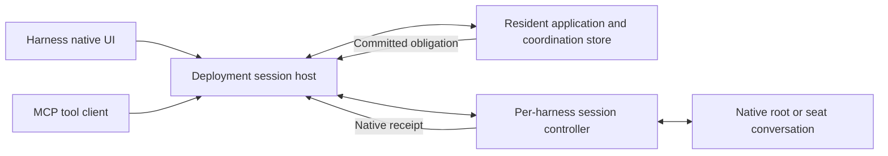

# 57 — Durable attention and harness session ownership

Issue: [#592](https://github.com/Flip-Engineering/baton/issues/592).
Status: native-root revision for review. Stage 2 core work is authorized by the root;
root integration changes remain subject to this review. The root reviews implementation before landing.
Research date: 2026-09-25 UTC. Repository inspected: `67b165685045c8f579fbbaba55d1f95c0f6f30f3`.

## Approved architecture and native root constraint

The operator requires Baton to remain a cross-agent coordinator. The root always uses its
harness's native UI. Baton coordinates work, owns delivery records, and integrates documented
harness interfaces. It supplies no conversation UI, approval UI, or replacement agent loop.

A deployment session host manages seat controllers and the admitted root integration. Roots use
one of two modes: a native UI attached to a hosted session, or documented input into an
independently launched native session. Each mode must establish actual turn-start behavior,
input ownership, and lifetime recovery. A harness with neither mode available is reported as
not wake-capable for the root, with its concrete cause. Its programmatic seat mode is assessed
separately. The shared obligation and dispatch rules cover both roles.

The session host submits owed work, records the harness's evidence, and restores delivery after
process loss. An independent native root retains ownership of its engine; its admitted integration
must provide documented lifecycle events and reconnect behavior. The host and resident have
separate lifetimes so resident replacement preserves the host's connections and live turns.
Only business resolution closes an obligation. Generated session handles remain runtime facts.
Section 4 defines native interaction and capability reporting for all six harnesses.

## 1. Required behavior

An attention obligation names a logical Baton recipient and the work requiring its attention.
The root recipient is the deployment's root role. A seat recipient follows its recorded
participant succession. Starting or resuming either recipient automatically connects its
controller to its owed attention. No model subscription, wake tool, heartbeat, or acknowledgment
task is part of delivery.

The obligation survives a disconnected UI, an MCP client restart, a harness process restart,
and a complete deployment process restart. Business resolution closes an obligation: for
example, the contribution has a review or the question has an answer. A transport write alone
cannot close it. A refused input preserves the obligation and records the refusal cause.

The architecture uses process exit, committed state changes, harness protocol events, and
connection lifecycle events to dispatch and recover. It has no delivery deadline, retry limit,
polling loop, or periodic rescan. Passing time cannot resolve, exhaust, or abandon an obligation.

Authority and native resume handles are generated from authenticated runtime operations. They
are persisted as execution facts. No operator edits a session ID, PID, socket address, or path
to keep delivery working. A harness choice and model choice remain ordinary routing policy.

## 2. Inspected implementation

`docs/54-native-wake.md` describes brief composition, MCP auto-subscription, and the rejected
root socket mechanism. Brief context is useful input on creation and recovery. Its inclusion
does not establish that an idle recipient started a turn.

`impl/src/wake-delivery.mjs` currently contains the configured target validator, discovery using
`claude agents --json`, PID-derived socket path, private cross-session frame encoder, and a
three-attempt cap. It records `wake.root_delivered` after the transport reports success. A
received write is insufficient evidence of processing, and the cap strands owed work.

`WakeStream.watch` calls the timed `coordination.waitAfter` and has a timer-backed error retry.
`WakeSubscriptionPlane` in `mcp-web-bridge.mjs` also has timed reconnection. These paths cannot
be the dispatch clock for this design. The coordination store already maintains append waiters;
an unbounded, cancellation-aware commit subscription can use the same append boundary.

`McpFleetServer` starts auto-subscription during `initialize`, advertises ordinary MCP tools,
and sends `notifications/baton/wake`. It does not implement the Claude Channels capability.
`serveMcpStdio` shares one output with notifications and tool replies. MCP remains the tool
interface; session input is supplied by the harness controller.

The headless `mcp-stdio.mjs` entry takes a descriptor or module. The resident-connected
`mcp-web.mjs` entry takes no arguments and discovers the published connection. The latter is the
appropriate resident-connected tool client for a native root. The resident publishes an incarnation-specific
socket through `ResidentAuthority`; the local HTTP transport validates its ownership. These
are Baton-controlled connection coordinates, which must continue to be generated and validated.

The reported `baton-clone: CONNECTION_CLOSED` cause is still unproven. The current index import
and all three MCP startup surface assertions passed in this worktree. That narrows the fault
but does not reproduce the root's launch. Stage 2 must capture the exact entry point, exit cause,
and redacted stderr through the root's real launch path. A tool connection and a wake connection
must each have their own measured result.

## 3. Harness contracts and verification

The following evidence establishes the design inputs. It is not a report that the proposed wake
system already works. The stage 2 real-process tests in section 10 establish that separately.
Version strings below came from local `--version`; help and schema inspection made no model calls.

### Claude Code

Anthropic documents a persistent streaming-input Agent SDK session. The host supplies user
messages and receives streamed results, permission callbacks, and session information. The
public session API supports resuming a captured session ID. Select that SDK interface for seats and any proven hosted-native root mode, keep session
persistence enabled, and record the returned ID before subsequent dispatch. Independent native
roots require the documented ingress evaluated in section 4. SDK result and error events are evidence for the submitted input; a successful enqueue
is only input acceptance. [Streaming input](https://code.claude.com/docs/en/agent-sdk/streaming-vs-single-mode),
[sessions](https://code.claude.com/docs/en/agent-sdk/sessions).

Local evidence: Claude Code `2.1.282`; help exposes streaming input/output, user-message replay,
and resume. `ClaudeSessionCli` already drives persistent workers, but the new controller should
use the maintained SDK for its control operations. Raw private cross-session messages are
excluded. A live SDK session restart has not been run in stage 1.

Anthropic's Channels reference specifies `experimental['claude/channel']` and
`notifications/claude/channel`. Enabled sessions queue incoming events for processing. The
server gets no receipt; policy-blocked or unregistered channels can silently discard them.
Baton must record such an attempt as receipt-unknown and retain its source obligation. A model
reply tool is unnecessary for obligation retention; this design does not request one as a
transport acknowledgment. [Channels reference](https://code.claude.com/docs/en/channels-reference).

Channels is a research preview. Its documented normal launch requires an approved plugin and
`--channels`; organizations can approve internal plugins. Custom development channels use a
separate testing flag. Help intentionally omits those flags. Consequently, absence from local
help is not evidence of absence, and an ordinary connected MCP server is not proof of channel
enablement. Section 4 evaluates this documented native-terminal integration, including the lifecycle
limits that remain when the session is independently owned. [Channels availability and controls](https://code.claude.com/docs/en/channels).

### Codex

Select the documented App Server interface: `thread/start` or `thread/resume`, then `turn/start`.
Observe the native turn identity and turn events; input acceptance and turn completion are
separate facts. Persist the returned thread handle with session persistence enabled. This gives
the hosted operator and seats the same input interface. The installed CLI and documentation
also expose a native TUI client for an App Server; section 4 covers its input ownership.
[App Server](https://learn.chatgpt.com/docs/app-server).

Local evidence: `codex-cli 0.156.1`; `codex app-server --help` advertises stdio and other supported
transports. The current `CodexAppServerCli` implements the relevant methods but creates fresh
threads with `ephemeral: true`; that setting must change for these durable conversations.
No live turn or resume was requested in stage 1. The current vendor reference labels App Server
and its WebSocket transport experimental and unsupported for production workloads. That is a
vendor support limitation of this selected dependency. Baton must report its maturity, pin and
exercise the supported protocol it uses, and avoid promising a vendor production guarantee.

### Oh My Pi

Select `omp --mode rpc` and its documented `prompt` command. The protocol exposes ready frames,
command responses, and agent events. A prompt response can precede an asynchronous scheduling
error, so an immediate success is not sufficient evidence of a processed turn. Use the installed
version's supported session restoration interface and retain the handle it returns.
[OMP 17.4.0 RPC reference](https://github.com/can1357/oh-my-pi/blob/v17.4.0/docs/rpc.md).

Local evidence: `omp/17.4.0`; help advertises RPC mode and resume. `OmpRpcCli` already records
session information and agent events. Current upstream documentation may describe newer
events than this binary; the controller must negotiate observed capabilities and test the
installed event sequence. Existing readiness backoff must not become a wake retry mechanism.
The live wake/restart contract remains untested here.

### Kimi Code

Moonshot documents `kimi acp` as a multi-session ACP server. The selected input method is ACP
`session/prompt`; use the advertised load/resume capability to restore a session and keep
native errors and `session/update` output associated with the pending request.
[Kimi ACP command](https://github.com/MoonshotAI/kimi-cli/blob/main/docs/en/reference/kimi-acp.md),
[upstream ACP implementation](https://github.com/MoonshotAI/kimi-cli/blob/main/src/kimi_cli/acp/server.py).

Local evidence: `KimiAcpCli` implements initialize, session creation/restoration, and prompting.
`kimi` was absent from this task's PATH. There is no current installed-binary or live-wake proof
for this route. The recorded quota exhaustion is also relevant to executing the acceptance test.
Kimi models selected through OMP use the OMP contract; the harness determines the interface.
The current Kimi Code documentation also specifies a web server with prompt and event APIs.
Section 4 evaluates that interface for native browser interaction. Its installed compatibility
is unproven here; an adapter must select one session-owning interface for a conversation.

### Grok Build

xAI documents `grok agent stdio`, ACP `session/prompt`, and streamed `session/update` output.
The selected controller uses these operations and the session-loading capability returned at
initialization. [Headless and scripting](https://docs.x.ai/build/cli/headless-scripting).

Local evidence: `GrokAcpCli`, the repository's earlier protocol captures, and the installed
vendor guide `~/.grok/docs/user-guide/15-agent-mode.md` agree on that interface. `grok` was
absent from this task's PATH; the old dossier's `0.1.216` version is historical evidence, not a
fresh executable measurement. The installed `~/.grok/bin/grok` and `agent` links target
`grok-0.2.118-macos-aarch64`, whose binary is absent. Installed guide text remains readable;
executing that release is unavailable. Live restart acceptance requires a working deployed binary.

### Muse

Select Muse's shipped MSP session host. Local `Muse Code 1.4.0 (1.4.0-R4161.1)` documents
`muse serve` as an exclusively connected stdio host. Its offline stable schema exports
`session/start`, `session/resume`, and `turn/start`. `TurnStartParams` includes a UUIDv7
`commandId` idempotency handle. The response carries authoritative `disposition` and `turnId`.
The controller must follow the schema's replay/error contract and inspect the returned
disposition. The present `MuseCli` one-shot adapter does not establish this capability.

Verification commands: `muse serve --help`, `muse schema --help`, and
`muse schema generate-json-schema --out <worktree-local-directory>`. The generated schema's
method descriptions and `TurnStartParams`/`TurnStartResult` were inspected. This is vendor
contract evidence from the installed binary; no public website or successful model call is
asserted. Stage 2 includes an MSP adapter and live restart test.

### Capability reporting

Replace the static root-only capability table with facts from controller initialization:
supported input operation, durable-resume support, connection generation, native acceptance
semantics, and last typed failure. A route can be available for one-shot execution while its
durable orchestrator mode remains unavailable. Report that distinction at root/session startup
and in the deployment view. An absent executable or denied credential is a concrete unavailable
route, with owed attention retained and the responsible reachable orchestrator notified.

No table entry in this document is a runtime authorization record. Runtime capabilities come
from the implemented adapter and negotiated harness interface. Test results are review evidence.

## 4. Process ownership and operator interaction

### 4.1 Deployment ownership

The deployment has a small session host supervising the resident application process and the
harness session controllers. The host owns the authenticated local listener and process-lifetime
control connections. The resident application owns coordination mutations and obligation
derivation. The controllers own the documented harness connections. An API process replacement
therefore leaves the listener and native sessions connected.

This introduces a real lifecycle boundary in `baton serve`. It is required implementation work,
not an assumption that an external reconnect service already exists. `ResidentAuthority` must
place listener ownership with this host and preserve incarnation checks for resident operations.
Host startup creates its coordinates and publishes them atomically using the existing
owner-only publication authority. Callers discover that publication from the repository.

The host and its resident child exchange explicit ready, commit, receipt, and exit messages over
an inherited IPC connection. After the child loads its durable store it sends `ready` with the
current incarnation and sequence. The host then rebinds tool clients, sends stored native
receipts, and asks the child to reconstruct pending dispatch. A child-exit event starts recovery;
an explicit startup error is recorded and displayed. Repeated permanent startup refusal remains
an external fault with its actual cause; it must not be disguised as an eligible recipient.

A root launch or enrollment authenticates operator authority and binds the native session to
the deployment's logical root. A hosted root launch opens the harness's own UI. Independent
native roots enroll through the admitted documented integration. Additional native UI connections
must preserve the selected integration's single input arbiter. An observer's MCP
connection never acquires the root role merely by connecting. Seat bindings come from existing
authenticated recruitment and succession records. Root and seat privileges remain distinct.

Closing or restarting a UI or MCP process has no effect on the native session's input ownership.
If the complete host stops, clients receive EOF and display the disconnected state. Restarting
`baton serve` restores root and seat bindings and authenticates supported resume operations.
For hosted sessions it drains owed work before a native UI reconnect is needed. An independent
root's integration replays debt at its documented connection or startup event. An unavailable
root remains visibly unavailable; its debt stays durable. Native reconnection must use admitted
lifecycle events, with no Baton polling loop.

A full host crash also requires exclusive native-session ownership during recovery. Each
controller holds a process-lifetime ownership lock and a parent control pipe. Its launcher
handles parent EOF and reports native exit through the existing process cleanup authority.
Recovery must acquire exclusive ownership and prove the predecessor is gone before opening
another writer. PID reuse and an old durable PID are insufficient evidence. Existing process
generation and exact-close machinery must be used and tested; an unproven cleanup blocks a
second writer and produces a visible recovery fault. No elapsed-time constant authorizes takeover.

The host itself performs no agent decisions. Its functions are process supervision, authenticated
transport, input serialization, and receipt storage. All root reasoning still runs in the selected
Claude Code, Codex, OMP, Kimi, Grok, or Muse harness. Model, effort, permissions, working directory,
tool configuration, and conversation continuation must remain explicit runtime facts.

### 4.2 Native interface evidence by harness

Attachment means a UI controls the same live session owned by the host. Resuming saved history
in a second engine is a new owner and requires exclusive transfer. A help flag establishes an
interface's existence; the real-process tests establish its behavior with Baton. The findings
below distinguish those evidence levels. A native UI and working wake ingress are required for
root capability. The programmatic seat controller in section 3 remains available independently
when that route's executable, permissions, and protocol support it.

| Harness | Native UI for a hosted session | External input to an independently launched native session | Stage 1 evidence limit |
|---|---|---|---|
| Claude Code | Native background-session attach and browser/mobile Remote Control exist; live attachment to the selected SDK controller is unproven | Channels queues events when enabled; transport receipt is unknown | CLI 2.1.282 help and vendor documentation inspected; SDK/native UI integration not run |
| Codex | Native TUI `--remote` connects to App Server; proposed Baton protocol gateway keeps the sole upstream writer | Installed `codex queue` addresses an existing session; target mode and turn-start receipts require testing | CLI 0.156.1 help, generated schema, and official App Server reference inspected |
| OMP | Native `omp join` joins a collab session; exposing the hosted RPC session through collab is unproven | Public extension input APIs can start turns in a native session loaded with the extension | CLI 17.4.0 help and tagged RPC, extension, and collab documentation inspected |
| Kimi | Native browser UI shares the documented web server API; no TUI attachment to the selected ACP host established | The web server accepts prompts; no external ingress into a standalone TUI established | Vendor server/CLI documentation inspected; executable unavailable here |
| Grok | Resume and local dashboard attachment documented; native TUI attachment to Baton-owned ACP session unproven | ACP server accepts prompts; no supported ingress into an arbitrary running TUI established | Installed vendor guides and historical CLI capture inspected; installed executable target missing |
| Muse | Native resume opens stored history; live native UI attachment to the exclusive MSP host unproven | Installed `session-message send` offers cross-session input; idle scheduling and receipt strength unproven | CLI 1.4.0-R4161.1 help and shipped stable MSP schema inspected |

**Claude Code.** `claude attach --help` describes opening a running background session in the
terminal. The [session guide](https://code.claude.com/docs/en/sessions) allows explicitly resuming
SDK/headless history by ID. Neither proves concurrent terminal attachment to an SDK-owned live
engine. [Remote Control](https://code.claude.com/docs/en/remote-control) documents browser/mobile
clients and refers to SDK hosts. Inspection of the [TypeScript reference](https://code.claude.com/docs/en/agent-sdk/typescript)
and published [0.3.282 declarations](https://unpkg.com/@anthropic-ai/claude-agent-sdk@0.3.282/sdk.d.ts)
did not establish the complete host integration and input-arbitration contract. Report that mode as unproven, preserving the SDK's sole input ownership. Sequential
native resume requires the controller's ownership transfer; it cannot preserve unattended wake
unless the successor also offers an admitted controller interface.

Channels is a documented external-input candidate for an independently launched native session.
Its write completion establishes only a sent notification. Enablement failures and silent drops
leave receipt unknown. The source obligation remains owed through the next connection or source
change and closes on its actual review, answer, or other business disposition. Missing receipt
alone is not a correctness objection to this model. Independent-session recovery and preview
policy admission still need proof; a channel send alone supplies neither. No model acknowledgment
action is required. Section 3 links the exact Channels controls and protocol.

**Codex.** `codex --help` and `codex resume --help` expose `--remote` with WebSocket and Unix
endpoints; the [App Server reference](https://learn.chatgpt.com/docs/app-server) documents the
native TUI connection. Baton can launch that TUI against its authenticated protocol gateway,
which forwards inputs to one owned App Server connection. Thread handles come from controller
creation/resume. Operator input and wake batches share that controller. Resuming the same thread
on a second independent App Server is excluded while the first owns it.

`codex queue --help` explicitly accepts an existing session UUID or exact name, message text,
and optional remote endpoint. This is a supported CLI surface for external input. Help alone
does not establish which independently launched session modes consume queued input while idle,
or whether success proves native acceptance. The generated schema supplies turn-start responses,
turn events, and queue-change notifications. Queue mutation by itself proves no business
resolution. Stage 2 must correlate a test-owned native queue submission with a real idle turn
before advertising that external mode. The hosted mode uses `turn/start` for both roles.

**OMP.** The tagged [17.4.0 guide](https://github.com/can1357/oh-my-pi/blob/v17.4.0/README.md)
documents `/collab`, native `omp join LINK`, and a view-only link. Local `omp join --help`
confirms the join command. The same release exposes `--mode rpc-ui`, whose client renders
extension UI requests. The inspected RPC documentation does not establish a collab endpoint
for that RPC-owned session. Consequently, native join is an existing harness feature with
unproven hosted-session applicability. A view-only connection would preserve controller
ownership; an interactive connection requires a demonstrated common input arbiter.

The public [17.4.0 extension API](https://github.com/can1357/oh-my-pi/blob/v17.4.0/docs/extensions.md)
provides `sendUserMessage`, `sendMessage` with `triggerTurn: true`, follow-up scheduling,
lifecycle events, and `mcp_notification`. A loaded extension can receive Baton
input and submit it to the native engine without model involvement. Submission and correlated
agent events have separate receipt meanings. The notification startup buffer is bounded and
cannot hold authoritative debt. A persistent obligation and replay on extension/session lifecycle
events address loss; a concrete extension acknowledgment must describe whether it only received
input or submitted it. An independently launched session without that extension has no established
Baton ingress. The extension is a documented capability candidate, not the selected RPC controller.

**Kimi.** Current [Kimi Code CLI documentation](https://github.com/MoonshotAI/kimi-code/blob/main/docs/en/reference/kimi-command.md)
provides `kimi web`. Its [server API](https://github.com/MoonshotAI/kimi-code/blob/main/docs/en/reference/server-api.md)
serves the native browser UI and authenticated REST/WebSocket APIs. Prompt submission returns
on acceptance, with turn progress obtained from the event stream; snapshots and event cursors
support reconnection. This is both a native browser interface candidate for a hosted server and
an external-input mechanism for an independently running web server. It does not establish
access to a separately running TUI. No corresponding TUI attach contract was found in the
inspected CLI, ACP, and server references.

A future admitted web-server controller would supervise that server and mediate its UI requests
through the same authenticated gateway and serializer used for wakes. It would replace ACP
ownership for that session; opening ACP and web owners on the same history is excluded. Generated
server coordinates and session handles are runtime facts. Because no Kimi binary is executable
here, current API support, native UI behavior, and restart receipts remain unverified. For an
admitted ACP version the seat controller can operate independently. Root capability requires
proving the native web interface or another documented native integration.

**Grok.** Installed vendor guides `15-agent-mode.md`, `17-sessions.md`, and `23-dashboard.md`
describe ACP stdio, an authenticated WebSocket server that retains state across reconnects,
native resume, and dashboard attachment within a pager process. The session guide describes
concurrent use of the same history ID as best-effort. These contracts do not establish a native
TUI client attaching to the particular ACP session Baton owns. The
[public CLI reference](https://docs.x.ai/build/cli/reference) and historical `0.1.216` help capture
provide no verified replacement for that missing integration contract.

An authenticated `agent serve` client has documented `session/prompt` input and streaming updates.
The ACP response and correlated updates provide native processing evidence; the underlying
obligation closes on business resolution. This API does not by itself give access to an arbitrary
independent TUI. Shared leader support is documented, but shared process placement does not prove
same-session input ownership. With the executable missing, both native attachment and independent
TUI ingress remain unproven. The root route is unavailable with those causes; an operational
ACP controller can still serve seats.

**Muse.** Installed `muse serve --help` specifies an exclusive stdio MSP connection. Native
`muse resume` consumes a session reference, but the inspected CLI help and stable MSP schema
provide no native UI attach operation for the live hosted engine. The seat controller preserves
that exclusive connection. Root support therefore requires proving native attachment or the
external input described below. A second resume process requires ownership
transfer and cannot be assumed to remain connected to the first engine.

`muse session-message send --help` documents cross-session input addressed by target UUID/name,
with optional reply token and JSON output. `session-message list --help` documents discovery.
These are public CLI operations, with no private socket dependency. Their help does not establish
idle turn-start behavior or the durability/meaning of the JSON receipt. No messages were sent to
existing sessions during research. External delivery therefore remains unproven pending a
fresh-marker test in an isolated native session. MSP `turn/start` already specifies admission
and turn identity separately; its events and resumable views can supply processing evidence.
Future external mode must retain an unresolved obligation even after a successful send receipt.

### 4.3 Native operator interaction

The root is operated through Claude Code, Codex, OMP, Kimi, Grok, or Muse's own UI. Native
messages, replies, approvals, questions, interrupts, and history stay in that interface. Baton
may launch or connect the native client and display coordination diagnostics. It must not render
a substitute conversation client or implement an agent loop. Choosing a route with unavailable
native integration produces a concrete root capability failure.

A root integration selects one of the following modes for its session. Both use the deployment's
authenticated logical-root binding and the shared attention dispatcher. Neither requires the
operator to configure a native session ID, process, or path.

**Hosted session with native attachment.** The host supervises the harness's programmatic
session controller and launches its native frontend using coordinates generated at runtime.
Codex's remote TUI is the first evidenced interface candidate. Claude attach/Remote Control,
OMP join, Kimi web, and Grok dashboard require proof that they reach the hosted live session
and preserve input ownership. Sequential native resume of saved history does not establish
that property. A view-only native client cannot satisfy the operator's need to control the root.

For a protocol-based native frontend, a versioned gateway mediates the documented client
protocol and owns one upstream controller connection. It maps request identities, forwards
native output, and serializes state-changing requests: prompts, wake batches, interrupts,
approvals, questions, and session changes. The native UI renders those interactions. Gateway
initialization/resume binds to the existing owned session; unsupported operations return a
protocol error. The real native client, its permissions, and its disconnection behavior must
pass integration tests. A frontend cannot create a second backend owner through this binding.

A harness's documented native input arbiter can also satisfy single ownership when every input
source reaches the same engine and the integration observes its receipts. Approval answers are
consumed once by native request identity; stale connections cannot answer for a replacement
session generation. Closing a native frontend leaves a hosted engine running where the harness
supports that behavior. A gateway must preserve native control semantics, including explicit
operator cancellation. It cannot turn an internal wake into a tool or model decision.

**Independent native session with documented ingress.** The native harness owns the root's
engine and UI. The deployment host owns its authenticated delivery integration. Claude Channels,
OMP extension input, Codex queue, and Muse session-message are required candidates for this mode,
with the evidence limits in section 4.2. The selected mechanism must start a turn when idle and
preserve native scheduling while busy. Enrollment must associate the logical root with the live
session using public runtime operations and establish documented lifecycle/reconnection events.
Baton does not infer ownership from arbitrary MCP initialization or from private environment
variables, socket paths, process scans, or transcript files.

The independent mode must prove delivery recovery after both native-session and integration-client
restart. A lifecycle connection carries a generation; a replaced connection cannot submit input
or receipts for its successor. A new authenticated session incarnation rebinds the logical role
and replays its debt. When a harness's public interface cannot supply this lifecycle contract,
its root route remains not wake-capable. Mere availability of a send command is insufficient.

Strong native receipts allow accepted/processing facts. Write-only ingress records an offered
attempt with receipt unknown. Both retain debt until business resolution. A failed send records
its cause. An unacknowledged send stays visibly unknown; elapsed time cannot label it failed or
trigger retry. A new connection generation or relevant committed state can replay still-owed
work, subject to section 6's in-flight rules. No model acknowledgment task is required.

Seats continue through their harness's programmatic controller. The root's native interaction
requirement can select a different transport for that harness. Root and seat integrations share
logical addressing, obligation derivation, delivery facts, and recovery invariants. This narrows
the original requirement for one identical per-harness mechanism: native root operation and
programmatic seat control have different public interface contracts. A root-only private sender
remains excluded. Every selected interface must be documented and independently verified.

### 4.4 Runtime capability and operator presentation

Initialization publishes separate observed facts for:

- Seat control: input operation, receipt semantics, persistent resume, ownership, and failure cause.
- Root wake: selected mode, harness, native UI, documented turn-start operation, lifecycle
  generation, receipt level, and concrete capability failure when unavailable.
- Native attachment: interactive protocol and observed negotiation, including the reason a
  documented candidate cannot attach to this hosted session.
- Independent ingress: enablement, current connection, native scheduling evidence, and implemented
  lifecycle/restart behavior for that particular session mode.
- Dependency maturity: installed version, vendor preview status, and negotiated capabilities.

Root wake-capable means an operational native UI integration satisfies the selected mode's
input and lifetime contract. A programmatic prompt API alone cannot earn root capability.
Unimplemented native integration, missing executable, denied permission, unsupported protocol,
and disconnected lifecycle each retain their actual cause. Receipt-unknown is a delivery fact;
it does not by itself invalidate an otherwise proven ingress mechanism. Transport success alone
cannot advertise processing or resolve an obligation.

The deployment view and existing coordination diagnostics report root and seat capabilities
separately. They contain no substitute chat, approval, or history UI. Facts derive from executable
discovery, public initialization, current permissions, and adapter functionality. No editable
capability ledger or author-maintained test declaration governs runtime admission.

New work must not be assigned a required orchestrator that the runtime knows it cannot wake.
Admission reports the concrete unavailable root mode; it does not silently change harnesses.
If an existing root integration becomes unavailable, existing obligations stay durable and the
failure remains visible in the deployment and native integration diagnostics. Restoring its
admitted lifecycle connection drives replay. This is an operational fault, not completed work
or authorization to introduce a Baton conversation UI.

## 5. Obligation and delivery state

An obligation has a stable key derived from its source and recipient lineage. For example, a
contribution review obligation derives from the contribution ID and eligible recipient role;
a turn-report obligation also includes the reporting worker's turn identity. Repeated reads of
the same state yield the same obligation. Parent succession changes the effective recipient
without losing the source identity.

The source coordination row is the durable outbox. Resolve pending work by folding source rows,
their business dispositions, and native processing evidence. If a derived obligation row is
materialized, reconstruct it on startup from the source. A crash between the source commit and
the materialization must be harmless. There is no second manually synchronized queue inventory.

The delivery state for one obligation records these independent facts:

| Fact | Recorded evidence |
|---|---|
| Owed | Source row and recipient relationship; no resolving business disposition |
| Prepared | Immutable input batch, item keys, digest, controller generation, native request key |
| Accepted | A documented native acknowledgment, with the actual native identity and semantics |
| Processing observed | A correlated native turn/output event; never a controller's pre-send event |
| Processed | A correlated native result, including failure when the harness reports one |
| Uncertain | Connection/process loss left input acceptance or processing unproven |
| Refused | Native or local typed error, safe cause, and retained obligation |
| Resolved | The underlying action or authorized disposition closed the source obligation |

The host persists prepared batches and native receipts in its existing deployment-owned durable
storage before acknowledging them across the resident IPC boundary. These are functional
execution records. The coordination store imports them idempotently by dispatch identity.
An IPC acknowledgment means the receiving side has committed its copy; only then may the sender
release its durable receipt. Storage errors reach the operator connection and process stderr;
the system must not issue a successful delivery receipt when it cannot record the evidence.

The host receipt journal needs a single writer, framed records with integrity checks, an fsync
boundary, and atomic checkpoint replacement with directory synchronization. Recovery may discard
an incomplete final record; corruption in committed history is a storage fault. Reusing a batch
key with a different digest refuses. Acknowledged receipt retention and compaction follow durable
import state. These are requirements for the new host storage component, not features assumed of
an in-memory IPC queue. Its tests must kill the writer at each persistence boundary.

The guarantee is durable owed work and at-least-once attention under recovery. Harness APIs
without documented idempotent submission cannot provide exactly-once native turns across the
send/receipt crash interval. Use native idempotency where specified, such as Muse's command ID.
Otherwise recover native history through supported APIs where available. If that cannot prove
processing, record `uncertain` and submit the still-owed items to the restored conversation with
their original keys. Duplicate attention is possible and disclosed. Business mutations use
Baton's existing idempotency and expected-state guards.

Once a batch has a processed result, its items remain visible as unresolved work when appropriate.
They are not immediately resubmitted merely because a model chose to finish its turn. New work,
a business-state change requiring another decision, a native failure, or a new session generation
can make another attention turn necessary. Existing end-of-turn orchestration decides further
work; the wake dispatcher never substitutes a continuation policy for that decision.

## 6. Dispatch and recovery algorithm

1. Subscribe at the coordination commit boundary, capture a sequence barrier, and fold pending
   obligations through that barrier. Then consume committed rows after it. Register-before-read
   and a final sequence check cover the append/subscription race.
2. Resolve each effective logical recipient from authenticated root, parent, and succession state.
   Create or restore its controller automatically. An unavailable seat routes a failure report to
   its reachable parent, following the existing parent chain to root. Record the original debt.
3. Serialize input per conversation. If a turn is active, retain new items in the durable outbox;
   its real terminal result triggers the next batch. Waiting for an active turn is a protocol
   constraint, and does not terminate or park the agent. Native approval requests remain visible
   to their authorized answerer throughout the turn.
4. At an available input boundary, select pending items in source order, recheck their business
   state, and persist a prepared batch. Bound each frame by the negotiated transport limit.
   Overflow remains eligible for the next batch. Bounded encoding cannot drop older obligations.
5. Submit through the harness operation in section 3. Persist acceptance, native turn evidence,
   completion, or refusal as each is observed. Distinguish correlated native output from the
   current adapters' locally emitted `lifecycle.turn_started` events before a request is sent.
6. On native exit, restore the exact route and native conversation where supported, using the
   machine-recorded handle. Reconcile uncertain batches before draining pending work. If native
   history is irrecoverable, record that loss and create an explicitly identified successor with
   durable Baton context and the outstanding obligations. Never claim transcript continuity.
7. On resident ready, controller ready, native turn end, credential-change notification, or
   routing-state change, reconsider affected refused or uncertain items. Error records alone do
   not trigger immediate recursive delivery. A repeated deterministic refusal needs a relevant
   state change. There is no attempt counter that makes an item ineligible forever.

These callbacks call one serialized dispatcher. Delivery receipt writes do not generate another
ordinary attention obligation. Recovery faults have stable identities and route once per changed
cause to the supervising role, preventing a root failure from recursively generating root errors.

If every agent capable of deciding an external fault is unavailable, the authenticated operator
client receives the cause and the obligation remains owed. Starting the deployment or restoring
a supported root automatically replays it. Actual absence of all executing recipients is an
availability failure, not a successful delivery or a runtime decision to abandon live work.

## 7. Authentication and admission

Only the deployment's authenticated runtime can submit a wake batch. Seat text cannot choose
another recipient's native session ID, controller generation, model, or permissions. The dispatcher
derives routing from recorded relationships; untrusted contribution prose is task content.
Native tool approvals and operator questions keep their existing authority checks.

The controller validates harness protocol/version and restoration support when it starts. It
records the observed capabilities and refusals. A missing required operation prevents advertising
a wake-capable orchestration session. That decision follows actual runtime functionality and
permissions, and does not depend on a test census, capability declaration file, or completion list.

A wake never grants new tool authority or changes the declared route. Token material, raw socket
addresses, and private provider data remain outside attention messages and public receipts.

## 8. Removal and migration

Stage 2 removes the configured-target architecture in one reviewed change:

- Delete `normalizeRootWakeTarget`, `claudeSessionSocketPath`, `parseClaudeAgents`, the private
  frame encoder and sender, `ROOT_WAKE_DELIVERY_ATTEMPT_CAP`, and root-only delivery wiring.
- Remove `advanced.rootWake` and `rootWakeTarget` from deployment construction, Web wiring,
  doctor output, exports, CLI descriptions, and runtime capability reporting. Legacy input gets
  the normal unknown-field refusal; it never activates a compatibility sender.
- Replace the static unsupported-root table with observed root and seat capabilities. Integrate
  durable seat controllers and admit root modes only through the native interfaces in section 4.
- Replace attention delivery's timed wake-stream and bridge reconnect dependency with commit
  subscriptions and host ready/exit events. Observational wake APIs can retain their public
  contract, but their implementation must no longer drive delivery through timer wakeups.
- Rework the old socket tests into tests of obligations, actual input operations, receipts, and
  recovery. Remove assertions that require a configured target, a private socket, or exhaustion.
- Update docs/54 to describe brief context and observational MCP notifications accurately and
  reference this design for turn-start delivery. Update supported operator entry points.

Retain historical source and receipt rows. Old `wake.root_delivered` rows prove only the old
transport's reported outcome and cannot suppress unresolved source obligations. Startup rederives
those obligations from contribution, review, question, report, and succession state. Resolved
work stays resolved. Historical native process handles remain historical evidence.

The operator has already deleted the external serve config module. This lane must not recreate
or edit it. The root performs deployment cutover after implementation review, opens the hosted
native root interface, and confirms its authority before retiring the previous root role. Binding takeover
is an authenticated role transition; it must not be inferred from which MCP client connected last.
For the first migration, the new conversation receives Baton state and the operator's handoff;
importing an arbitrary terminal's transcript is not a prerequisite or an implied capability.

## 9. Alternatives rejected

| Alternative | Reason |
|---|---|
| Configured session/PID and private socket from #564 | Explicitly banned; lifetime and protocol ownership are unproven |
| In-session environment discovery and private socket writer | Explicitly banned; uses the same undocumented harness internals |
| Ordinary MCP notifications, resource changes, or logging | They do not establish an idle harness turn-start contract |
| An external native sender as the complete hosted-session architecture | Public ingress alone does not supply exclusive ownership or recovery; Channels and the other documented candidates are evaluated in section 4 |
| Periodic inbox reads, cron, polling reconnects, or delayed retries | Delivery would depend on monitors or timers |
| Terminal keystroke injection and transcript-file discovery | UI layout and private storage become protocol dependencies |
| Starting another CLI with a guessed or configured resume ID | Creates competing conversation ownership and a stale address |
| A root-only sender beside existing seat adapters | Does not satisfy the shared per-harness lifetime and delivery requirement |
| Declaring all non-Claude roots incapable using the old table | Codex, ACP, OMP, and the installed Muse host expose real prompt operations |
| Exactly-once claim after a successful write | Harnesses without replayable input identity have an uncertain crash interval |

## 10. Acceptance tests and evidence

The implementation must include subprocess tests for storage and process boundaries and an
authenticated real-harness test for each route it claims to support. Mock protocol servers are
useful for malformed frames and crash placement, but cannot prove a harness starts a turn.
No live test silently skips because an executable, credential, or quota is missing: its result
must name the unavailable prerequisite and leave that harness's acceptance unproven.

For each admitted root harness, open its real native UI using its selected root mode and give it a
task whose result identifies a fresh unpredictable obligation marker. Let its initial turn end.
Commit actual root-owed work, observe the native output containing that marker, and inspect the
durable processing receipt. The test driver injects work through the normal coordination mutation,
never through a direct adapter call. Execute the same test as a seat on that harness and verify
both use the shared obligation and delivery contract with their documented native operations.
Include Claude Code, Codex, OMP, Kimi, Grok, and Muse. A root route with neither proven native mode
must report not wake-capable and the actual missing prerequisite; its seat result is separate.

Required cases:

1. **Default delivery:** open a root and recruit a seat without wake configuration or a model
   subscription. Record review owed, a root question, a child turn report, and seat guidance.
   Observe the correctly addressed real turns and business dispositions.
2. **Harness restart:** terminate the test-owned native process, produce more work while its
   replacement is withheld by a test barrier, then release startup. Observe the restored session
   or truthful successor, outstanding markers, and processing receipts. Change no configuration.
3. **Client restart:** kill and restart the real UI and MCP subprocesses. Produce work during
   disconnection. A hosted native root must still receive it. An independent root whose UI exit
   ends its engine must preserve debt and replay on native restart. The test must report which
   native lifetime it exercised and observe processing after recovery.
4. **Resident replacement:** kill the actual resident application child while the host and
   native sessions stay up. Produce work through durable test setup, restart the child, and
   verify replay and receipt import. The host ready event drives recovery.
5. **Complete service restart:** kill the complete test deployment process tree, restart
   `baton serve` on its existing durable state, and verify root/seat recovery and all owed work.
   This case prevents passing the previous case by quietly exempting a newly added host process.
6. **Crash intervals:** stop real subprocesses after source commit, after prepared-batch commit,
   after native acceptance, and before receipt import. Assert retained debt, truthful uncertain
   states, documented native deduplication where available, and idempotent business effects.
7. **Refusal and recovery:** exercise a real protocol refusal and a broken native connection.
   Assert safe cause, outstanding debt, and delivery after a relevant restoration event.
   More failures than the deleted cap must not suppress later successful delivery.
8. **Ownership and authorization:** attempt a second writer, a stale-generation receipt,
   cross-seat input, and an observer claiming root. All refuse without consuming obligations.
   Verify session cleanup and exact ownership transfer across process loss.
9. **Concurrent/busy delivery:** append while snapshot subscription is opening and while the
   recipient is generating. All distinct items appear after real turn boundaries. Resolving an
   item before dispatch suppresses stale action. Large queues retain every overflow item.
10. **No timer dependency:** use event barriers to control readiness and completion; instrument
    delivery timers so any registration fails the test. Moving the wall clock cannot consume
    debt, dispatch retries, mark a live process dead, or authorize a takeover. A test-runner
    watchdog may abort the test and report no verdict; it is never production delivery evidence.
11. **MCP launch:** use the packaged resident-connected entry through a real Claude tool
    initialization, complete `initialize` and `notifications/initialized`, read tools, and make
    a read-only tool call. Capture process exit and redacted stderr on failure. Fix the measured
    `CONNECTION_CLOSED` cause and repeat this case across client and resident restart.
12. **Removal:** run with a plain serve invocation and no target configuration, scan executable
    paths for the removed private sender, and verify a legacy rootWake setting is rejected.
    The deployment's generated transport and resume facts remain usable after every restart.

13. **Native operator control:** in each admitted native root mode, send operator input while a
    wake is pending, answer native permission requests and user questions, interrupt explicitly,
    and reconnect native history. Assert one input arbiter and retained obligations. Native
    controls and wake delivery must work together without a Baton conversation frontend.
14. **Hosted native attachment:** launch each advertised native UI against the hosted conversation.
    Race native input with a wake, disconnect the UI during a live turn, and reconnect. Verify
    one native session, ordered admitted inputs, correlated outputs/approvals, and continued wake
    delivery. Codex tests exercise its actual remote TUI through the gateway. Claude, OMP, Kimi,
    Grok, and Muse candidates require the same evidence before they can earn this mode.
15. **Independent native ingress:** start an isolated native session with its documented ingress.
    Inject fresh obligation markers while idle and busy, record the actual receipt and turn
    events, and exercise policy rejection and receipt loss. Restart the native session and the
    integration client independently. Verify automatic role rebind and replay without manually
    supplied session/process/path configuration. Business resolution alone closes the debt.
    Channels records unknown receipt where the API offers no acknowledgment. No model wake or
    acknowledgment action, timer retry, or private transport is permitted.
16. **Unavailable root route:** remove or deny each candidate's actual prerequisite. Capability
    reporting must name the harness and cause, preserve existing debt, and refuse new work that
    requires an unwakeable orchestrator. Programmatic seat capability remains separate. Verify
    no path substitutes a Baton conversation UI or silently selects another harness.

Each live evidence artifact records executable version, exact route, native method and returned
identities, relevant source/receipt sequences, process exits, and cleanup outcome, with secrets
redacted. Record evidence at the tested commit. Do not add an expected-failure inventory or a
hand-maintained acceptance declaration that runtime decisions read.

Run the assignment's exact verification command, `npm test --prefix impl`, and report its exit.
For implementation landing review, also run the repository's target-comparison gate, accounting
for every selected file and comparing failures by file, test, and failure type. A baseline failure
does not turn the plain suite green. A missing verdict cannot authorize landing.

## 11. Review boundary

The operator's decision is that Baton must never become its own harness. The root uses its
harness's native UI. This revision removes the proposed Baton operator client and requires
native attachment or documented independent-session ingress for each wake-capable root route.
A route with neither proven mode reports the cause and remains not wake-capable for the root.
Its seat controller has an independent capability result. No operator-interface fallback or
remaining choice between a native UI and a Baton UI is proposed.

The root has authorized stage 2 work on obligation derivation and delivery state, the dispatcher,
the host/resident split, removal of #564, and seat controllers. These changes can proceed while
the native-root revision is reviewed. Native integration must preserve the section 4 ownership
and lifecycle contracts. The implementation contribution must identify incomplete root modes;
working seat control or successful transport writes cannot close their acceptance requirement.

The approved core remains the source-derived obligation model with closure on business
resolution, event-driven recovery, separate host/resident lifetimes, removal of the old private
sender, runtime capability reporting, and real-process acceptance. Native wake/restart proof,
the root's MCP connection failure reproduction, and implementation review remain required.
Vendor maturity and unavailable prerequisites must be reported truthfully. The root alone lands
the reviewed implementation and performs deployment cutover.
