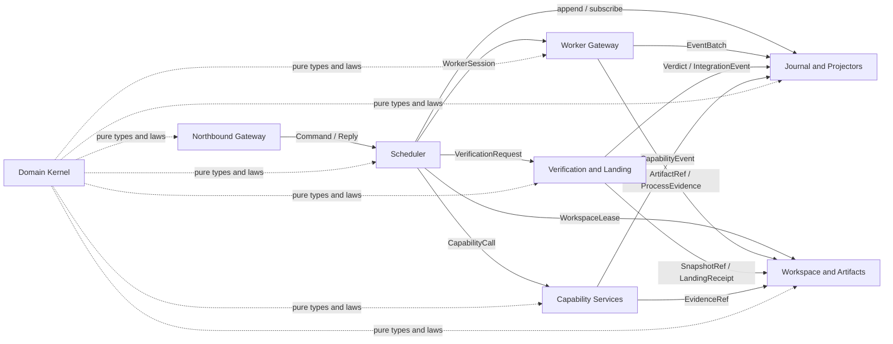

# Baton2 target architecture

## Design constraints

BATON2 is written entirely in Bend2 and runs on HVM. Its final deployment contains no JavaScript,
Node runtime, or JavaScript host for processes, sockets, files, Git, or transports. A missing Bend2
host effect is a rewrite prerequisite or a go/no-go reason; it does not create a permanent host
layer.

BATON2 keeps Baton's durable laws and removes boundaries created by class extraction, dynamic
JavaScript checks, Node process plumbing, and successive compatibility layers. The language and
runtime assumptions are limited to the pinned Bend2 reference in
[`reference/README.md`](reference/README.md) and compiled evidence recorded by
[`language-review.md`](language-review.md). A capability that is not proven there remains an
implementation risk for the rewrite plan.

The architecture has eight subsystems. Every mutable fact has one owner. Cross-subsystem values are
immutable records, affine leases, journal references, or typed command/result channels. A subsystem
may cache a value owned elsewhere only as a projector with a recorded journal cursor.

The dotted Kernel edges are compile-time dependencies. They do not synchronize at runtime.

## Current subsystem disposition

The target subsystems below are new ownership boundaries. The current subsystem names in this table
disappear from the final tree.

| Current subsystem or layer | BATON2 disposition |
| --- | --- |
| `Coordinator` and the six `runtime-*` partials | Delete the class, delegates, recorder port, and partial buckets. Pure transitions enter Domain Kernel; scheduling enters Scheduler; process effects enter Worker Gateway; recovery enters the journal reconciler. |
| `CoordinationStore` and the five `coordination-*` partials | Delete the class shell and seam buckets. Journal and Projectors owns append, replay, subscription, and projection; Scheduler owns admission. |
| Per-worker `Log`, coordination JSONL, and the prototype `EventJournal` | Delete the three store implementations after migration. One partitioned Journal preserves their distinct partition policies. |
| `BatonApplication`, `application-observation`, and application clients | Delete the application facade and scan-based observation methods. Northbound Gateway serves the protocol; Projectors serve views. |
| `SwarmRuntime`, swarm fold facade, and native bridge command layer | Delete these classes. Scheduler owns swarm work and authority transitions; Journal owns the fold; Northbound Gateway owns transport. |
| Goal plan, orchestrator plan, workflow, wave, recipes, task topology, and run-lineage schedulers | Delete their independent graph and scheduling engines. Scheduler owns one versioned plan graph with typed node variants. |
| Adapter hierarchy, provider supervisors, and provider-specific process owners | Delete the common class layers and repeated lifecycle machines. Worker Gateway owns one session lifecycle with typed protocol codecs. |
| `FenceTable`, custody booleans, opaque startup tokens, drain tokens, and northbound bearer strings | Delete the in-process emulation. Domain Kernel defines affine leases and capabilities; durable generations remain journal facts. |
| `host-capacity` and `worktree-capacity` publication protocols | Delete both implementations. Workspace and Artifacts owns one resource lease substrate with resource-specific floor policy. |
| `holistic-runtime`, `index-converged`, and `production-*` wrapper succession | Delete the parallel runtimes and decorators. The seven runtime subsystems below form the only deployment. |
| Seam inventory generator, committed inventory, delegate bijection tests, and landing-table inventory branch | Delete the textual shadow architecture. Typed effects and capability use determine verification gates. |
| ESM re-export shims, Node timer loops, hand-written WebSocket server, `v8.serialize` repair, `/bin/ps` lease probe, and event-loop yield choreography | Delete the Node-specific machinery. Bend2 host effects and structured parallel tasks supply the required operations. |
| Atlas modules, context engines, browser tools, advisory feeds, LSP, and representation producers | Delete their core-runtime wiring. Capability Services retains each capability behind one typed call and evidence protocol. |

These deletions implement the review in
[`architecture-review.md`](architecture-review.md), with detailed lane evidence in
[`architecture-findings-coordination.md`](architecture-findings-coordination.md) and
[`architecture-findings-surface.md`](architecture-findings-surface.md).

## Subsystem ownership

### 1. Domain Kernel

**Owns**

- identifiers, bounded scalar types, fixed-point USD, canonical encoding, and digest versions;
- the versioned command, event, refusal, receipt, plan-node, artifact, and evidence variants;
- one schema source for those variants and derived journal, CLI, MCP, and Web codecs;
- the at-most-once operation state and versioned decoder for earlier idempotency keys;
- pure transition functions and policy decisions;
- affine value definitions such as `TurnLease`, `WorkerSession`, `WorkspaceLease`,
  `PendingInteraction`, and `Capability`;
- versioned boundary decoders and migrations for journal and network values.

**Forbidden from owning**

- files, sockets, processes, Git repositories, timers, provider clients, or mutable caches;
- transport authentication and presentation;
- journal append, retry, scheduling, or recovery loops;
- deployment-global registries initialized by import.

This subsystem replaces local `canonical`, `exact`, `clone`, `freeze`, identifier, currency, and
digest helpers. Canonical order remains versioned because the current implementation makes it part
of durable replay ([`canonical-order.mjs`](../../impl/src/canonical-order.mjs),
[`phase63-canonical-order-authority.test.mjs`](../../impl/test/phase63-canonical-order-authority.test.mjs#L89)).

### 2. Journal and Projectors

**Owns**

- one partitioned append-only journal with atomic append batches;
- partition sequence, writer generation, segment format, checksums, archive, compaction, and
  quarantine;
- replay folds, projection checkpoints, subscription cursors, and materialized views;
- bounded queries for runs, workers, plans, workflows, swarms, attention, knowledge, contributions,
  verification, and recovery;
- the wake stream as a cursor over committed journal rows.

**Forbidden from owning**

- command admission, scheduling, provider sessions, Git mutation, verification execution, or
  transport presentation;
- an effect that cannot be represented as an append transaction;
- a projection whose source cursor is unknown;
- policy decisions based on wall-clock polling.

Logical partitions preserve the behavior currently split between `Log` and `CoordinationStore`.
Operational worker streams retain gap-free per-worker sequence and their archive policy
([`log.test.mjs`](../../impl/test/log.test.mjs#L43)). Control partitions retain ledger replay,
quarantine, canonical-order migration, and prospective fold admission. A projector can be rebuilt
from a checkpoint plus a verified suffix.

### 3. Scheduler

**Owns**

- the versioned plan graph for goals, tasks, workflow roles, waves, swarm work, dependencies, and
  attempts;
- admission of commands against current plan state and policy values;
- structured task scopes, joins, cancellation, supervision policy, and per-member settlement;
- route selection requests, worker assignment, pause and resume state, pending interaction state,
  and contribution workflow state;
- physical resource lease requests and waiting policy, including the #541 rule that worker admission
  never refuses for host load or waiting;
- one Reconciler task that compares durable intent with observed external evidence at startup and
  after disconnects.

**Forbidden from owning**

- child processes, provider protocol framing, worktree mutation, durable files, verification
  execution, or transport-specific payloads;
- mutable state that has no corresponding journal event or live affine handle;
- direct calls to CLI, MCP, Web, or optional capability implementations;
- recovery based only on elapsed time when durable evidence can decide the outcome.

The scheduler replaces the control portions of `Coordinator`, `SwarmRuntime`, wave driver, workflow
interpreter, goal plan, orchestrator plan, task topology, and run lineage. First-class parallel tasks
carry the supervision policy now implemented by the wave poll loop. The policy must preserve stall,
nudge, claim recovery, settle, and selective-stop behavior pinned in
[`wave-driver-red.test.mjs`](../../impl/test/wave-driver-red.test.mjs#L135).

### 4. Worker Gateway

**Owns**

- provider and harness capability cards;
- child process and remote session lifetime, stdout and stderr framing, size limits, close/reap, and
  process evidence;
- JSON-RPC, ACP, OMP, app-server, CLI, and provider-specific codecs;
- permission and interaction frames, session resume tokens, usage normalization, and provider fault
  classification;
- provider polling and processing tasks under scheduler-provided supervision policy.

**Forbidden from owning**

- plan state, contribution state, worktree custody, route policy, verification decisions, or public
  command schemas;
- its own durable event store;
- provider-independent admission rules;
- a process or session after its affine `WorkerSession` has been consumed or cancelled.

This subsystem merges the Adapter surface, adapter card contract, CLI adapters, persistent sessions,
ACP/OMP processes, process lifecycle, and provider supervisors. Protocol differences remain typed
codec variants. The shared process owner carries the exact-close latch behavior tested by
`acp-json-rpc-process.test.mjs`, `omp-process-truth.test.mjs`, and `omp-rpc-red.test.mjs`.

### 5. Workspace and Artifacts

**Owns**

- repository identity, Git worktrees, sparse checkout, runtime homes, checkout cleanup, and disk
  capacity accounting;
- the shared physical resource lease substrate for host verification budgets, worktree reservations,
  owner publication, incarnation checks, dead-holder reap, and derived floors;
- affine workspace custody and its durable generation receipts;
- immutable snapshots, context packs, source references, result exports, provenance, and artifact
  retention;
- secret screening, content bounds, canonical artifact identity, and materialization into a scoped
  workspace;
- evidence links from an artifact to the journal event, command, source snapshot, and producer.

**Forbidden from owning**

- plan scheduling, provider route selection, contribution approval, verification verdicts, public
  transport commands, or journal policy;
- deletion of a workspace while any live or durable holder remains;
- an artifact without a content digest and provenance reference;
- execution of provider or verifier commands.

This subsystem absorbs worktree, runtime isolation, workspace snapshot, context materialization,
result export, context result lineage, and shared-workspace custody. An affine lease controls live
use; a serialized generation and holder set protect restart and multi-process cases. The retained
behavior is pinned by `shared-workspace-custody.test.mjs`,
`issue428-worktree-custody-on-stop.test.mjs`, `workspace-preservation.test.mjs`, and
`phase66-result-export-adversarial.test.mjs`.

### 6. Verification and Landing

**Owns**

- immutable verification requests containing executable, arguments, working directory, environment,
  expected result, source commit, and requester identity;
- verifier isolation and execution evidence;
- gate selection from typed affected-effect and path declarations;
- contribution contracts, independent review verdicts, dependency checks, integration, result
  adoption, and landing receipts;
- recovery of interrupted verification and integration from journal evidence.

**Forbidden from owning**

- the contributor's worker session, scheduler policy, provider routing, public surface rendering, or
  workspace custody outside a scoped verifier lease;
- accepting a contributor's reported test result as execution evidence;
- reviewing or approving a contribution under the same authority that authored it;
- integrating a commit that differs from the verified commit.

This subsystem merges contribution service, contribution verification, referee, landing table,
verification selection, diagnostics, result adoption, and integration effects. Gate selection no
longer reads a generated AST seam inventory. The typed effect declarations referenced by a change
produce the gate set. The recovery result distinguishes executed failure, infrastructure failure,
interrupted execution, and absence of execution as required by
[`docs/41-verification-recovery-review.md`](../41-verification-recovery-review.md#L69).

### 7. Northbound Gateway

**Owns**

- the single versioned command and query protocol presented through CLI, MCP, Web, and embedded
  clients;
- transport authentication, session binding, request decoding, response encoding, streaming,
  pagination presentation, help, and exit status;
- compatibility aliases with an explicit version and removal point;
- the mapping from domain refusal variants to each transport's wire form.

**Forbidden from owning**

- scheduling, journal mutation other than submitting a command, process ownership, Git mutation,
  verification execution, capability implementation, or business policy;
- optional duck-typed fallback calls into coordinator methods;
- transport-specific copies of command semantics or refusal classification;
- globally installed convergence hooks.

This subsystem replaces `BatonApplication`, `application-client`, application semantics copies,
CLI, MCP, Web, native bridge, surface catalogs, and production surface wrappers. The protocol is one
typed definition with transport codecs. HTTP authentication, MCP framing, CLI behavior, and Web
streaming remain codec-owned parameters.

### 8. Capability Services

**Owns**

- optional capabilities such as Atlas indexing and rewriting, browser use, advisory feeds, LSP,
  representation production, supply-chain queries, and future tools;
- capability-specific dependencies, versions, language support, cost evidence, continuation tokens,
  and reverification;
- a bounded `CapabilityCall -> CapabilityResult` protocol;
- capability health and availability evidence.

**Forbidden from owning**

- scheduler state, journal format, worktree custody, provider worker sessions, verification authority,
  or northbound command semantics;
- core deployment initialization through static imports;
- a bearer string that any in-process caller can mint;
- unbounded results or receipts without an underlying version.

The Atlas modules first merge their native version and language maps into one substrate. They then
run behind the capability protocol. This keeps per-operation support precise and removes native
parser loading from the core deployment.

## Synchronization seams

There are eight subsystems, yielding 28 unordered pairs. Every pair is listed here. `None` means the
architecture permits no direct runtime synchronization for that pair; the named intermediary owns
the exchange.

| Pair | Synchronization seam |
| --- | --- |
| Domain Kernel / Journal and Projectors | None. Journal imports pure event, codec, digest, and fold types from Kernel. |
| Domain Kernel / Scheduler | None. Scheduler imports pure plan transitions, policies, and affine handle definitions. |
| Domain Kernel / Worker Gateway | None. Worker Gateway imports protocol variants, bounds, and evidence types. |
| Domain Kernel / Workspace and Artifacts | None. Workspace imports identifiers, provenance, lease, and artifact types. |
| Domain Kernel / Verification and Landing | None. Verification imports request, verdict, contribution, and receipt types. |
| Domain Kernel / Northbound Gateway | None. Northbound imports the versioned command and refusal protocol. |
| Domain Kernel / Capability Services | None. Capability services import call, result, receipt, and availability variants. |
| Journal and Projectors / Scheduler | `AppendTransaction` in one direction; `SubscriptionCursor<ViewDelta>` in the other. Scheduler waits for commit acknowledgement before publishing success. |
| Journal and Projectors / Worker Gateway | `EventBatch<WorkerEvent>` and a committed sequence acknowledgement. The gateway cannot query scheduler state through this seam. |
| Journal and Projectors / Workspace and Artifacts | `ArtifactRecorded` and `CustodyReceipt` events carry immutable references. Journal never reads artifact bytes during append. |
| Journal and Projectors / Verification and Landing | `VerificationEvent`, `ContributionEvent`, `IntegrationEvent`, and subscription cursors for recovery. |
| Journal and Projectors / Northbound Gateway | `QueryRequest<View, Cursor>` and bounded `QueryPage<View>`. Commands route through Scheduler. |
| Journal and Projectors / Capability Services | `CapabilityEvent` and `EvidenceRef`; health projection reads committed events. |
| Scheduler / Worker Gateway | Affine `WorkerSession` plus typed command/event channels. Cancelling or consuming the session closes its child task scope. |
| Scheduler / Workspace and Artifacts | Affine `ResourceLease` and `WorkspaceLease`, immutable `SnapshotRef`, `ArtifactRef`, and `CustodyReceipt`. Resource-kind policy carries the host worker admission law. |
| Scheduler / Verification and Landing | Immutable `VerificationRequest`, `ContributionRef`, and asynchronous `VerificationOutcome` or `LandingOutcome`. |
| Scheduler / Northbound Gateway | `CommandEnvelope -> CommandReceipt` and `ControlStream`. Gateway authentication produces a principal value consumed by command admission. |
| Scheduler / Capability Services | Affine `Capability` plus `CapabilityCall -> CapabilityResult`; scheduler owns retry and continuation policy. |
| Worker Gateway / Workspace and Artifacts | Scoped runtime descriptor, input `ArtifactRef`, output `ArtifactRef`, and `ProcessEvidence`. A workspace lease is passed through Scheduler. |
| Worker Gateway / Verification and Landing | None. Verification executes through its own isolated executor. Scheduler correlates worker results with verification requests. |
| Worker Gateway / Northbound Gateway | None. Live provider interaction is represented as scheduler commands and journal views. |
| Worker Gateway / Capability Services | None. A capability can call a provider only through a scheduler-owned worker session. |
| Workspace and Artifacts / Verification and Landing | Scoped verifier `WorkspaceLease`, `SnapshotRef`, `EvidenceRef`, `ResultRef`, and `LandingReceipt`. |
| Workspace and Artifacts / Northbound Gateway | `ArtifactReadRequest -> BoundedArtifactChunk` for authorized downloads. Scheduler supplies the authority reference. |
| Workspace and Artifacts / Capability Services | Scoped read lease, `ArtifactRef`, and returned `EvidenceRef`. Capability services never receive unscoped repository paths. |
| Verification and Landing / Northbound Gateway | None. Gateway reads verification projections and submits commands through Scheduler. |
| Verification and Landing / Capability Services | `ReverifyEvidenceRequest -> ReverifyEvidenceResult` for capability receipts cited by a contribution. |
| Northbound Gateway / Capability Services | None. Capability calls route through Scheduler so policy, authority, and evidence share one path. |

## Authority and recovery rules

Affine values remove repeated in-process checks only inside one typed execution. Four boundaries still
need durable authority:

1. a command arriving over CLI, MCP, Web, or another process carries a generation and idempotency key;
2. journal append uses a writer generation and atomic compare-and-swap;
3. a workspace lease has a durable holder record and generation;
4. an external process or provider session produces start, ready, close, and reap evidence.

The Reconciler operates on durable intent and evidence. It may mint a new affine value after proving
the prior value is expired, consumed, or unreachable. It records the proof before repeating an
external effect. Ledger corruption enters quarantine; recovery never rewrites the refused source
bytes.

## Migration deletions

The rewrite reaches this architecture only when the following artifacts are absent from the new
core:

- class delegate tables and tests that assert source names, arities, or one-line forwarding bodies;
- `holistic-runtime`, `index-converged`, and production convergence decorators;
- separate operational and coordination store implementations;
- `FenceTable`, exported northbound capability strings, and in-memory custody inference;
- per-provider timer supervisors and repeated child-process close latches;
- independent goal-plan, orchestrator-plan, workflow, wave, and swarm schedulers;
- application, coordinator, store, and swarm observation scans outside projectors;
- local canonical, exact, clone, freeze, fixed-point currency, and lineage validator copies;
- the generated seam inventory and source-shape gate tests;
- static imports of optional capability dependencies from the core deployment.

Deleting an item before its owner and synchronization seam exist would remove the behavior named in
[`architecture-review.md`](architecture-review.md). The rewrite plan must therefore sequence each
deletion after its target subsystem passes the cited behavior tests and replay fixtures.
